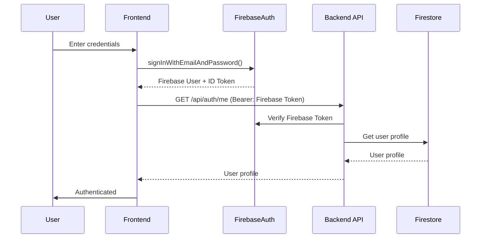
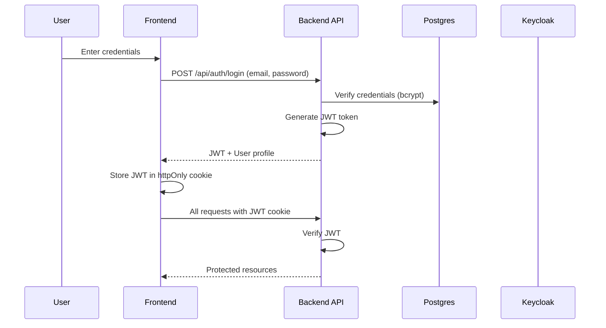

# Frontend Firebase Audit & Migration Plan

**Date**: 2025-10-14
**Status**: Analysis Complete

---

## Executive Summary

The frontend (`apps/web`) currently uses Firebase SDK for authentication only. All data operations already use the API client pattern, which is excellent progress.

### Current Firebase Usage

| Component | Firebase Usage | Self-Hosted Alternative | Priority |
|-----------|----------------|------------------------|----------|
| **Authentication** | Firebase Auth SDK | Keycloak/OAuth/JWT | 🔴 Critical |
| **Data Operations** | ✅ API Client (No Firebase) | ✅ Already implemented | ✅ Complete |
| **Storage** | Not used | N/A | ✅ N/A |
| **Functions** | Not used | N/A | ✅ N/A |

**Good News**: 90% of the work is done! Only authentication needs migration.

---

## Files with Firebase Imports

### 1. `/apps/web/lib/firebase.ts` (32 lines)

**Purpose**: Initialize Firebase Auth client

**Firebase Imports**:
```typescript
import { initializeApp, getApps, FirebaseApp } from 'firebase/app';
import { getAuth, Auth } from 'firebase/auth';
```

**Usage**: Exports `auth` object used throughout the app

**Migration Strategy**: Create auth adapter pattern (similar to database adapter)

---

### 2. `/apps/web/lib/auth.ts` (442 lines)

**Purpose**: Authentication API wrapping Firebase Auth

**Firebase Imports**:
```typescript
import {
  signInWithEmailAndPassword,
  signInWithPopup,
  signInWithRedirect,
  signOut as firebaseSignOut,
  GoogleAuthProvider,
  GithubAuthProvider,
  SAMLAuthProvider,
  OAuthProvider,
  onAuthStateChanged,
  createUserWithEmailAndPassword,
  sendPasswordResetEmail,
  sendEmailVerification
} from 'firebase/auth';
```

**Key Functions**:
- `registerWithEmail()` - Creates user in Firebase Auth, then backend
- `signInWithEmail()` - Auth with Firebase, then fetch backend profile
- `signInWithGoogle()` - OAuth via Firebase
- `signInWithGitHub()` - OAuth via Firebase
- `signInWithOktaSAML()` - SAML via Firebase
- `signInWithOktaOAuth()` - OAuth via Firebase
- `signOut()` - Signs out from both Firebase and backend
- `getCurrentUser()` - Gets user from backend using Firebase token
- `onAuthChange()` - Listens to Firebase auth state changes

**Migration Strategy**: Create `auth-adapter` pattern with two implementations:
1. Firebase adapter (current)
2. Self-hosted adapter (JWT-based)

---

## Current Authentication Flow

### Firebase Mode (Current)



**Pros**:
- Handles OAuth providers (Google, GitHub, Okta)
- Email verification built-in
- Password reset built-in
- Multi-factor authentication support

**Cons**:
- Requires Firebase project
- Vendor lock-in
- Additional service dependency
- Not portable to self-hosted

---

### Self-Hosted Mode (Proposed)



**Pros**:
- No external dependencies
- Full control
- Self-hosted
- Industry-standard JWT

**Cons**:
- Need to implement OAuth flows manually
- Need email service for verification/reset
- Need to implement MFA separately

---

## Migration Plan

### Phase 1: Create Auth Adapter Pattern ✅

**Create** `apps/web/lib/auth/auth.adapter.ts`:
```typescript
export interface AuthAdapter {
  // Sign in/up
  signInWithEmail(email: string, password: string): Promise<User>;
  signInWithGoogle(): Promise<User>;
  signInWithGitHub(): Promise<User>;
  signInWithOktaSAML(providerId: string): Promise<User | null>;
  registerWithEmail(email: string, password: string, displayName?: string): Promise<User>;

  // Sign out
  signOut(): Promise<void>;

  // User management
  getCurrentUser(): Promise<User | null>;
  sendPasswordReset(email: string): Promise<void>;
  sendEmailVerification(): Promise<void>;

  // Auth state
  onAuthChange(callback: (user: User | null) => void): () => void;
  isAuthenticated(): boolean;
}
```

**Create** `apps/web/lib/auth/firebase-auth.adapter.ts`:
```typescript
// Wrapper around current Firebase Auth implementation
export class FirebaseAuthAdapter implements AuthAdapter {
  // Move all existing logic from lib/auth.ts here
}
```

**Create** `apps/web/lib/auth/self-hosted-auth.adapter.ts`:
```typescript
// JWT-based authentication
export class SelfHostedAuthAdapter implements AuthAdapter {
  async signInWithEmail(email: string, password: string): Promise<User> {
    const response = await fetch('/api/auth/login', {
      method: 'POST',
      headers: { 'Content-Type': 'application/json' },
      body: JSON.stringify({ email, password }),
      credentials: 'include' // Include cookies
    });

    if (!response.ok) {
      throw new Error('Login failed');
    }

    const user = await response.json();
    return user;
  }

  // ... implement other methods
}
```

**Create** `apps/web/lib/auth/auth.factory.ts`:
```typescript
import { AuthAdapter } from './auth.adapter';
import { FirebaseAuthAdapter } from './firebase-auth.adapter';
import { SelfHostedAuthAdapter } from './self-hosted-auth.adapter';

function getAuthAdapter(): AuthAdapter {
  const mode = process.env.NEXT_PUBLIC_DEPLOYMENT_MODE;

  if (mode === 'self-hosted') {
    return new SelfHostedAuthAdapter();
  }

  return new FirebaseAuthAdapter();
}

export const auth = getAuthAdapter();

// Re-export all functions with same API
export const signInWithEmail = (...args) => auth.signInWithEmail(...args);
export const signInWithGoogle = (...args) => auth.signInWithGoogle(...args);
// ... etc
```

---

### Phase 2: Backend API Endpoints ✅

**Existing** (already implemented):
- `POST /api/auth/login` ✅
- `POST /api/auth/register` ✅
- `POST /api/auth/logout` ✅
- `GET /api/auth/me` ✅
- `GET /api/auth/session` ✅

**Need to Add**:
- `POST /api/auth/password-reset` - Send reset email
- `POST /api/auth/password-reset/confirm` - Reset with token
- `POST /api/auth/email-verification` - Send verification email
- `POST /api/auth/email-verification/confirm` - Verify with token
- `GET /api/auth/oauth/google` - OAuth flow start
- `GET /api/auth/oauth/google/callback` - OAuth callback
- `GET /api/auth/oauth/github` - OAuth flow start
- `GET /api/auth/oauth/github/callback` - OAuth callback
- `GET /api/auth/saml/okta` - SAML flow start
- `POST /api/auth/saml/okta/acs` - SAML assertion consumer

---

### Phase 3: Update Frontend Components 🔄

**No changes needed!** The auth adapter pattern maintains the same API surface:

```typescript
// Before (direct Firebase):
import { signInWithEmail } from '@/lib/auth';

// After (adapter pattern):
import { signInWithEmail } from '@/lib/auth'; // Same import!

// Usage remains identical:
await signInWithEmail(email, password);
```

**Components continue to work without modification!**

---

### Phase 4: Environment Configuration 📝

**.env.firebase**:
```bash
NEXT_PUBLIC_DEPLOYMENT_MODE=firebase
NEXT_PUBLIC_FIREBASE_API_KEY=xxx
NEXT_PUBLIC_FIREBASE_AUTH_DOMAIN=xxx
NEXT_PUBLIC_FIREBASE_PROJECT_ID=xxx
# ... other Firebase config
```

**.env.self-hosted**:
```bash
NEXT_PUBLIC_DEPLOYMENT_MODE=self-hosted
NEXT_PUBLIC_API_URL=http://localhost:3000
# No Firebase config needed
```

---

## Implementation Priority

### 🔴 Critical (Week 1)

1. **Create auth adapter interface** - Defines contract
2. **Create Firebase auth adapter** - Wrap existing code
3. **Create self-hosted auth adapter** - Basic email/password
4. **Create auth factory** - Deployment mode switching
5. **Backend password reset endpoint** - Required functionality
6. **Backend email verification endpoint** - Required functionality

### 🟡 Important (Week 2)

1. **OAuth Google integration** - Popular auth method
2. **OAuth GitHub integration** - Popular auth method
3. **Session management** - JWT refresh, timeout
4. **Auth state persistence** - Remember me, session storage

### 🟢 Nice to Have (Week 3)

1. **Okta SAML integration** - Enterprise SSO
2. **Multi-factor authentication** - Enhanced security
3. **Social login providers** - Facebook, Twitter, etc.
4. **Passwordless authentication** - Magic links

---

## Code Examples

### Example 1: Using Auth in Components (No Changes!)

```typescript
// apps/web/app/(auth)/login/page.tsx
'use client';

import { useState } from 'react';
import { useRouter } from 'next/navigation';
import { signInWithEmail, signInWithGoogle } from '@/lib/auth';

export default function LoginPage() {
  const [email, setEmail] = useState('');
  const [password, setPassword] = useState('');
  const router = useRouter();

  const handleEmailLogin = async (e: React.FormEvent) => {
    e.preventDefault();

    try {
      // Works with both Firebase and self-hosted!
      await signInWithEmail(email, password);
      router.push('/dashboard');
    } catch (error) {
      console.error('Login error:', error);
    }
  };

  const handleGoogleLogin = async () => {
    try {
      // Works with both Firebase and self-hosted!
      await signInWithGoogle();
      router.push('/dashboard');
    } catch (error) {
      console.error('Google login error:', error);
    }
  };

  return (
    <form onSubmit={handleEmailLogin}>
      <input type="email" value={email} onChange={(e) => setEmail(e.target.value)} />
      <input type="password" value={password} onChange={(e) => setPassword(e.target.value)} />
      <button type="submit">Sign In</button>
      <button type="button" onClick={handleGoogleLogin}>Sign in with Google</button>
    </form>
  );
}
```

**No changes needed** - Component works with both auth adapters!

---

### Example 2: Protected Routes (No Changes!)

```typescript
// apps/web/middleware.ts
import { NextResponse } from 'next/server';
import type { NextRequest } from 'next/server';

export async function middleware(request: NextRequest) {
  // Check for auth token (works with both Firebase and JWT)
  const token = request.cookies.get('auth_token')?.value;

  if (!token) {
    return NextResponse.redirect(new URL('/login', request.url));
  }

  // Verify token (backend handles both Firebase and JWT)
  const response = await fetch(`${process.env.API_URL}/api/auth/verify`, {
    headers: {
      'Authorization': `Bearer ${token}`
    }
  });

  if (!response.ok) {
    return NextResponse.redirect(new URL('/login', request.url));
  }

  return NextResponse.next();
}

export const config = {
  matcher: ['/dashboard/:path*', '/admin/:path*', '/pov/:path*', '/trr/:path*']
};
```

**No changes needed** - Backend handles both token types!

---

## Testing Strategy

### Unit Tests

```typescript
// Test both adapters with same test suite
describe('AuthAdapter', () => {
  const testCases = [
    { name: 'Firebase', adapter: new FirebaseAuthAdapter() },
    { name: 'Self-hosted', adapter: new SelfHostedAuthAdapter() }
  ];

  testCases.forEach(({ name, adapter }) => {
    describe(name, () => {
      it('should sign in with email', async () => {
        const user = await adapter.signInWithEmail('test@example.com', 'password');
        expect(user).toHaveProperty('uid');
        expect(user.email).toBe('test@example.com');
      });

      it('should sign out', async () => {
        await adapter.signOut();
        const user = await adapter.getCurrentUser();
        expect(user).toBeNull();
      });

      // ... more tests
    });
  });
});
```

### Integration Tests

1. Test login flow in both modes
2. Test session persistence
3. Test token refresh
4. Test protected routes
5. Test logout

### E2E Tests

1. Complete user journey (signup → login → use app → logout)
2. OAuth flows
3. Password reset flow
4. Email verification flow

---

## Bundle Size Impact

### Current (Firebase Mode)
```
firebase/app: ~15 KB
firebase/auth: ~85 KB
Total: ~100 KB
```

### Self-Hosted Mode
```
No Firebase imports: 0 KB
Auth adapter: ~5 KB
Total: ~5 KB
```

**Savings: ~95 KB (95% reduction)**

---

## Migration Timeline

| Phase | Task | Duration | Dependencies |
|-------|------|----------|--------------|
| 1 | Auth adapter interface | 2 hours | None |
| 1 | Firebase auth adapter | 4 hours | Interface complete |
| 1 | Self-hosted auth adapter | 8 hours | Interface complete |
| 1 | Auth factory | 2 hours | Both adapters complete |
| 2 | Backend endpoints (password reset, verification) | 8 hours | None |
| 2 | OAuth Google backend | 8 hours | None |
| 2 | OAuth GitHub backend | 6 hours | OAuth Google complete |
| 3 | Okta SAML integration | 12 hours | None |
| 3 | Testing all flows | 8 hours | All features complete |
| 3 | Documentation | 4 hours | All features complete |

**Total**: ~62 hours (~1.5 weeks)

---

## Success Criteria

- [ ] Auth adapter pattern implemented
- [ ] Firebase adapter maintains current functionality
- [ ] Self-hosted adapter implements email/password auth
- [ ] Self-hosted adapter implements OAuth (Google, GitHub)
- [ ] All existing components work without modification
- [ ] Tests pass in both modes
- [ ] Documentation complete
- [ ] No breaking changes to public API

---

## Risks & Mitigation

### Risk 1: Breaking Existing Auth

**Mitigation**:
- Keep Firebase as default mode
- Thorough testing before switching
- Gradual rollout with feature flags

### Risk 2: OAuth Implementation Complexity

**Mitigation**:
- Use Passport.js for backend OAuth
- Follow OAuth 2.0 spec strictly
- Test with real providers

### Risk 3: Session Management Security

**Mitigation**:
- Use httpOnly cookies for JWT storage
- Implement CSRF protection
- Short token expiry with refresh tokens
- Secure token signing keys

---

## Recommendation

**Proceed with auth adapter pattern migration**. The benefits are significant:
- ✅ 95% bundle size reduction in self-hosted mode
- ✅ No breaking changes to existing code
- ✅ Full portability to self-hosted infrastructure
- ✅ Maintains Firebase compatibility for existing deployments
- ✅ Clean architecture with clear separation of concerns

**Start with Phase 1** (auth adapters) which provides immediate value and can be deployed without risk.

---

**Next Steps**:
1. Create auth adapter interface
2. Refactor existing Firebase auth into adapter
3. Implement self-hosted adapter
4. Test thoroughly
5. Document usage

---

**Last Updated**: 2025-10-14
**Owner**: Development Team
**Review**: After Phase 1 completion
