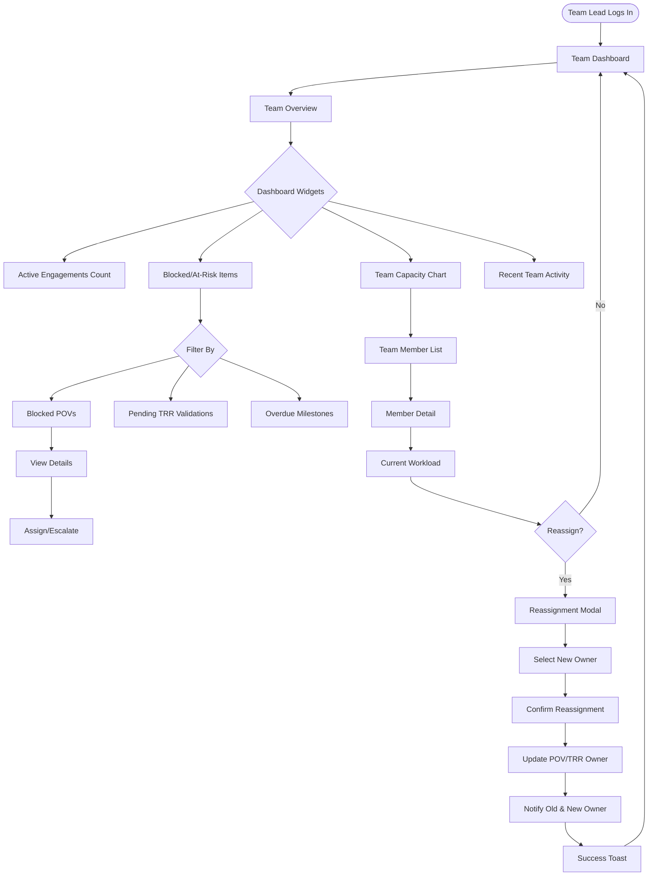

# Cortex DC - Front-End UX Architecture
**Intuitive Modern App Design for Domain Consultant Engagement Tracking**

**Version**: 1.0
**Date**: 2025-10-15
**Stack**: Next.js 15 (App Router) / React 19 / TypeScript 5 / Tailwind CSS
**Design System**: Atomic Design + shadcn/ui primitives

---

## Executive UX Brief

### Who

**Primary Users**:
1. **Domain Consultants (DCs)** - Individual contributors tracking POVs and customer engagements
2. **Team Leads / Managers** - Oversight of multiple engagements, resource allocation
3. **Administrators** - Platform configuration, analytics, user management

**User Personas**:

**Alex (Domain Consultant)**
- Age: 28-40, technical background (security, cloud, networking)
- Manages 3-5 active POVs simultaneously
- Needs: Quick access to POV status, test plans, TRR workflows
- Pain points: Context switching, scattered documentation, unclear next actions
- Tech comfort: High; prefers keyboard shortcuts

**Maria (Team Lead)**
- Age: 35-50, former DC now managing team of 8
- Oversees 15-20 concurrent engagements
- Needs: Team health metrics, blockers visibility, resource capacity
- Pain points: Manual aggregation of status, lack of early warning signals
- Tech comfort: Medium; prefers clear visualizations

**Jordan (Administrator)**
- Age: 30-45, platform operations and strategy
- Manages platform-wide configuration and analytics
- Needs: Usage metrics, integration health, user activity
- Pain points: Siloed data, manual reporting, no audit trails
- Tech comfort: High; comfortable with admin interfaces

### What

**Core Product**: Cortex DC Portal - A unified platform for accelerating Domain Consultant engagement tracking with:
- **POV Management**: Multi-phase proof-of-value workflows from planning to validation
- **TRR Workflows**: Technical Risk Reviews with findings, severity scoring, and signoff
- **Project Tracking**: Customer engagement lifecycle with team, timeline, and value metrics
- **Analytics**: Real-time insights into engagement health and outcomes
- **Content Library**: Knowledge base and scenario templates

**Key Differentiators**:
- **Role-Adaptive UI**: Dashboard, navigation, and actions adapt to user role
- **Progressive Disclosure**: Complex workflows broken into digestible steps
- **Context Preservation**: Remember user position, filters, and preferences across sessions
- **Real-Time Collaboration**: Live updates when team members edit shared resources
- **AI-Assisted**: Intelligent recommendations for next steps, similar scenarios

### Why

**Business Goals**:
1. **Reduce POV cycle time** by 30% (baseline: 6 weeks → target: 4 weeks)
2. **Increase POV success rate** to 75% (baseline: 60%)
3. **Improve DC productivity** - 50% less time on admin tasks
4. **Enable data-driven decisions** - Real-time insights vs. weekly reports
5. **Scale team operations** - Support 2x growth without linear headcount increase

**Success Metrics**:

| Metric | Baseline | Target | Measurement |
|--------|----------|--------|-------------|
| Time to POV Creation | 15 min | < 3 min | Analytics event: POV created |
| POV Status Visibility | 45% know current status | > 90% | User survey |
| Task Completion Rate | 60% | > 85% | Completed actions / Started actions |
| User Satisfaction (NPS) | +30 | > +50 | Quarterly survey |
| Daily Active Users | 120 | > 200 | Auth analytics |
| Page Load Time (P95) | 3.2s | < 2s | RUM (Real User Monitoring) |
| Mobile Usage | 10% | > 30% | Device analytics |

**UX Principles**:
1. **Progressive Disclosure**: Show what's needed now; hide complexity until relevant
2. **Forgiving Defaults**: Pre-fill forms, remember choices, suggest next steps
3. **Status Always Visible**: No hidden states; everything has a loading/error/success indicator
4. **Keyboard-First**: All actions accessible via keyboard; shortcuts for power users
5. **Recover from Errors**: Undo, retry, clear guidance on fix; never dead-ends

---

## User Flow Diagrams

### Entry & Authentication Flow

```mermaid
flowchart TD
  Start([User Visits App]) --> CheckAuth{Authenticated?}
  CheckAuth -->|No| Landing[Landing Page]
  CheckAuth -->|Yes| RedirectDash[Redirect to Dashboard]

  Landing --> ChooseAuth{User Action}
  ChooseAuth --> Login[Login Form]
  ChooseAuth --> Register[Register Form]
  ChooseAuth --> SSO[SSO (Google/MS)]

  Login --> ValidateCreds{Credentials Valid?}
  ValidateCreds -->|No| ShowError[Show Error + Retry]
  ValidateCreds -->|Yes| SetSession[Create Session]
  ShowError --> Login

  Register --> ValidateReg{Form Valid?}
  ValidateReg -->|No| ShowRegError[Inline Validation Errors]
  ValidateReg -->|Yes| CreateUser[Create Account]
  ShowRegError --> Register
  CreateUser --> SendVerify[Send Verification Email]
  SendVerify --> Onboard[Onboarding Wizard]

  SSO --> OAuthFlow[OAuth 2.0 Flow]
  OAuthFlow --> SSOSuccess{Success?}
  SSOSuccess -->|No| SSOError[Show Error + Retry]
  SSOSuccess -->|Yes| CheckProfile{Profile Complete?}
  SSOError --> Landing
  CheckProfile -->|No| CompleteProfile[Profile Setup]
  CheckProfile -->|Yes| SetSession
  CompleteProfile --> Onboard

  SetSession --> LoadPrefs[Load User Preferences]
  LoadPrefs --> RouteRole{Route by Role}
  RouteRole -->|Admin| AdminDash[Admin Dashboard]
  RouteRole -->|Manager| TeamDash[Team Dashboard]
  RouteRole -->|User| UserDash[Personal Dashboard]

  Onboard --> RouteRole
```

### POV Creation Flow (Happy Path)

```mermaid
flowchart TD
  Start([User Clicks "New POV"]) --> CheckContext{Project Selected?}
  CheckContext -->|No| SelectProject[Select/Create Project Modal]
  CheckContext -->|Yes| InitWizard[Initialize POV Wizard]

  SelectProject --> ProjectChosen{Project Selected?}
  ProjectChosen -->|Cancel| Abort([Cancel - Back to List])
  ProjectChosen -->|Selected| InitWizard

  InitWizard --> Step1[Step 1: Basic Info]
  Step1 --> Validate1{Validate Step 1}
  Validate1 -->|Invalid| ShowErrors1[Show Inline Errors]
  ShowErrors1 --> Step1
  Validate1 -->|Valid| AutoSave1[Auto-save Draft]
  AutoSave1 --> Step2[Step 2: Objectives]

  Step2 --> Validate2{Validate Step 2}
  Validate2 -->|Invalid| ShowErrors2[Show Inline Errors]
  ShowErrors2 --> Step2
  Validate2 -->|Valid| AutoSave2[Auto-save Draft]
  AutoSave2 --> Step3[Step 3: Test Plan]

  Step3 --> Validate3{Validate Step 3}
  Validate3 -->|Invalid| ShowErrors3[Show Inline Errors]
  ShowErrors3 --> Step3
  Validate3 -->|Valid| AutoSave3[Auto-save Draft]
  AutoSave3 --> Step4[Step 4: Resources & Timeline]

  Step4 --> Validate4{Validate Step 4}
  Validate4 -->|Invalid| ShowErrors4[Show Inline Errors]
  ShowErrors4 --> Step4
  Validate4 -->|Valid| Review[Review Summary]

  Review --> UserAction{User Action}
  UserAction -->|Save Draft| SaveDraft[Save as Draft]
  UserAction -->|Submit| Submit[Create POV]
  UserAction -->|Back| Step4

  Submit --> CreateRecord[Create POV Record]
  CreateRecord --> CreateSuccess{Success?}
  CreateSuccess -->|No| CreateError[Show Error + Retry]
  CreateError --> Review
  CreateSuccess -->|Yes| ShowSuccess[Success Toast]
  ShowSuccess --> RedirectPOV[Redirect to POV Detail]
  RedirectPOV --> SuggestNext[Suggest Next Action]

  SaveDraft --> SaveSuccess{Success?}
  SaveSuccess -->|No| SaveError[Show Error + Retry]
  SaveSuccess -->|Yes| SaveToast[Draft Saved Toast]
  SaveToast --> ExitWizard[Exit to List]
  SaveError --> Review
```

### POV Management Flow (DC Daily Workflow)

```mermaid
flowchart TD
  Start([DC Logs In]) --> Dashboard[Personal Dashboard]
  Dashboard --> ViewPOVs[View My Active POVs]

  ViewPOVs --> POVList[POV List View]
  POVList --> FilterSort{User Action}

  FilterSort -->|Filter| ApplyFilters[Apply Status/Phase Filters]
  FilterSort -->|Sort| ApplySort[Sort by Date/Priority]
  FilterSort -->|Search| Search[Search by Name/Customer]
  FilterSort -->|Select POV| POVDetail[POV Detail View]

  ApplyFilters --> POVList
  ApplySort --> POVList
  Search --> POVList

  POVDetail --> ViewTabs{Navigate Tabs}
  ViewTabs -->|Overview| Overview[Status, Timeline, Team]
  ViewTabs -->|Objectives| Objectives[Success Criteria List]
  ViewTabs -->|Test Plan| TestPlan[Test Scenarios & Results]
  ViewTabs -->|TRR| TRRLink[Linked TRR (if exists)]
  ViewTabs -->|Activity| Activity[Audit Log & Comments]

  Overview --> Actions{User Action}
  Actions -->|Update Status| StatusUpdate[Change Phase/Status]
  Actions -->|Edit Details| InlineEdit[Inline Edit Mode]
  Actions -->|Add Milestone| AddMilestone[Milestone Form]
  Actions -->|Upload Evidence| FileUpload[File Upload]

  StatusUpdate --> Validate{Valid Transition?}
  Validate -->|No| ValidationError[Show Error + Why]
  Validate -->|Yes| Save[Save Changes]
  ValidationError --> StatusUpdate
  Save --> Success{Success?}
  Success -->|No| SaveError[Show Error + Retry]
  Success -->|Yes| Toast[Success Toast]
  Toast --> Refresh[Refresh POV Data]
  Refresh --> POVDetail
  SaveError --> Overview

  InlineEdit --> EditForm[Editable Fields]
  EditForm --> SaveEdit{Save or Cancel}
  SaveEdit -->|Cancel| POVDetail
  SaveEdit -->|Save| ValidateEdit{Valid Data?}
  ValidateEdit -->|No| EditErrors[Show Errors]
  ValidateEdit -->|Yes| Save
  EditErrors --> EditForm
```

### TRR Workflow (Technical Risk Review)

```mermaid
flowchart TD
  Start([Initiate TRR]) --> Source{TRR Source}
  Source -->|From POV| LinkPOV[Auto-link to POV]
  Source -->|Standalone| SelectProject[Select Project]

  LinkPOV --> TRRForm[TRR Creation Form]
  SelectProject --> TRRForm

  TRRForm --> FillBasics[Name, Description, Reviewer]
  FillBasics --> Validate{Valid?}
  Validate -->|No| FormErrors[Show Errors]
  Validate -->|Yes| CreateTRR[Create TRR (Draft)]
  FormErrors --> FillBasics

  CreateTRR --> TRRDetail[TRR Detail View]
  TRRDetail --> AddFindings[Add Risk Findings]

  AddFindings --> FindingForm[Finding Form]
  FindingForm --> SetSeverity[Set Severity: L/M/H/C]
  SetSeverity --> SetCategory[Set Category]
  SetCategory --> SetDescription[Description & Mitigation]
  SetDescription --> SaveFinding[Save Finding]
  SaveFinding --> TRRDetail

  TRRDetail --> MoreFindings{More Findings?}
  MoreFindings -->|Yes| AddFindings
  MoreFindings -->|No| CalcRisk[Auto-calc Risk Score]

  CalcRisk --> ReviewTRR[Review TRR]
  ReviewTRR --> UserReview{Reviewer Action}

  UserReview -->|Add Comment| AddComment[Comment Form]
  UserReview -->|Request Changes| RequestChanges[Change Status to In Review]
  UserReview -->|Validate| ValidationForm[Validation Form]
  UserReview -->|Reject| RejectForm[Rejection Reason]

  AddComment --> TRRDetail
  RequestChanges --> Notify[Notify POV Owner]
  Notify --> TRRDetail

  ValidationForm --> SignOff[Reviewer Sign-off]
  SignOff --> SetValidated[Status → Validated]
  SetValidated --> NotifyComplete[Notify Stakeholders]
  NotifyComplete --> Success[TRR Complete]

  RejectForm --> ReasonRequired{Reason Provided?}
  ReasonRequired -->|No| RejectForm
  ReasonRequired -->|Yes| SetRejected[Status → Rejected]
  SetRejected --> NotifyRejection[Notify POV Owner]
  NotifyRejection --> TRRDetail
```

### Team Lead Dashboard Flow



---

## Information Architecture & Navigation

### Site Map

```
Cortex DC Portal
│
├── / (Root) → Landing Page (unauthenticated) or Dashboard (authenticated)
│
├── /auth
│   ├── /login
│   ├── /register
│   ├── /reset-password
│   └── /verify-email
│
├── /dashboard
│   ├── / (role-based dashboard)
│   ├── /personal (DC view)
│   ├── /team (Manager view)
│   └── /admin (Admin view)
│
├── /projects
│   ├── / (list)
│   ├── /new (create)
│   ├── /[id] (detail)
│   ├── /[id]/edit (edit)
│   └── /[id]/analytics (project metrics)
│
├── /povs
│   ├── / (list with filters)
│   ├── /new (creation wizard)
│   ├── /[id] (detail view)
│   │   ├── #overview (default tab)
│   │   ├── #objectives
│   │   ├── #test-plan
│   │   ├── #trr (linked TRR)
│   │   ├── #activity (audit log)
│   │   └── #settings
│   ├── /[id]/edit (edit mode)
│   └── /[id]/export (export POV data)
│
├── /trrs
│   ├── / (list with filters)
│   ├── /new (create)
│   ├── /[id] (detail view)
│   │   ├── #overview (default)
│   │   ├── #findings (risk findings list)
│   │   ├── #activity
│   │   └── #validation (sign-off)
│   └── /[id]/edit (edit mode)
│
├── /content
│   ├── / (knowledge base)
│   ├── /search (global search)
│   ├── /scenarios (scenario templates)
│   └── /[id] (content detail)
│
├── /analytics
│   ├── / (overview)
│   ├── /povs (POV metrics)
│   ├── /trrs (TRR metrics)
│   ├── /team (team productivity)
│   └── /export (data export)
│
├── /settings
│   ├── /profile (user profile)
│   ├── /preferences (UI preferences)
│   ├── /notifications (notification settings)
│   ├── /integrations (external integrations)
│   └── /accessibility (a11y settings)
│
└── /admin (Admin only)
    ├── /users (user management)
    ├── /roles (role management)
    ├── /audit (audit logs)
    ├── /system (system health)
    └── /integrations (platform integrations)
```

### Navigation Model

**Primary Navigation** (Top-level)
1. **Dashboard** - Home base for all users
2. **Projects** - Project list and management
3. **POVs** - POV list and creation
4. **TRRs** - TRR list and workflows
5. **Content** - Knowledge base
6. **Analytics** - Metrics and insights (role-dependent visibility)

**Contextual Navigation** (Breadcrumbs)
- Always show path: Home > Projects > Project Name > POV Name
- Each segment clickable for quick navigation
- Current page not clickable (accessibility best practice)

**Quick Actions** (Command Palette)
- Keyboard shortcut: `Cmd+K` / `Ctrl+K`
- Search everything: Projects, POVs, TRRs, Content, Users
- Quick actions: "New POV", "New TRR", "Create Project"
- Recent items: Last 5 viewed items

**User Menu** (Top right)
- Profile
- Settings
- Notifications (with badge count)
- Help & Documentation
- Logout

**Mobile Navigation**
- Bottom navigation bar (5 icons max)
- Hamburger menu for secondary items
- Swipe gestures for tab navigation

---

## Component System

### Design Tokens (CSS Variables)

**File**: `apps/web/app/globals.css` or `packages/ui/src/styles/tokens.css`

```css
:root {
  /* Colors - Cortex Brand */
  --color-primary-50: 255 247 237;  /* #fff7ed */
  --color-primary-100: 255 237 213; /* #ffedd5 */
  --color-primary-500: 249 115 22;  /* #f97316 - Main brand orange */
  --color-primary-600: 234 88 12;   /* #ea580c */
  --color-primary-900: 124 45 18;   /* #7c2d12 */

  /* Semantic Colors */
  --color-success: 34 197 94;       /* #22c55e */
  --color-warning: 234 179 8;       /* #eab308 */
  --color-error: 239 68 68;         /* #ef4444 */
  --color-info: 59 130 246;         /* #3b82f6 */

  /* Neutral Grays */
  --color-gray-50: 249 250 251;
  --color-gray-100: 243 244 246;
  --color-gray-500: 107 114 128;
  --color-gray-900: 17 24 39;

  /* Backgrounds & Surfaces */
  --bg-primary: 255 255 255;
  --bg-secondary: 249 250 251;
  --bg-elevated: 255 255 255;
  --bg-overlay: 17 24 39 / 0.5;     /* Backdrop overlay */

  /* Text Colors */
  --text-primary: 17 24 39;
  --text-secondary: 107 114 128;
  --text-tertiary: 156 163 175;
  --text-inverse: 255 255 255;

  /* Borders */
  --border-color: 229 231 235;
  --border-focus: 249 115 22;       /* Primary orange */
  --border-error: 239 68 68;

  /* Spacing Scale (4px base) */
  --space-0: 0;
  --space-1: 0.25rem;  /* 4px */
  --space-2: 0.5rem;   /* 8px */
  --space-3: 0.75rem;  /* 12px */
  --space-4: 1rem;     /* 16px */
  --space-5: 1.25rem;  /* 20px */
  --space-6: 1.5rem;   /* 24px */
  --space-8: 2rem;     /* 32px */
  --space-10: 2.5rem;  /* 40px */
  --space-12: 3rem;    /* 48px */
  --space-16: 4rem;    /* 64px */

  /* Typography Scale */
  --font-size-xs: 0.75rem;    /* 12px */
  --font-size-sm: 0.875rem;   /* 14px */
  --font-size-base: 1rem;     /* 16px */
  --font-size-lg: 1.125rem;   /* 18px */
  --font-size-xl: 1.25rem;    /* 20px */
  --font-size-2xl: 1.5rem;    /* 24px */
  --font-size-3xl: 1.875rem;  /* 30px */
  --font-size-4xl: 2.25rem;   /* 36px */

  /* Font Weights */
  --font-weight-normal: 400;
  --font-weight-medium: 500;
  --font-weight-semibold: 600;
  --font-weight-bold: 700;

  /* Line Heights */
  --line-height-tight: 1.25;
  --line-height-normal: 1.5;
  --line-height-relaxed: 1.75;

  /* Border Radius */
  --radius-sm: 0.375rem;   /* 6px */
  --radius-md: 0.5rem;     /* 8px */
  --radius-lg: 0.75rem;    /* 12px */
  --radius-xl: 1rem;       /* 16px */
  --radius-2xl: 1.5rem;    /* 24px */
  --radius-full: 9999px;

  /* Shadows */
  --shadow-sm: 0 1px 2px 0 rgb(0 0 0 / 0.05);
  --shadow-md: 0 4px 6px -1px rgb(0 0 0 / 0.1);
  --shadow-lg: 0 10px 15px -3px rgb(0 0 0 / 0.1);
  --shadow-xl: 0 20px 25px -5px rgb(0 0 0 / 0.1);
  --shadow-focus: 0 0 0 3px rgb(249 115 22 / 0.3);

  /* Z-Index Scale */
  --z-base: 0;
  --z-dropdown: 10;
  --z-sticky: 20;
  --z-fixed: 30;
  --z-modal-backdrop: 40;
  --z-modal: 50;
  --z-popover: 60;
  --z-tooltip: 70;
  --z-toast: 80;

  /* Transitions */
  --transition-fast: 150ms cubic-bezier(0.4, 0, 0.2, 1);
  --transition-base: 200ms cubic-bezier(0.4, 0, 0.2, 1);
  --transition-slow: 300ms cubic-bezier(0.4, 0, 0.2, 1);

  /* Breakpoints (for JS) */
  --breakpoint-sm: 640px;
  --breakpoint-md: 768px;
  --breakpoint-lg: 1024px;
  --breakpoint-xl: 1280px;
  --breakpoint-2xl: 1536px;
}

/* Dark Mode Tokens */
.dark {
  --bg-primary: 17 24 39;
  --bg-secondary: 31 41 55;
  --bg-elevated: 31 41 55;

  --text-primary: 249 250 251;
  --text-secondary: 209 213 219;
  --text-tertiary: 156 163 175;

  --border-color: 55 65 81;
}

/* Motion Preferences */
@media (prefers-reduced-motion: reduce) {
  :root {
    --transition-fast: 0ms;
    --transition-base: 0ms;
    --transition-slow: 0ms;
  }
}
```

### Primitive Components (Atoms)

**Button** - `packages/ui/src/components/primitives/Button.tsx`

```typescript
import * as React from 'react';
import { Slot } from '@radix-ui/react-slot';
import { cva, type VariantProps } from 'class-variance-authority';
import { cn } from '@/lib/utils';

const buttonVariants = cva(
  // Base styles
  'inline-flex items-center justify-center gap-2 rounded-lg font-medium transition-colors focus-visible:outline-none focus-visible:ring-2 focus-visible:ring-primary-500 focus-visible:ring-offset-2 disabled:pointer-events-none disabled:opacity-50',
  {
    variants: {
      variant: {
        primary: 'bg-primary-500 text-white hover:bg-primary-600 active:bg-primary-700',
        secondary: 'bg-gray-100 text-gray-900 hover:bg-gray-200 active:bg-gray-300',
        outline: 'border-2 border-gray-300 bg-transparent hover:bg-gray-50 active:bg-gray-100',
        ghost: 'bg-transparent hover:bg-gray-100 active:bg-gray-200',
        danger: 'bg-red-500 text-white hover:bg-red-600 active:bg-red-700',
        success: 'bg-green-500 text-white hover:bg-green-600 active:bg-green-700',
      },
      size: {
        sm: 'h-8 px-3 text-sm',
        md: 'h-10 px-4 text-base',
        lg: 'h-12 px-6 text-lg',
        icon: 'h-10 w-10',
      },
      fullWidth: {
        true: 'w-full',
      },
    },
    defaultVariants: {
      variant: 'primary',
      size: 'md',
    },
  }
);

export interface ButtonProps
  extends React.ButtonHTMLAttributes<HTMLButtonElement>,
    VariantProps<typeof buttonVariants> {
  asChild?: boolean;
  loading?: boolean;
  leftIcon?: React.ReactNode;
  rightIcon?: React.ReactNode;
}

const Button = React.forwardRef<HTMLButtonElement, ButtonProps>(
  ({ className, variant, size, fullWidth, asChild = false, loading, leftIcon, rightIcon, children, disabled, ...props }, ref) => {
    const Comp = asChild ? Slot : 'button';
    return (
      <Comp
        className={cn(buttonVariants({ variant, size, fullWidth, className }))}
        ref={ref}
        disabled={disabled || loading}
        {...props}
      >
        {loading && (
          <svg className="h-4 w-4 animate-spin" xmlns="http://www.w3.org/2000/svg" fill="none" viewBox="0 0 24 24">
            <circle className="opacity-25" cx="12" cy="12" r="10" stroke="currentColor" strokeWidth="4"></circle>
            <path className="opacity-75" fill="currentColor" d="M4 12a8 8 0 018-8V0C5.373 0 0 5.373 0 12h4zm2 5.291A7.962 7.962 0 014 12H0c0 3.042 1.135 5.824 3 7.938l3-2.647z"></path>
          </svg>
        )}
        {!loading && leftIcon}
        {children}
        {!loading && rightIcon}
      </Comp>
    );
  }
);

Button.displayName = 'Button';

export { Button, buttonVariants };
```

**Input** - `packages/ui/src/components/primitives/Input.tsx`

```typescript
import * as React from 'react';
import { cn } from '@/lib/utils';

export interface InputProps extends React.InputHTMLAttributes<HTMLInputElement> {
  error?: string;
  helperText?: string;
  leftAddon?: React.ReactNode;
  rightAddon?: React.ReactNode;
}

const Input = React.forwardRef<HTMLInputElement, InputProps>(
  ({ className, type, error, helperText, leftAddon, rightAddon, ...props }, ref) => {
    return (
      <div className="w-full">
        <div className="relative flex items-center">
          {leftAddon && (
            <div className="pointer-events-none absolute left-3 flex items-center text-gray-500">
              {leftAddon}
            </div>
          )}
          <input
            type={type}
            className={cn(
              'flex h-10 w-full rounded-lg border border-gray-300 bg-white px-3 py-2 text-sm transition-colors',
              'placeholder:text-gray-400',
              'focus:border-primary-500 focus:outline-none focus:ring-2 focus:ring-primary-500 focus:ring-offset-2',
              'disabled:cursor-not-allowed disabled:opacity-50',
              error && 'border-red-500 focus:border-red-500 focus:ring-red-500',
              leftAddon && 'pl-10',
              rightAddon && 'pr-10',
              className
            )}
            ref={ref}
            aria-invalid={!!error}
            aria-describedby={error ? `${props.id}-error` : undefined}
            {...props}
          />
          {rightAddon && (
            <div className="pointer-events-none absolute right-3 flex items-center text-gray-500">
              {rightAddon}
            </div>
          )}
        </div>
        {error && (
          <p id={`${props.id}-error`} className="mt-1 text-sm text-red-600" role="alert">
            {error}
          </p>
        )}
        {!error && helperText && (
          <p className="mt-1 text-sm text-gray-500">{helperText}</p>
        )}
      </div>
    );
  }
);

Input.displayName = 'Input';

export { Input };
```

**Badge** - Status indicator

```typescript
import * as React from 'react';
import { cva, type VariantProps } from 'class-variance-authority';
import { cn } from '@/lib/utils';

const badgeVariants = cva(
  'inline-flex items-center gap-1 rounded-full px-2.5 py-0.5 text-xs font-medium transition-colors',
  {
    variants: {
      variant: {
        default: 'bg-gray-100 text-gray-800',
        success: 'bg-green-100 text-green-800',
        warning: 'bg-yellow-100 text-yellow-800',
        error: 'bg-red-100 text-red-800',
        info: 'bg-blue-100 text-blue-800',
        primary: 'bg-primary-100 text-primary-800',
      },
      size: {
        sm: 'text-xs px-2 py-0.5',
        md: 'text-sm px-2.5 py-0.5',
        lg: 'text-base px-3 py-1',
      },
    },
    defaultVariants: {
      variant: 'default',
      size: 'md',
    },
  }
);

export interface BadgeProps
  extends React.HTMLAttributes<HTMLDivElement>,
    VariantProps<typeof badgeVariants> {
  dot?: boolean;
}

function Badge({ className, variant, size, dot, children, ...props }: BadgeProps) {
  return (
    <div className={cn(badgeVariants({ variant, size }), className)} {...props}>
      {dot && (
        <span className="h-1.5 w-1.5 rounded-full bg-current" aria-hidden="true" />
      )}
      {children}
    </div>
  );
}

export { Badge, badgeVariants };
```

### Pattern Components (Molecules & Organisms)

**Card** - Content container

```typescript
import * as React from 'react';
import { cn } from '@/lib/utils';

const Card = React.forwardRef<HTMLDivElement, React.HTMLAttributes<HTMLDivElement>>(
  ({ className, ...props }, ref) => (
    <div
      ref={ref}
      className={cn(
        'rounded-xl border border-gray-200 bg-white p-6 shadow-sm transition-shadow hover:shadow-md',
        className
      )}
      {...props}
    />
  )
);
Card.displayName = 'Card';

const CardHeader = React.forwardRef<HTMLDivElement, React.HTMLAttributes<HTMLDivElement>>(
  ({ className, ...props }, ref) => (
    <div ref={ref} className={cn('mb-4 flex items-start justify-between', className)} {...props} />
  )
);
CardHeader.displayName = 'CardHeader';

const CardTitle = React.forwardRef<HTMLHeadingElement, React.HTMLAttributes<HTMLHeadingElement>>(
  ({ className, children, ...props }, ref) => (
    <h3 ref={ref} className={cn('text-lg font-semibold text-gray-900', className)} {...props}>
      {children}
    </h3>
  )
);
CardTitle.displayName = 'CardTitle';

const CardDescription = React.forwardRef<HTMLParagraphElement, React.HTMLAttributes<HTMLParagraphElement>>(
  ({ className, ...props }, ref) => (
    <p ref={ref} className={cn('text-sm text-gray-500', className)} {...props} />
  )
);
CardDescription.displayName = 'CardDescription';

const CardContent = React.forwardRef<HTMLDivElement, React.HTMLAttributes<HTMLDivElement>>(
  ({ className, ...props }, ref) => (
    <div ref={ref} className={cn('', className)} {...props} />
  )
);
CardContent.displayName = 'CardContent';

const CardFooter = React.forwardRef<HTMLDivElement, React.HTMLAttributes<HTMLDivElement>>(
  ({ className, ...props }, ref) => (
    <div ref={ref} className={cn('mt-4 flex items-center gap-2', className)} {...props} />
  )
);
CardFooter.displayName = 'CardFooter';

export { Card, CardHeader, CardTitle, CardDescription, CardContent, CardFooter };
```

**POVCard** - Domain-specific card for POV list

```typescript
import * as React from 'react';
import { Card, CardHeader, CardTitle, CardDescription, CardContent, CardFooter } from '@/components/primitives/Card';
import { Badge } from '@/components/primitives/Badge';
import { Button } from '@/components/primitives/Button';
import { formatDistanceToNow } from 'date-fns';
import Link from 'next/link';

interface POVCardProps {
  pov: {
    id: string;
    name: string;
    projectName: string;
    status: 'planning' | 'in_progress' | 'testing' | 'validating' | 'completed' | 'failed';
    phase: string;
    owner: string;
    updatedAt: Date;
    objectivesCount: number;
    testsCompleted: number;
    testsTotal: number;
  };
}

const statusConfig = {
  planning: { variant: 'default' as const, label: 'Planning' },
  in_progress: { variant: 'info' as const, label: 'In Progress' },
  testing: { variant: 'warning' as const, label: 'Testing' },
  validating: { variant: 'warning' as const, label: 'Validating' },
  completed: { variant: 'success' as const, label: 'Completed' },
  failed: { variant: 'error' as const, label: 'Failed' },
};

export function POVCard({ pov }: POVCardProps) {
  const statusInfo = statusConfig[pov.status];
  const testProgress = pov.testsTotal > 0 ? (pov.testsCompleted / pov.testsTotal) * 100 : 0;

  return (
    <Card>
      <CardHeader>
        <div className="flex-1">
          <CardTitle>{pov.name}</CardTitle>
          <CardDescription>{pov.projectName}</CardDescription>
        </div>
        <Badge variant={statusInfo.variant} dot>
          {statusInfo.label}
        </Badge>
      </CardHeader>

      <CardContent>
        <dl className="grid grid-cols-2 gap-4 text-sm">
          <div>
            <dt className="text-gray-500">Phase</dt>
            <dd className="font-medium capitalize">{pov.phase.replace('_', ' ')}</dd>
          </div>
          <div>
            <dt className="text-gray-500">Owner</dt>
            <dd className="font-medium">{pov.owner}</dd>
          </div>
          <div>
            <dt className="text-gray-500">Objectives</dt>
            <dd className="font-medium">{pov.objectivesCount}</dd>
          </div>
          <div>
            <dt className="text-gray-500">Test Progress</dt>
            <dd className="font-medium">
              {pov.testsCompleted}/{pov.testsTotal}
              <div className="mt-1 h-1.5 w-full rounded-full bg-gray-200">
                <div
                  className="h-full rounded-full bg-primary-500 transition-all"
                  style={{ width: `${testProgress}%` }}
                  role="progressbar"
                  aria-valuenow={testProgress}
                  aria-valuemin={0}
                  aria-valuemax={100}
                />
              </div>
            </dd>
          </div>
        </dl>
      </CardContent>

      <CardFooter>
        <span className="text-xs text-gray-500">
          Updated {formatDistanceToNow(pov.updatedAt, { addSuffix: true })}
        </span>
        <div className="ml-auto">
          <Link href={`/povs/${pov.id}`}>
            <Button variant="outline" size="sm">
              View Details
            </Button>
          </Link>
        </div>
      </CardFooter>
    </Card>
  );
}
```

**EmptyState** - Zero data component

```typescript
import * as React from 'react';
import { Button } from '@/components/primitives/Button';
import { cn } from '@/lib/utils';

interface EmptyStateProps {
  icon?: React.ReactNode;
  title: string;
  description: string;
  action?: {
    label: string;
    onClick: () => void;
    icon?: React.ReactNode;
  };
  className?: string;
}

export function EmptyState({ icon, title, description, action, className }: EmptyStateProps) {
  return (
    <div className={cn('flex flex-col items-center justify-center rounded-xl border-2 border-dashed border-gray-300 bg-gray-50 p-12 text-center', className)}>
      {icon && <div className="mb-4 text-gray-400">{icon}</div>}
      <h3 className="mb-2 text-lg font-semibold text-gray-900">{title}</h3>
      <p className="mb-6 max-w-sm text-sm text-gray-500">{description}</p>
      {action && (
        <Button onClick={action.onClick} leftIcon={action.icon}>
          {action.label}
        </Button>
      )}
    </div>
  );
}
```

---

## State & Data Management

### Server-Client Boundary

**React Server Components (RSC)**:
- Use for: Static layouts, data fetching, SEO-critical content
- Examples: Dashboard shells, project lists, content pages

**Client Components** (`'use client'`):
- Use for: Interactive UI, forms, real-time updates, local state
- Examples: POV wizard, inline editors, command palette

### Data Fetching Strategy

**Server-Side**:
```typescript
// app/povs/page.tsx
import { getPOVs } from '@cortex/db/queries';

export default async function POVsPage() {
  // Fetch on server, passed as props
  const povs = await getPOVs({ status: 'in_progress' });

  return <POVList initialPOVs={povs} />;
}
```

**Client-Side (SWR)**:
```typescript
'use client';
import useSWR from 'swr';
import { fetcher } from '@/lib/fetcher';

export function POVList({ initialPOVs }) {
  const { data: povs, error, mutate } = useSWR(
    '/api/povs',
    fetcher,
    {
      fallbackData: initialPOVs,
      revalidateOnFocus: true,
      refreshInterval: 30000, // 30s
    }
  );

  if (error) return <ErrorState />;
  if (!povs) return <LoadingSkeleton />;

  return <div>{povs.map(pov => <POVCard key={pov.id} pov={pov} />)}</div>;
}
```

### Optimistic Updates

```typescript
async function updatePOVStatus(povId: string, newStatus: string) {
  // Optimistically update UI
  mutate(
    '/api/povs',
    (current) => current.map(p => p.id === povId ? { ...p, status: newStatus } : p),
    false // Don't revalidate yet
  );

  try {
    // Send to API
    await fetch(`/api/povs/${povId}`, {
      method: 'PATCH',
      body: JSON.stringify({ status: newStatus }),
    });

    // Revalidate to get server truth
    mutate('/api/povs');
  } catch (error) {
    // Revert on error
    mutate('/api/povs');
    toast.error('Failed to update status');
  }
}
```

### Form State (React Hook Form + Zod)

```typescript
import { useForm } from 'react-hook-form';
import { zodResolver } from '@hookform/resolvers/zod';
import * as z from 'zod';

const povSchema = z.object({
  name: z.string().min(3, 'Name must be at least 3 characters').max(100),
  projectId: z.string().uuid('Invalid project ID'),
  objectives: z.array(z.string()).min(1, 'At least one objective required'),
  startDate: z.date(),
  endDate: z.date(),
}).refine(data => data.endDate > data.startDate, {
  message: 'End date must be after start date',
  path: ['endDate'],
});

export function POVForm() {
  const { register, handleSubmit, formState: { errors } } = useForm({
    resolver: zodResolver(povSchema),
  });

  const onSubmit = async (data) => {
    // Submit to API
  };

  return (
    <form onSubmit={handleSubmit(onSubmit)}>
      <Input
        {...register('name')}
        error={errors.name?.message}
        label="POV Name"
      />
      {/* ... */}
    </form>
  );
}
```

---

## Interaction Rules & Motion

### Loading States

**Skeleton Loaders** (Content loading):
```typescript
export function POVCardSkeleton() {
  return (
    <Card>
      <CardHeader>
        <div className="h-6 w-3/4 animate-pulse rounded bg-gray-200" />
        <div className="h-4 w-1/2 animate-pulse rounded bg-gray-200" />
      </CardHeader>
      <CardContent>
        <div className="space-y-3">
          <div className="h-4 w-full animate-pulse rounded bg-gray-200" />
          <div className="h-4 w-2/3 animate-pulse rounded bg-gray-200" />
        </div>
      </CardContent>
    </Card>
  );
}
```

**Spinners** (Action loading):
```typescript
<Button loading={isSubmitting}>
  Submit POV
</Button>
```

**Progress Bars** (Multi-step processes):
```typescript
<div className="mb-6">
  <div className="mb-2 flex justify-between text-sm">
    <span>Step 2 of 4</span>
    <span>50% Complete</span>
  </div>
  <div className="h-2 w-full rounded-full bg-gray-200">
    <div
      className="h-full rounded-full bg-primary-500 transition-all duration-500"
      style={{ width: '50%' }}
    />
  </div>
</div>
```

### Transitions (Framer Motion)

**Page Transitions**:
```typescript
import { motion } from 'framer-motion';

export function PageTransition({ children }) {
  return (
    <motion.div
      initial={{ opacity: 0, y: 20 }}
      animate={{ opacity: 1, y: 0 }}
      exit={{ opacity: 0, y: -20 }}
      transition={{ duration: 0.2 }}
    >
      {children}
    </motion.div>
  );
}
```

**List Animations**:
```typescript
import { motion, AnimatePresence } from 'framer-motion';

<AnimatePresence>
  {povs.map((pov, index) => (
    <motion.div
      key={pov.id}
      initial={{ opacity: 0, y: 20 }}
      animate={{ opacity: 1, y: 0 }}
      exit={{ opacity: 0, scale: 0.95 }}
      transition={{ delay: index * 0.05 }}
    >
      <POVCard pov={pov} />
    </motion.div>
  ))}
</AnimatePresence>
```

**Hover Effects**:
```typescript
<motion.button
  whileHover={{ scale: 1.05 }}
  whileTap={{ scale: 0.98 }}
  className="..."
>
  View Details
</motion.button>
```

### Gestures & Interactions

**Drag & Drop** (Kanban boards):
```typescript
import { DndContext, closestCenter, useSensor, useSensors, PointerSensor } from '@dnd-kit/core';

function POVKanban() {
  const sensors = useSensors(useSensor(PointerSensor));

  const handleDragEnd = (event) => {
    const { active, over } = event;
    if (over && active.id !== over.id) {
      // Move POV to new column
    }
  };

  return (
    <DndContext sensors={sensors} collisionDetection={closestCenter} onDragEnd={handleDragEnd}>
      {/* Droppable columns */}
    </DndContext>
  );
}
```

**Keyboard Shortcuts**:
```typescript
import { useHotkeys } from 'react-hotkeys-hook';

function Dashboard() {
  useHotkeys('cmd+k, ctrl+k', (e) => {
    e.preventDefault();
    openCommandPalette();
  });

  useHotkeys('cmd+n, ctrl+n', (e) => {
    e.preventDefault();
    createNewPOV();
  });

  useHotkeys('/', (e) => {
    e.preventDefault();
    focusSearch();
  });

  return (/* ... */);
}
```

---

## Accessibility Plan (WCAG 2.1 AA)

### Semantic HTML

**Use proper HTML elements**:
- `<button>` for actions (not `<div onClick>`)
- `<a>` for navigation
- `<nav>` for navigation sections
- `<main>` for primary content
- `<aside>` for sidebars
- `<article>` for independent content

### ARIA Attributes

**Landmark Roles**:
```html
<nav aria-label="Main navigation">
<main aria-labelledby="main-heading">
<aside aria-label="Filters">
<section aria-labelledby="section-title">
```

**Live Regions**:
```html
<div role="status" aria-live="polite" aria-atomic="true">
  POV created successfully
</div>

<div role="alert" aria-live="assertive" aria-atomic="true">
  Error: Failed to save changes
</div>
```

**Dialog/Modal**:
```html
<div role="dialog" aria-modal="true" aria-labelledby="modal-title">
  <h2 id="modal-title">Create New POV</h2>
  {/* ... */}
</div>
```

### Keyboard Navigation

**Focus Management**:
- All interactive elements are keyboard-accessible
- Visible focus indicators (2px ring)
- Logical tab order (no `tabindex` > 0)
- Skip links for bypassing navigation

**Focus Trap in Modals**:
```typescript
import { useRef, useEffect } from 'react';
import FocusTrap from 'focus-trap-react';

function Modal({ isOpen, onClose, children }) {
  if (!isOpen) return null;

  return (
    <FocusTrap>
      <div role="dialog" aria-modal="true">
        <button onClick={onClose} aria-label="Close modal">
          <XIcon />
        </button>
        {children}
      </div>
    </FocusTrap>
  );
}
```

### Screen Reader Support

**Labels & Descriptions**:
```html
<label htmlFor="pov-name">POV Name</label>
<input
  id="pov-name"
  type="text"
  aria-describedby="pov-name-hint"
  aria-required="true"
/>
<p id="pov-name-hint">Enter a descriptive name for this POV</p>
```

**Image Alt Text**:
```html


```

**Visually Hidden Text**:
```html
<span className="sr-only">Loading POVs...</span>
<span aria-hidden="true"><SpinnerIcon /></span>
```

### Color Contrast

**WCAG AA Standards**:
- Normal text: 4.5:1 minimum
- Large text (18px+): 3:1 minimum
- UI components: 3:1 minimum

**Tools**:
- WebAIM Contrast Checker
- axe DevTools
- Lighthouse accessibility audit

### Motion & Animation

**Respect User Preferences**:
```css
@media (prefers-reduced-motion: reduce) {
  * {
    animation-duration: 0.01ms !important;
    animation-iteration-count: 1 !important;
    transition-duration: 0.01ms !important;
  }
}
```

**Provide Motion Controls**:
```typescript
// User preference setting
const [reduceMotion, setReduceMotion] = useState(false);

<motion.div
  animate={reduceMotion ? {} : { opacity: 1, y: 0 }}
  transition={reduceMotion ? { duration: 0 } : { duration: 0.3 }}
>
  {children}
</motion.div>
```

---

## API/Data Contracts

### API Client Setup

**File**: `apps/web/lib/api-client.ts`

```typescript
import axios, { AxiosError } from 'axios';
import { z } from 'zod';

const API_BASE_URL = process.env.NEXT_PUBLIC_API_URL || 'http://localhost:8080';

export const apiClient = axios.create({
  baseURL: API_BASE_URL,
  headers: {
    'Content-Type': 'application/json',
  },
  withCredentials: true, // Send cookies
});

// Request interceptor (add auth token)
apiClient.interceptors.request.use((config) => {
  const token = localStorage.getItem('auth_token');
  if (token) {
    config.headers.Authorization = `Bearer ${token}`;
  }
  return config;
});

// Response interceptor (error handling)
apiClient.interceptors.response.use(
  (response) => response,
  (error: AxiosError) => {
    if (error.response?.status === 401) {
      // Redirect to login
      window.location.href = '/auth/login';
    }
    return Promise.reject(error);
  }
);

// Type-safe fetcher for SWR
export async function fetcher<T>(url: string): Promise<T> {
  const response = await apiClient.get(url);
  return response.data;
}

// Schema-validated fetcher
export async function fetchWithSchema<T>(url: string, schema: z.ZodSchema<T>): Promise<T> {
  const response = await apiClient.get(url);
  return schema.parse(response.data);
}
```

### Data Schemas (Zod)

**File**: `packages/db/src/schemas/pov.schema.ts`

```typescript
import { z } from 'zod';

export const POVStatus = z.enum(['planning', 'in_progress', 'testing', 'validating', 'completed', 'failed']);
export const POVPhase = z.enum(['discovery', 'design', 'implementation', 'testing', 'validation', 'handoff']);

export const POVSchema = z.object({
  id: z.string().uuid(),
  projectId: z.string().uuid(),
  name: z.string().min(3).max(100),
  description: z.string().max(1000).optional(),
  status: POVStatus,
  phase: POVPhase,
  ownerId: z.string().uuid(),
  objectives: z.array(z.string()).min(1),
  successCriteria: z.array(z.object({
    metric: z.string(),
    target: z.number(),
    achieved: z.number().optional(),
  })),
  startDate: z.string().datetime(),
  endDate: z.string().datetime(),
  createdAt: z.string().datetime(),
  updatedAt: z.string().datetime(),
});

export type POV = z.infer<typeof POVSchema>;

// API response wrapper
export const APIResponse = <T extends z.ZodTypeAny>(dataSchema: T) =>
  z.object({
    success: z.boolean(),
    data: dataSchema.optional(),
    error: z.object({
      code: z.string(),
      message: z.string(),
      details: z.unknown().optional(),
    }).optional(),
  });

// Paginated response
export const PaginatedResponse = <T extends z.ZodTypeAny>(itemSchema: T) =>
  z.object({
    data: z.array(itemSchema),
    pagination: z.object({
      page: z.number(),
      limit: z.number(),
      total: z.number(),
      totalPages: z.number(),
    }),
  });
```

### API Hooks

**File**: `apps/web/hooks/use-povs.ts`

```typescript
import useSWR from 'swr';
import { apiClient, fetcher } from '@/lib/api-client';
import { POVSchema, type POV } from '@cortex/db/schemas';
import { z } from 'zod';
import { toast } from 'sonner';

export function usePOVs(filters?: { status?: string; projectId?: string }) {
  const queryParams = new URLSearchParams(filters as any).toString();
  const url = `/api/povs${queryParams ? `?${queryParams}` : ''}`;

  const { data, error, mutate, isLoading } = useSWR<POV[]>(url, fetcher, {
    revalidateOnFocus: true,
    refreshInterval: 30000,
  });

  return {
    povs: data,
    isLoading,
    isError: error,
    mutate,
  };
}

export function usePOV(povId: string) {
  const { data, error, mutate, isLoading } = useSWR<POV>(
    povId ? `/api/povs/${povId}` : null,
    fetcher
  );

  return {
    pov: data,
    isLoading,
    isError: error,
    mutate,
  };
}

export function useCreatePOV() {
  return async (data: Partial<POV>) => {
    try {
      const response = await apiClient.post<POV>('/api/povs', data);
      toast.success('POV created successfully');
      return response.data;
    } catch (error) {
      toast.error('Failed to create POV');
      throw error;
    }
  };
}

export function useUpdatePOV(povId: string) {
  return async (updates: Partial<POV>) => {
    try {
      const response = await apiClient.patch<POV>(`/api/povs/${povId}`, updates);
      toast.success('POV updated');
      return response.data;
    } catch (error) {
      toast.error('Failed to update POV');
      throw error;
    }
  };
}

export function useDeletePOV() {
  return async (povId: string) => {
    try {
      await apiClient.delete(`/api/povs/${povId}`);
      toast.success('POV deleted');
    } catch (error) {
      toast.error('Failed to delete POV');
      throw error;
    }
  };
}
```

---

## Validation & Error Handling

### Form Validation (Inline)

**Real-time validation as user types**:
```typescript
<Input
  {...register('email')}
  type="email"
  label="Email"
  error={errors.email?.message}
  helperText="We'll never share your email"
  onBlur={() => trigger('email')} // Validate on blur
/>
```

### Error Messages (User-Friendly)

**Error Message Guidelines**:
1. **Be specific**: "Email already exists" not "Error"
2. **Be actionable**: "Password must be at least 8 characters" not "Invalid password"
3. **Be forgiving**: Suggest fixes, don't blame user

**Error Toast**:
```typescript
import { toast } from 'sonner';

toast.error('Failed to save POV', {
  description: 'Please check your internet connection and try again',
  action: {
    label: 'Retry',
    onClick: () => handleRetry(),
  },
});
```

### Empty States

**Zero data states**:
```typescript
{povs.length === 0 && !isLoading && (
  <EmptyState
    icon={<DocumentPlusIcon className="h-12 w-12" />}
    title="No POVs yet"
    description="Get started by creating your first Proof of Value"
    action={{
      label: 'Create POV',
      onClick: () => router.push('/povs/new'),
      icon: <PlusIcon className="h-4 w-4" />,
    }}
  />
)}
```

### Error Boundaries

**Catch React errors gracefully**:
```typescript
'use client';
import { Component, ReactNode } from 'react';
import { Button } from '@/components/primitives/Button';

interface Props {
  children: ReactNode;
  fallback?: ReactNode;
}

interface State {
  hasError: boolean;
  error?: Error;
}

export class ErrorBoundary extends Component<Props, State> {
  constructor(props: Props) {
    super(props);
    this.state = { hasError: false };
  }

  static getDerivedStateFromError(error: Error): State {
    return { hasError: true, error };
  }

  componentDidCatch(error: Error, errorInfo: any) {
    console.error('ErrorBoundary caught:', error, errorInfo);
    // Log to error tracking service (e.g., Sentry)
  }

  render() {
    if (this.state.hasError) {
      return this.props.fallback || (
        <div className="flex min-h-screen flex-col items-center justify-center p-8">
          <h2 className="mb-2 text-2xl font-bold">Something went wrong</h2>
          <p className="mb-6 text-gray-600">
            We're sorry for the inconvenience. Please try refreshing the page.
          </p>
          <Button onClick={() => window.location.reload()}>
            Refresh Page
          </Button>
        </div>
      );
    }

    return this.props.children;
  }
}
```

---

## Test Matrix

### Unit Tests (Vitest)

**Component tests**:
```typescript
// Button.test.tsx
import { render, screen, fireEvent } from '@testing-library/react';
import { Button } from './Button';

describe('Button', () => {
  it('renders children', () => {
    render(<Button>Click me</Button>);
    expect(screen.getByRole('button')).toHaveTextContent('Click me');
  });

  it('handles click events', () => {
    const handleClick = vi.fn();
    render(<Button onClick={handleClick}>Click</Button>);

    fireEvent.click(screen.getByRole('button'));
    expect(handleClick).toHaveBeenCalledOnce();
  });

  it('shows loading state', () => {
    render(<Button loading>Submit</Button>);

    expect(screen.getByRole('button')).toBeDisabled();
    expect(screen.getByRole('button')).toContainHTML('svg'); // Spinner
  });

  it('applies variant styles', () => {
    const { container } = render(<Button variant="danger">Delete</Button>);
    expect(container.firstChild).toHaveClass('bg-red-500');
  });
});
```

**Hook tests**:
```typescript
// use-povs.test.ts
import { renderHook, waitFor } from '@testing-library/react';
import { usePOVs } from './use-povs';
import { SWRConfig } from 'swr';

describe('usePOVs', () => {
  it('fetches POVs', async () => {
    const wrapper = ({ children }) => (
      <SWRConfig value={{ provider: () => new Map() }}>
        {children}
      </SWRConfig>
    );

    const { result } = renderHook(() => usePOVs(), { wrapper });

    await waitFor(() => {
      expect(result.current.povs).toBeDefined();
      expect(result.current.isLoading).toBe(false);
    });
  });
});
```

### Visual Regression Tests (Chromatic/Percy)

**Storybook stories**:
```typescript
// POVCard.stories.tsx
import type { Meta, StoryObj } from '@storybook/react';
import { POVCard } from './POVCard';

const meta: Meta<typeof POVCard> = {
  title: 'Components/POVCard',
  component: POVCard,
  tags: ['autodocs'],
};

export default meta;
type Story = StoryObj<typeof POVCard>;

export const Planning: Story = {
  args: {
    pov: {
      id: '1',
      name: 'Network Security POV',
      projectName: 'Acme Corp',
      status: 'planning',
      phase: 'discovery',
      owner: 'Alex Johnson',
      updatedAt: new Date(),
      objectivesCount: 5,
      testsCompleted: 0,
      testsTotal: 10,
    },
  },
};

export const InProgress: Story = {
  args: {
    pov: {
      ...Planning.args.pov,
      status: 'in_progress',
      phase: 'implementation',
      testsCompleted: 4,
    },
  },
};

export const Completed: Story = {
  args: {
    pov: {
      ...Planning.args.pov,
      status: 'completed',
      phase: 'handoff',
      testsCompleted: 10,
    },
  },
};
```

### E2E Tests (Playwright)

**User flows**:
```typescript
// pov-creation.spec.ts
import { test, expect } from '@playwright/test';

test.describe('POV Creation Flow', () => {
  test.beforeEach(async ({ page }) => {
    // Login
    await page.goto('/auth/login');
    await page.fill('[name="email"]', 'alex@cortex.com');
    await page.fill('[name="password"]', 'password123');
    await page.click('button[type="submit"]');
    await page.waitForURL('/dashboard');
  });

  test('should create POV successfully', async ({ page }) => {
    await page.click('text=New POV');

    // Step 1: Basic Info
    await page.fill('[name="name"]', 'Test POV');
    await page.selectOption('[name="projectId"]', { label: 'Test Project' });
    await page.click('text=Next');

    // Step 2: Objectives
    await page.fill('[name="objectives.0"]', 'Validate integration');
    await page.click('text=Add Objective');
    await page.fill('[name="objectives.1"]', 'Measure performance');
    await page.click('text=Next');

    // Step 3: Test Plan
    await page.fill('[name="testPlan"]', 'Execute load tests');
    await page.click('text=Next');

    // Step 4: Resources
    await page.fill('[name="startDate"]', '2025-11-01');
    await page.fill('[name="endDate"]', '2025-12-01');
    await page.click('text=Create POV');

    // Success
    await expect(page.locator('text=POV created successfully')).toBeVisible();
    await expect(page).toHaveURL(/\/povs\/[a-z0-9-]+/);
  });

  test('should validate required fields', async ({ page }) => {
    await page.click('text=New POV');

    // Try to submit without filling
    await page.click('text=Next');

    // Should show validation errors
    await expect(page.locator('text=Name must be at least 3 characters')).toBeVisible();
  });

  test('should save draft', async ({ page }) => {
    await page.click('text=New POV');

    await page.fill('[name="name"]', 'Draft POV');
    await page.selectOption('[name="projectId"]', { label: 'Test Project' });

    await page.click('text=Save Draft');

    await expect(page.locator('text=Draft saved')).toBeVisible();
    await expect(page).toHaveURL('/povs');
  });
});
```

### Accessibility Tests

**axe-core integration**:
```typescript
// a11y.spec.ts
import { test, expect } from '@playwright/test';
import AxeBuilder from '@axe-core/playwright';

test.describe('Accessibility', () => {
  test('should not have accessibility violations on dashboard', async ({ page }) => {
    await page.goto('/dashboard');

    const accessibilityScanResults = await new AxeBuilder({ page }).analyze();

    expect(accessibilityScanResults.violations).toEqual([]);
  });

  test('should support keyboard navigation', async ({ page }) => {
    await page.goto('/povs');

    // Tab through interactive elements
    await page.keyboard.press('Tab');
    await page.keyboard.press('Tab');
    await page.keyboard.press('Enter'); // Should activate button

    // Check focus is visible
    const focusedElement = await page.locator(':focus');
    await expect(focusedElement).toHaveCSS('outline', /solid/);
  });
});
```

---

## Risks & Tradeoffs

### Risk 1: Performance with Large Data Sets

**Risk**: Rendering 1000+ POVs in a list could cause UI lag

**Mitigation**:
- Implement virtual scrolling (react-window)
- Server-side pagination (max 50 items per page)
- Lazy load images and heavy components
- Optimize re-renders with React.memo

### Risk 2: Real-Time Updates at Scale

**Risk**: WebSocket connections for 200+ users could overwhelm server

**Mitigation**:
- Use polling for non-critical updates (30s interval)
- WebSockets only for critical notifications
- Implement connection throttling
- Fallback to HTTP polling if WebSocket fails

### Risk 3: Mobile Experience

**Risk**: Complex workflows (POV wizard) may not translate well to mobile

**Mitigation**:
- Design mobile-first simplified flows
- Allow saving progress at each step
- Use native mobile patterns (bottom sheets, swipe gestures)
- Consider Progressive Web App (PWA) for offline support

### Risk 4: Accessibility Compliance

**Risk**: Custom components may not meet WCAG 2.1 AA

**Mitigation**:
- Use radix-ui primitives (accessibility built-in)
- Automated testing with axe-core
- Manual testing with screen readers
- ARIA attributes on all interactive elements

### Risk 5: State Management Complexity

**Risk**: Mix of server/client state could cause sync issues

**Mitigation**:
- Clear boundaries: Server for data, client for UI state
- SWR for automatic revalidation
- Optimistic updates with rollback on error
- Single source of truth per data type

---

## Handoff Pack

### Figma Design System
- **Link**: [Figma Design System](https://figma.com/cortex-dc-design-system) (placeholder)
- **Contents**: Design tokens, component library, user flows, prototypes

### Storybook Component Library
- **Local**: `pnpm --filter "@cortex/ui" storybook`
- **Deployed**: https://storybook.cortex-dc.henryreed.ai (placeholder)
- **Contents**: All primitive and pattern components with props documentation

### Acceptance Criteria

**POV Creation Flow**:
- [ ] User can create POV in < 3 minutes
- [ ] Form validation provides immediate feedback
- [ ] Auto-save every 10 seconds
- [ ] Can save draft and resume later
- [ ] Success confirmation with next action suggestions

**Dashboard Experience**:
- [ ] Loads in < 2 seconds (P95)
- [ ] Real-time updates visible within 5 seconds
- [ ] Responsive on mobile, tablet, desktop
- [ ] Keyboard shortcuts work (Cmd+K, etc.)
- [ ] Screen reader navigation works

**Accessibility**:
- [ ] Passes axe-core automated tests (0 violations)
- [ ] Manual screen reader testing (VoiceOver, NVDA)
- [ ] All interactive elements keyboard-accessible
- [ ] Focus visible on all elements
- [ ] ARIA labels on all complex components

**Performance**:
- [ ] Lighthouse score > 90 (Performance, Accessibility, Best Practices)
- [ ] Core Web Vitals green (LCP < 2.5s, FID < 100ms, CLS < 0.1)
- [ ] Bundle size < 200KB (gzipped)
- [ ] Time to Interactive < 3s

---

## Next Steps

### Immediate (This Session)
- [x] Analyze existing frontend structure
- [x] Create UX architecture document
- [x] Design user flow diagrams
- [x] Define component system and design tokens
- [x] Map information architecture
- [x] Document accessibility plan
- [x] Create API/data contracts

### Short-Term (Next 1-2 Days)
- [ ] Implement design token system in CSS
- [ ] Refactor Button, Input, Badge primitives
- [ ] Create POVCard, TRRCard, ProjectCard
- [ ] Build EmptyState component
- [ ] Add Framer Motion transitions
- [ ] Implement keyboard shortcuts

### Medium-Term (Next Week)
- [ ] Build POV Creation Wizard
- [ ] Implement TRR workflow screens
- [ ] Create Team Dashboard
- [ ] Add Command Palette (Cmd+K)
- [ ] Implement real-time notifications
- [ ] Build responsive mobile views

### Long-Term (Next Month)
- [ ] Storybook documentation for all components
- [ ] Visual regression testing setup
- [ ] E2E test coverage > 80%
- [ ] Accessibility audit and fixes
- [ ] Performance optimization
- [ ] User testing and feedback iteration

---

**Document Version**: 1.0
**Last Updated**: 2025-10-15
**Maintained By**: Front-End Team
**Review Cycle**: Bi-weekly or after major feature releases

**Related Documentation**:
- [`ARCHITECTURE_K8S_READY.md`](./ARCHITECTURE_K8S_READY.md) - Backend architecture
- [`K8S_OPTIMIZATION_SUMMARY.md`](./K8S_OPTIMIZATION_SUMMARY.md) - Implementation summary
- [`CLAUDE.md`](./CLAUDE.md) - Development guide
