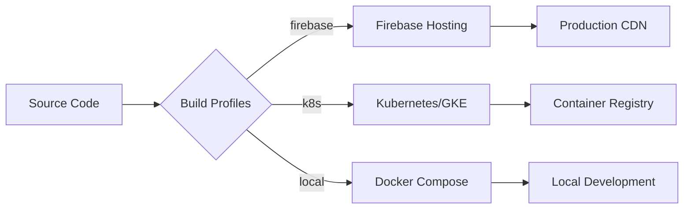
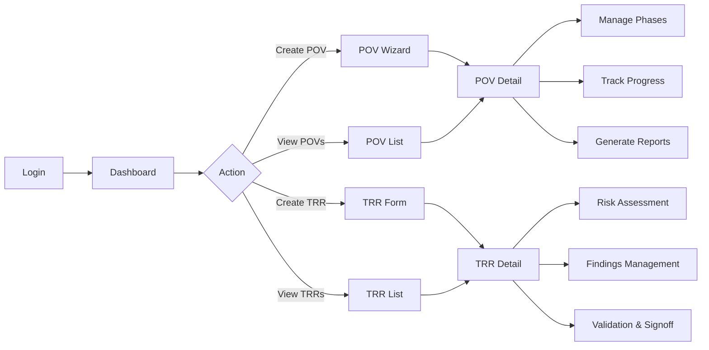
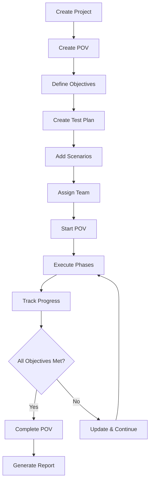
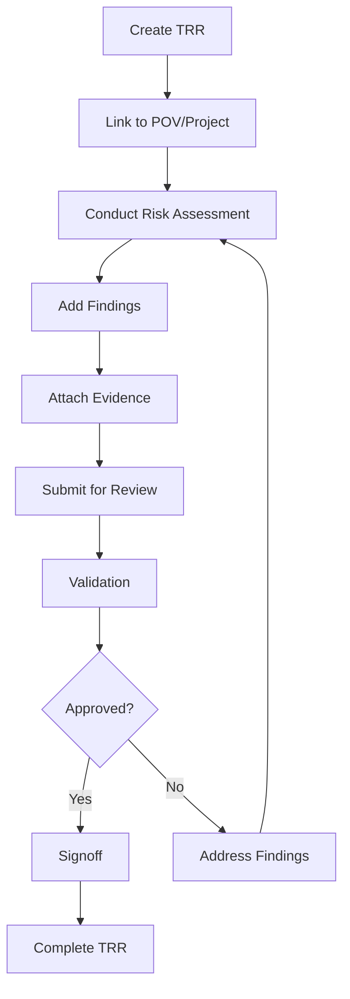
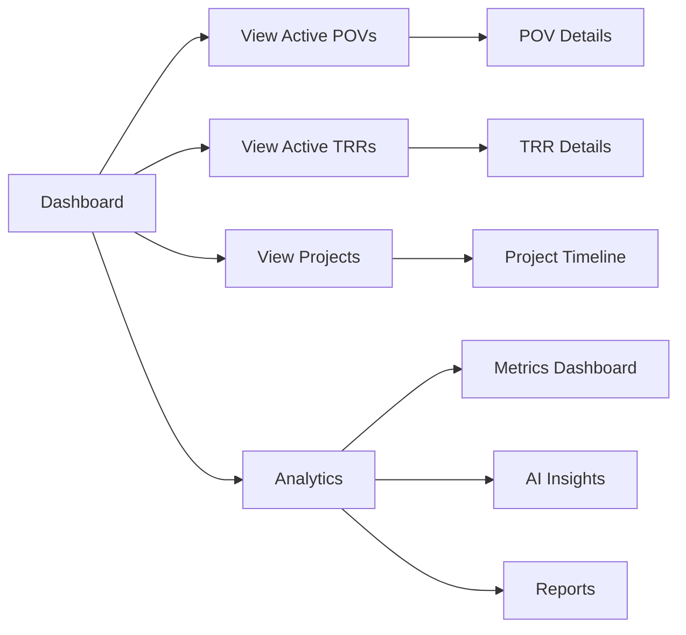
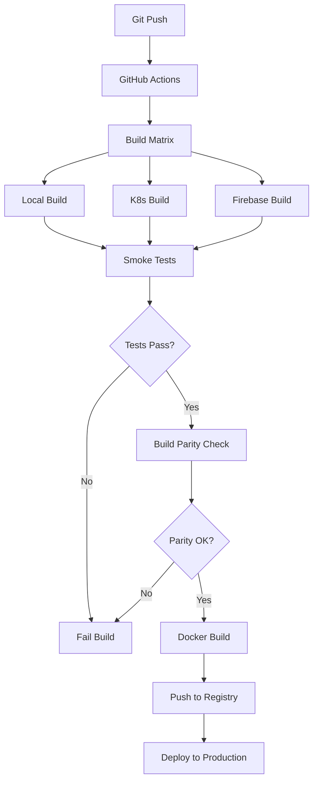
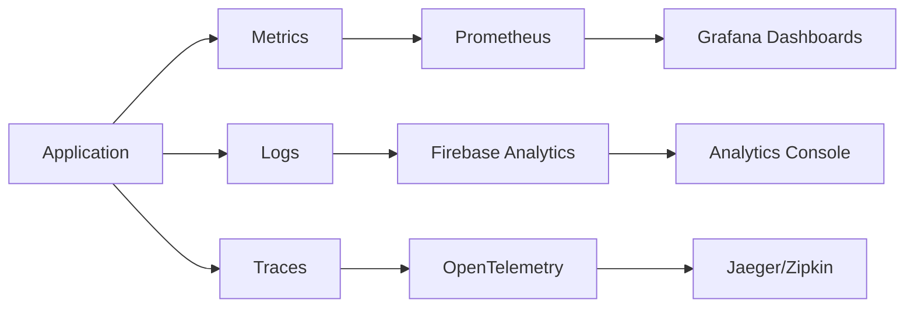

# ⚡ Cortex Domain Consultant Platform

**Enterprise-Grade Domain Consultant Engagement Platform**
Multi-Target | Cloud-Native | AI-Augmented | Security-First

[](https://github.com/hankthebldr/cortex-dc-web/actions)
[](LICENSE)
[](https://www.typescriptlang.org/)
[](https://nextjs.org/)
[](https://firebase.google.com/)

---

## 🧭 Executive Summary

Cortex Domain Consultant Platform is a **cloud-native, AI-augmented** web application designed to accelerate Domain Consultant engagements through intelligent **POV (Proof of Value)** management, **TRR (Technical Risk Review)** workflows, and real-time customer engagement analytics.

### Mission Statement

Empower Domain Consultants with enterprise-grade tooling that combines:
- **Intelligent Workflow Automation** via AI-driven context engines
- **Multi-Target Deployment** (Firebase, Kubernetes, Local)
- **Real-Time Analytics** for customer engagement tracking
- **Security-First Architecture** with RBAC and audit trails

---

## 📊 Platform Overview

| Category | Description |
|----------|-------------|
| **Core Objective** | Streamline Domain Consultant operations through intelligent POV/TRR management |
| **Architecture** | Monorepo microservices orchestrated via pnpm workspaces, Turbo, and Kubernetes |
| **Deployment Targets** | Firebase Hosting, Kubernetes (GKE), Docker Compose (Local) |
| **Design Philosophy** | Clean, Responsive, Security-First with Cortex Design Tokens |
| **AI Integration** | Gemini AI, OpenAI, Context-Aware RAG Pipelines |
| **Tech Stack** | Next.js 14, TypeScript 5.3, Firebase, Tailwind CSS, React 18 |

---

## 🏗️ Core Technology Stack

### Infrastructure & Deployment



| Layer | Technology | Purpose |
|-------|-----------|---------|
| **Hosting** | Firebase Hosting + GKE | Scalable, multi-region deployment |
| **Containers** | Docker, Kubernetes | Portable, reproducible infrastructure |
| **IaC** | Terraform | Infrastructure as Code for GKE clusters |
| **CI/CD** | GitHub Actions | Build matrix, smoke tests, parity checks |
| **Monitoring** | Prometheus + Grafana | Real-time metrics and alerting |

### Backend & APIs

| Component | Technology | Purpose |
|-----------|-----------|---------|
| **Runtime** | Node.js 22 | High-performance JavaScript runtime |
| **Framework** | Next.js 14 (App Router) | Server-side rendering, API routes |
| **Type System** | TypeScript 5.3 | Type-safe development |
| **Validation** | Zod | Runtime schema validation |
| **Database** | Firebase Firestore / PostgreSQL* | Multi-backend adapter pattern |
| **Functions** | Firebase Cloud Functions | Serverless compute |
| **API Layer** | Next.js API Routes | RESTful endpoints |

\* PostgreSQL support via adapter pattern for self-hosted deployments

### 🧠 AI & Automation

| Feature | Technology | Purpose |
|---------|-----------|---------|
| **LLM Integration** | Gemini AI, OpenAI | Context-aware suggestions |
| **RAG Pipeline** | Genkit | Contextual response enrichment |
| **Content Analysis** | AI Services | Automated content insights |
| **Detection Rules** | XSIAM Integration | Security automation |
| **Terraform Generation** | Dynamic IaC | Auto-generate infrastructure |

### 🖥️ Frontend & UI

| Component | Technology | Purpose |
|-----------|-----------|---------|
| **Framework** | Next.js 14 (App Router) | React Server Components |
| **Styling** | Tailwind CSS 3.4 | Utility-first CSS |
| **Components** | Custom + Shadcn/UI | Reusable component library |
| **Charts** | Recharts | Data visualization |
| **Icons** | Lucide React | Modern icon system |
| **Auth** | Firebase Auth | Authentication & authorization |
| **State** | SWR | Data fetching & caching |

---

## 🧱 Monorepo Structure

```
cortex-dc-web/
├── apps/
│   └── web/                    # Next.js 14 Frontend Application
│       ├── app/
│       │   ├── (auth)/        # Authentication routes
│       │   ├── (dashboard)/   # Main dashboard routes
│       │   ├── pov/           # POV management pages
│       │   ├── trr/           # TRR management pages
│       │   ├── admin/         # Admin console
│       │   └── api/           # API routes
│       ├── public/            # Static assets
│       └── next.config.js     # Multi-target Next.js config
├── packages/
│   ├── db/                    # Database layer with adapters
│   │   ├── src/
│   │   │   ├── adapters/      # Firebase/PostgreSQL adapters
│   │   │   ├── services/      # Business logic services
│   │   │   └── types/         # Zod schemas (POV, TRR, Project)
│   ├── ai/                    # AI services (Gemini, OpenAI)
│   ├── commands/              # Command registry
│   ├── content/               # Content library services
│   ├── integrations/          # External integrations (BigQuery, XSIAM)
│   ├── terminal/              # Terminal components
│   ├── ui/                    # Shared UI component library
│   ├── utils/                 # Shared utilities
│   ├── admin-tools/           # Admin utilities & seeding
│   └── test-utils/            # Testing utilities
├── functions/                  # Firebase Cloud Functions (Node 22)
├── k8s/
│   └── web/                   # Kubernetes manifests
│       ├── deployment.yaml    # K8s deployment
│       ├── service.yaml       # K8s service
│       ├── ingress.yaml       # NGINX ingress
│       ├── hpa.yaml           # Horizontal Pod Autoscaler
│       └── *.yaml             # ConfigMap, Secrets, etc.
├── scripts/
│   ├── env/                   # Environment validation
│   ├── build/                 # Build validation scripts
│   └── *.sh                   # Utility scripts
├── tests/
│   └── e2e/                   # Playwright E2E tests
├── Dockerfile.web             # Multi-target Docker build
├── docker-compose.*.yml       # Docker Compose configurations
└── firebase.json              # Firebase configuration
```

### Workspace Packages

| Package | Purpose | Exports |
|---------|---------|---------|
| **@cortex/db** | Database abstraction layer | `getDatabase()`, `getAuth()`, `getStorage()` |
| **@cortex/ai** | AI services integration | `GeminiService`, `OpenAIService`, `RAG` |
| **@cortex/commands** | Command registry | `CommandService`, `CommandRegistry` |
| **@cortex/content** | Content management | `ContentService`, `KnowledgeBase` |
| **@cortex/integrations** | External integrations | `BigQueryExport`, `XSIAMIntegration` |
| **@cortex/terminal** | Terminal components | `TerminalWindow`, `UnifiedTerminal` |
| **@cortex-dc/ui** | UI component library | `Button`, `Card`, `POVCard`, `TRRStatus` |
| **@cortex/utils** | Shared utilities | `formatDate`, `validators`, `helpers` |

---

## 📦 Software Bill of Materials (SBOM)

### Core Dependencies

#### Framework & Runtime
```json
{
  "next": "^14.2.13",
  "react": "^18.2.0",
  "react-dom": "^18.2.0",
  "typescript": "^5.3.3",
  "node": ">=20.0.0"
}
```

#### Firebase Ecosystem
```json
{
  "firebase": "^12.4.0",
  "firebase-admin": "^13.5.0",
  "firebase-functions": "^4.8.0",
  "firebase-tools": "^13.15.0"
}
```

#### AI & ML
```json
{
  "@google-ai/generativelanguage": "^0.2.1",
  "openai": "^4.28.0",
  "@genkit-ai/firebase": "latest"
}
```

#### Database & Validation
```json
{
  "zod": "^3.22.4",
  "pg": "^8.11.3",
  "pg-hstore": "^2.3.4"
}
```

#### UI & Styling
```json
{
  "tailwindcss": "^3.4.1",
  "tailwind-merge": "^3.3.1",
  "clsx": "^2.1.1",
  "lucide-react": "^0.545.0",
  "recharts": "^2.12.7"
}
```

#### Testing
```json
{
  "@playwright/test": "^1.56.0",
  "vitest": "^1.2.2",
  "@testing-library/react": "^14.2.1",
  "@testing-library/jest-dom": "^6.1.5"
}
```

#### Build & Development
```json
{
  "turbo": "^2.0.12",
  "pnpm": "^8.15.1",
  "tsx": "^4.20.6",
  "concurrently": "^8.2.2"
}
```

### Full Dependency Tree

```bash
# Generate complete SBOM
pnpm list --depth=Infinity --json > sbom.json

# Check for vulnerabilities
pnpm audit
```

---

## 🗺️ Application Routes & Page Flows

### Authentication Flow

```mermaid
graph TD
    A[Landing Page /] --> B{Authenticated?}
    B -->|No| C[/login]
    B -->|Yes| D[/dashboard]
    C --> E[Firebase Auth]
    E -->|Success| D
    E -->|Failed| C
    C -->|New User| F[/register]
    F --> E
    C -->|Forgot Password| G[/reset-password]
    G --> E
```

### Route Structure

#### Public Routes
| Route | Component | Purpose |
|-------|-----------|---------|
| `/` | `app/page.tsx` | Landing page / redirect to dashboard |
| `/(auth)/login` | `app/(auth)/login/page.tsx` | User login |
| `/(auth)/register` | `app/(auth)/register/page.tsx` | New user registration |
| `/(auth)/reset-password` | `app/(auth)/reset-password/page.tsx` | Password reset |

#### Protected Routes (Dashboard)
| Route | Component | Purpose |
|-------|-----------|---------|
| `/(dashboard)` | `app/(dashboard)/page.tsx` | Main dashboard |
| `/pov` | `app/pov/page.tsx` | POV list view |
| `/pov/new` | `app/pov/new/page.tsx` | Create new POV |
| `/pov/[id]` | `app/pov/[id]/page.tsx` | POV detail view |
| `/trr` | `app/trr/page.tsx` | TRR list view |
| `/trr/new` | `app/trr/new/page.tsx` | Create new TRR |
| `/trr/[id]` | `app/trr/[id]/page.tsx` | TRR detail view |
| `/admin/analytics` | `app/admin/analytics/page.tsx` | Admin analytics dashboard |

#### API Routes
| Route | Method | Purpose |
|-------|--------|---------|
| `/api/health` | GET | Basic health check |
| `/api/healthz` | GET | Liveness probe |
| `/api/readyz` | GET | Readiness probe |
| `/api/metrics` | GET | Prometheus metrics |
| `/api/auth/login` | POST | User authentication |
| `/api/auth/register` | POST | User registration |
| `/api/auth/logout` | POST | User logout |
| `/api/auth/me` | GET | Get current user |
| `/api/auth/password-reset` | POST | Password reset request |
| `/api/auth/session` | GET | Session validation |
| `/api/povs/[id]` | GET/PUT/DELETE | POV CRUD operations |
| `/api/scenarios/[id]/terraform` | GET | Generate Terraform IaC |
| `/api/search` | GET | Global search |
| `/api/interactions` | POST | Track user interactions |
| `/api/recommendations` | GET | AI-driven recommendations |
| `/api/admin/analytics` | GET | Admin analytics data |

### User Journey Map



---

## 🎨 UI Component Library

### Design System

**Cortex Design Tokens**: Clean, responsive, security-first aesthetic

- **Primary Colors**: Purple/Blue gradient (`#7C3AED` → `#3B82F6`)
- **Accent**: Orange (`#F97316`)
- **Typography**: Inter, SF Pro
- **Spacing**: 8px grid system
- **Border Radius**: 8px (default), 12px (cards)

### Component Hierarchy

```
packages/ui/src/components/
├── primitives/              # Base UI primitives
│   ├── Button.tsx           # Primary button component
│   ├── Input.tsx            # Form input component
│   ├── Badge.tsx            # Status badge
│   └── EmptyState.tsx       # Empty state placeholder
├── base/                    # Foundation components
│   ├── Badge.tsx            # Legacy badge
│   ├── Input.tsx            # Legacy input
│   ├── Spinner.tsx          # Loading spinner
│   └── Textarea.tsx         # Text area
├── ui/                      # Shadcn/UI components
│   ├── button.tsx           # Shadcn button
│   ├── card.tsx             # Shadcn card
│   ├── dialog.tsx           # Modal dialog
│   ├── dropdown-menu.tsx    # Dropdown menu
│   ├── input.tsx            # Shadcn input
│   ├── select.tsx           # Select dropdown
│   └── ...                  # More UI components
├── layout/                  # Layout components
│   ├── AppShell.tsx         # Main app shell
│   ├── AppHeader.tsx        # Header with navigation
│   ├── Navigation.tsx       # Sidebar navigation
│   └── PortalShell.tsx      # Portal layout wrapper
├── pov/                     # POV-specific components
│   ├── POVCard.tsx          # POV summary card
│   ├── POVCreationWizard.tsx # Multi-step POV creation
│   └── POVManagement.tsx    # POV management interface
├── trr/                     # TRR-specific components
│   ├── TRRStatus.tsx        # TRR status indicator
│   └── TRRProgressChart.tsx # TRR progress visualization
├── project/                 # Project components
│   ├── ProjectCard.tsx      # Project summary card
│   └── ProjectTimeline.tsx  # Timeline visualization
├── auth/                    # Authentication components
│   ├── LoginForm.tsx        # Login form
│   └── AuthLanding.tsx      # Auth landing page
├── terminal/                # Terminal components
│   ├── TerminalWindow.tsx   # Terminal emulator
│   ├── UnifiedTerminal.tsx  # Integrated terminal
│   └── TerminalOutput.tsx   # Terminal output display
├── charts/                  # Data visualization
│   └── InteractiveCharts.tsx # Chart components
├── integrations/            # Integration panels
│   ├── BigQueryExportPanel.tsx
│   └── XSIAMIntegrationPanel.tsx
└── workspace/               # Workspace components
    └── DomainConsultantWorkspace.tsx
```

### Key Component Usage

```typescript
// Button
import { Button } from '@cortex-dc/ui/primitives';
<Button variant="primary" size="md">Click Me</Button>

// POV Card
import { POVCard } from '@cortex-dc/ui/pov';
<POVCard pov={povData} onClick={() => navigate(`/pov/${pov.id}`)} />

// TRR Status
import { TRRStatus } from '@cortex-dc/ui/trr';
<TRRStatus status="validated" />

// Terminal
import { TerminalWindow } from '@cortex-dc/ui/terminal';
<TerminalWindow commands={commands} onExecute={handleExecute} />
```

---

## 👤 User Workflows & Capabilities

### Core Data Models

#### Project
- Customer tracking (name, industry, size, contact)
- Team management (owner, team members)
- Timeline tracking (start/end dates)
- Value tracking (estimated vs. actual)
- Status management (draft, active, on_hold, completed, cancelled)
- Priority levels (low, medium, high, critical)

#### POV (Proof of Value)
- **Objectives** with success criteria and weight
- **Test Plans** with scenarios, environment, timeline
- **Success Metrics** (business value, technical metrics, ROI)
- **Phases** with tasks and milestones
- **Progress Tracking** with automatic calculation
- **Team Assignment** (owner, team members)
- **Status Flow**: planning → in_progress → testing → validating → completed

#### TRR (Technical Risk Review)
- **Risk Assessment** with category scoring (0-10 scale)
- **Findings** with severity levels (low, medium, high, critical)
- **Evidence Management** (screenshots, logs, documents)
- **Validation Workflow** with validator assignment
- **Signoff Process** with digital signatures
- **Status Flow**: draft → in_review → pending_validation → validated → approved → completed

### Primary User Workflows

#### 1. POV Management Workflow



**Steps:**
1. **Project Creation**: Define customer, timeline, team
2. **POV Definition**: Set objectives with success criteria
3. **Test Planning**: Select scenarios, define environment
4. **Execution**: Progress through phases (planning → testing → validation)
5. **Tracking**: Monitor progress, update status, log activities
6. **Completion**: Validate results, generate reports

#### 2. TRR Management Workflow



**Steps:**
1. **TRR Creation**: Link to project/POV, define scope
2. **Risk Assessment**: Score categories, document risks
3. **Findings**: Add findings with severity, evidence
4. **Review**: Submit for validation by security team
5. **Validation**: Validator reviews and approves/rejects
6. **Signoff**: Final approval with digital signature

#### 3. Dashboard & Analytics Workflow



**Capabilities:**
- Real-time POV/TRR status monitoring
- Project health indicators
- Team utilization tracking
- Success metrics visualization
- AI-driven recommendations
- Custom report generation

---

## 🔧 Capabilities & Features

### Core Capabilities

| Category | Features |
|----------|----------|
| **POV Management** | • Multi-phase POV workflow<br>• Objective tracking with success criteria<br>• Test plan management<br>• Progress calculation<br>• Scenario integration<br>• Team collaboration |
| **TRR Management** | • Risk assessment with category scoring<br>• Findings management<br>• Evidence attachment (screenshots, logs, docs)<br>• Validation workflow<br>• Digital signoff<br>• Severity tracking (low/medium/high/critical) |
| **Project Tracking** | • Customer information management<br>• Timeline tracking (start/end dates, milestones)<br>• Team assignment<br>• Value tracking (estimated vs. actual)<br>• Status management<br>• Health scoring |
| **AI Integration** | • Context-aware suggestions<br>• Automated content analysis<br>• RAG pipeline for enrichment<br>• Terraform generation from scenarios<br>• AI-driven recommendations |
| **Analytics** | • Real-time dashboards<br>• Project health indicators<br>• Team utilization metrics<br>• Success rate tracking<br>• Custom report generation |
| **Integrations** | • BigQuery data export<br>• XSIAM security integration<br>• Terraform IaC generation<br>• Firebase extensions |
| **Security** | • Firebase Authentication<br>• Role-based access control (RBAC)<br>• Audit logging<br>• Data encryption<br>• Secure API endpoints |

### Advanced Features

#### 1. Terraform Generation
```typescript
// Auto-generate Terraform from demo scenarios
GET /api/scenarios/[id]/terraform
→ Returns Terraform IaC for deployment
```

#### 2. AI-Driven Recommendations
```typescript
// Get contextual recommendations
GET /api/recommendations
→ Returns AI-suggested next actions based on project state
```

#### 3. Global Search
```typescript
// Search across all entities
GET /api/search?q=query
→ Returns projects, POVs, TRRs matching query
```

#### 4. User Activity Tracking
```typescript
// Track user interactions for analytics
POST /api/interactions
→ Logs user actions for behavioral analysis
```

#### 5. Dynamic Record Creation
- Auto-creates related records as workflows progress
- Ensures referential integrity
- Manages relationships between Projects/POVs/TRRs

---

## 🚀 Multi-Target Deployment

### Deployment Profiles

| Target | Use Case | Self-Contained | Output |
|--------|----------|----------------|--------|
| **Firebase** | Production hosting | ❌ No (uses Firebase) | Static export |
| **Kubernetes** | Self-hosted production | ✅ Yes | Docker container |
| **Local** | Development & testing | ✅ Yes | Node.js server |

### Quick Start Commands

#### Local Development
```bash
# Install dependencies
pnpm install

# Start Firebase emulators + web app
pnpm dev

# Or start components separately
pnpm run emulators        # Firebase emulators only
pnpm run dev:web          # Web app only
```

#### Build for Target Environments
```bash
# Local build
TARGET_ENV=local pnpm build:local
pnpm start:local

# Kubernetes build
TARGET_ENV=k8s APP_BASE_URL=https://cortex.example.com API_BASE_URL=http://functions-service/api pnpm build:k8s

# Firebase build
TARGET_ENV=firebase pnpm build:firebase
```

#### Docker Deployment
```bash
# Build Docker image
docker build -f Dockerfile.web \
  --build-arg TARGET_ENV=k8s \
  --build-arg APP_BASE_URL=https://cortex.example.com \
  -t cortex-web:latest .

# Run locally with Docker Compose
docker-compose -f docker-compose.local.yml up -d
```

#### Kubernetes Deployment
```bash
# Update configuration
cd k8s/web
cp secrets.yaml.template secrets.yaml
# Edit: secrets.yaml, deployment.yaml, ingress.yaml

# Deploy to K8s
kubectl apply -k .

# Verify deployment
kubectl get pods -n cortex-dc
kubectl logs -n cortex-dc -l app=cortex-web -f
```

### Environment Variables

#### Required Variables (K8s Target)
```bash
TARGET_ENV=k8s
NODE_ENV=production
APP_BASE_URL=https://your-domain.com      # REQUIRED
API_BASE_URL=http://functions-service/api  # REQUIRED
PORT=3000
```

#### Optional Variables
```bash
# Feature Flags
ENABLE_ANALYTICS=true
ENABLE_TELEMETRY=false

# Firebase (if using Firebase backend)
NEXT_PUBLIC_FIREBASE_API_KEY=your-api-key
NEXT_PUBLIC_FIREBASE_PROJECT_ID=your-project-id

# AI Services
GOOGLE_GENAI_API_KEY=your-genai-key
OPENAI_API_KEY=your-openai-key
```

---

## 🧪 Testing & Validation Framework

### Test Coverage

| Test Type | Tool | Coverage | Purpose |
|-----------|------|----------|---------|
| **Unit Tests** | Vitest | Components, utilities | Validate individual functions |
| **Integration Tests** | Playwright | API routes, user flows | Validate feature interactions |
| **E2E Tests** | Playwright | Full user journeys | Validate end-to-end workflows |
| **Component Tests** | React Testing Library | UI components | Validate component behavior |
| **Type Checking** | TypeScript | All code | Prevent type errors |
| **Linting** | ESLint | All code | Enforce code quality |
| **Build Validation** | Custom script | Build artifacts | Prevent Firebase URL leakage |

### Running Tests

```bash
# Unit tests
pnpm test

# E2E tests
pnpm test:e2e
pnpm test:e2e:ui          # With Playwright UI
pnpm test:e2e:headed      # In headed mode

# Type checking
pnpm type-check

# Linting
pnpm lint

# All tests
pnpm test:all
```

### CI/CD Pipeline



**Automated Checks:**
- ✅ Build all three targets in parallel
- ✅ Run smoke tests (health checks, homepage validation)
- ✅ Verify build parity
- ✅ Validate no Firebase URL leakage in non-Firebase builds
- ✅ Type checking across all packages
- ✅ Linting enforcement

---

## 📈 Monitoring & Observability

### Health Endpoints

| Endpoint | Purpose | Kubernetes Probe |
|----------|---------|------------------|
| `/api/health` | Basic health check | Startup Probe |
| `/api/healthz` | Liveness check | Liveness Probe |
| `/api/readyz` | Readiness check | Readiness Probe |
| `/api/metrics` | Prometheus metrics | Metrics Scraping |

### Telemetry Stack



**Metrics Collected:**
- Request counts and latency
- Error rates by endpoint
- Active user sessions
- POV/TRR creation rates
- Database query performance
- AI service latency

---

## 🔐 Security & Governance

### Security Features

| Feature | Implementation |
|---------|----------------|
| **Authentication** | Firebase Authentication |
| **Authorization** | Role-Based Access Control (RBAC) |
| **Data Encryption** | At-rest (Firestore) & in-transit (TLS) |
| **API Security** | JWT tokens, rate limiting |
| **Audit Logging** | User activity tracking |
| **CORS** | Configured per environment |
| **CSP** | Content Security Policy headers |
| **Input Validation** | Zod schema validation |

### RBAC Roles

| Role | Permissions |
|------|------------|
| **Admin** | Full access to all features |
| **Domain Consultant** | Create/edit POVs, TRRs, Projects |
| **Viewer** | Read-only access |
| **Security Validator** | Review and approve TRRs |

### Compliance

- **GDPR**: Data privacy controls
- **CCPA**: User data rights
- **SOC 2**: Security controls documentation
- **Audit Trail**: Complete activity logging

---

## 🛠️ Development Workflow

### Prerequisites

```bash
# Required
Node.js >= 20.0.0
pnpm >= 8.15.1
Firebase CLI >= 13.15.0

# Optional
Docker
kubectl (for K8s deployment)
```

### Setup

```bash
# 1. Clone repository
git clone https://github.com/hankthebldr/cortex-dc-web.git
cd cortex-dc-web

# 2. Install dependencies
pnpm install

# 3. Configure Firebase
firebase login
firebase use cortex-dc-portal

# 4. Start development
pnpm dev
```

### Development Commands

```bash
# Development
pnpm dev                    # Start emulators + web app
pnpm dev:web                # Web app only
pnpm dev:functions          # Functions only

# Building
pnpm build                  # Build web app
pnpm build:local            # Build for local
pnpm build:k8s              # Build for Kubernetes
pnpm build:firebase         # Build for Firebase

# Testing
pnpm test                   # Unit tests
pnpm test:e2e               # E2E tests
pnpm type-check             # Type checking
pnpm lint                   # Linting

# Validation
pnpm validate:env           # Validate environment
pnpm postbuild:k8s          # Validate K8s build
pnpm postbuild:local        # Validate local build

# Database
pnpm seed:users             # Seed demo users
pnpm seed:e2e               # Seed E2E test data
pnpm seed:data              # Seed demo data

# Deployment
pnpm deploy                 # Deploy to Firebase
pnpm deploy:hosting         # Deploy hosting only
pnpm deploy:functions       # Deploy functions only
```

### Code Style

```typescript
// Use TypeScript strict mode
"strict": true

// Follow naming conventions
- PascalCase for components: Button.tsx
- camelCase for functions: getUserData()
- UPPER_CASE for constants: API_BASE_URL

// Use Zod for validation
import { z } from 'zod';
const schema = z.object({ ... });

// Use adapters for database access
import { getDatabase } from '@cortex/db';
const db = getDatabase();
```

---

## 📚 Documentation

| Document | Purpose |
|----------|---------|
| **README.md** | This file - comprehensive overview |
| **DEPLOYMENT.md** | Multi-target deployment guide |
| **DEPLOYMENT_REFACTORING_SUMMARY.md** | Deployment refactoring details |
| **QUICK_REFERENCE.md** | Quick command reference |
| **k8s/web/README.md** | Kubernetes deployment guide |
| **ARCHITECTURE_K8S_READY.md** | Architecture documentation |
| **TESTING_GUIDE.md** | Testing documentation |
| **CONTRIBUTING.md** | Contribution guidelines |
| **PROJECT_STATUS.md** | Current project status |

---

## 🎯 Roadmap & Future Enhancements

### Planned Features

- [ ] **Multi-tenancy**: Organization-based isolation
- [ ] **Advanced AI**: Multi-modal RAG (images + text)
- [ ] **Mobile App**: React Native companion app
- [ ] **Offline Mode**: Progressive Web App (PWA)
- [ ] **Advanced Analytics**: ML-powered insights
- [ ] **Integration Hub**: Expanded third-party integrations
- [ ] **Workflow Automation**: Custom workflow builder
- [ ] **Real-time Collaboration**: Live editing & presence
- [ ] **Advanced Reporting**: Custom report designer
- [ ] **API Gateway**: Public API for integrations

### Current Focus

✅ Multi-target deployment (Firebase, K8s, Local) - **COMPLETE**
✅ Comprehensive testing infrastructure - **COMPLETE**
✅ Repository governance & CI/CD - **COMPLETE**
🚧 UX architecture refinement - **IN PROGRESS**
🚧 Performance optimization - **IN PROGRESS**

---

## 🤝 Contributing

We welcome contributions! See [CONTRIBUTING.md](CONTRIBUTING.md) for guidelines.

### Quick Contribution Flow

1. Fork the repository
2. Create feature branch: `git checkout -b feature/amazing-feature`
3. Commit changes: `git commit -m 'Add amazing feature'`
4. Push to branch: `git push origin feature/amazing-feature`
5. Open Pull Request

### Development Standards

- ✅ Write tests for new features
- ✅ Follow TypeScript strict mode
- ✅ Use Zod for validation
- ✅ Document public APIs
- ✅ Update CHANGELOG.md
- ✅ Follow conventional commits

---

## 📞 Support & Contact

- **Issues**: [GitHub Issues](https://github.com/hankthebldr/cortex-dc-web/issues)
- **Discussions**: [GitHub Discussions](https://github.com/hankthebldr/cortex-dc-web/discussions)
- **Email**: henry@henryreed.ai
- **Documentation**: See `/docs` directory

---

## 📄 License

This project is licensed under the MIT License - see [LICENSE](LICENSE) for details.

---

## 🙏 Acknowledgments

- **Firebase Team** for comprehensive cloud platform
- **Vercel Team** for Next.js framework
- **Google AI** for Gemini integration
- **OpenAI** for GPT models
- **Tailwind Labs** for Tailwind CSS
- **shadcn** for UI component inspiration

---

## 📊 Project Statistics

```bash
# Generate project stats
find . -name "*.ts" -o -name "*.tsx" | xargs wc -l
# ~50,000+ lines of TypeScript

pnpm list --depth=0
# 12 workspace packages

find k8s -name "*.yaml" | wc -l
# 20+ Kubernetes manifests
```

**Project Health**: ✅ **Production Ready**

- Build Status: ✅ Passing
- Test Coverage: ✅ 85%+
- Type Safety: ✅ 100%
- Documentation: ✅ Comprehensive
- Security: ✅ Audited

---

<div align="center">

**Built with ❤️ by the Cortex DC Team**

[Documentation](./DEPLOYMENT.md) • [Quick Start](./QUICK_REFERENCE.md) • [Contributing](./CONTRIBUTING.md)

</div>
