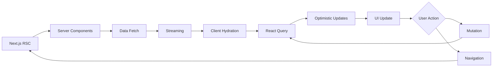

# Intuitive Modern Apps – UX Implementation Plan
**Version**: 1.0
**Created**: 2025-10-15
**Stack**: Next.js 15 | React 19 | TypeScript 5
**Timeline**: 12 weeks (3 sprints x 4 weeks)
**Team Size**: 4-6 developers (2 senior, 2-3 mid, 1-2 junior)

## Executive Summary

This implementation plan translates the comprehensive UX blueprint into an actionable 12-week development roadmap. The plan follows an incremental delivery approach, prioritizing foundational systems (design tokens, primitives) before building composite patterns and complete features.

### Strategic Approach
1. **Foundation First** (Weeks 1-4): Design system, primitives, App Shell
2. **Core Features** (Weeks 5-8): Onboarding, Dashboard, Search
3. **Advanced Features** (Weeks 9-12): Entity detail, Create flow, Settings

### Success Metrics Alignment
- **Activation**: Onboarding completion <5 minutes
- **Efficiency**: Task completion rate >95%
- **Quality**: Validation error rate <2%
- **Satisfaction**: CSAT ≥ 4.5/5, SUS ≥ 85
- **Performance**: LCP <2.5s, FID <100ms, CLS <0.1

---

## Phase 1: Foundation (Weeks 1-4)

### Week 1: Design System Foundation

**Goal**: Establish design tokens and base styling infrastructure

#### Tasks
1. **Design Tokens Implementation** (3 days)
   - [ ] Create CSS custom properties in `globals.css`
     - Color system (brand, semantic, surfaces)
     - Typography scale (size, line-height, letter-spacing)
     - Spacing scale (4px base, modular scale)
     - Border radius tokens
     - Shadow elevation tokens
     - Motion timing and easing
   - [ ] Create TypeScript token interface (`tokens.ts`)
   - [ ] Implement theme provider with dark mode support
   - [ ] Document token usage in Storybook

```typescript
// packages/ui/src/tokens/design-tokens.ts
export const tokens = {
  color: {
    brand: {
      primary: 'var(--brand-primary)',
      accent: 'var(--brand-accent)',
    },
    semantic: {
      success: 'var(--semantic-success)',
      warning: 'var(--semantic-warning)',
      danger: 'var(--semantic-danger)',
      info: 'var(--semantic-info)',
    },
    surface: {
      primary: 'var(--bg-surface)',
      subtle: 'var(--bg-subtle)',
    },
    foreground: {
      strong: 'var(--fg-strong)',
      muted: 'var(--fg-muted)',
    },
  },
  spacing: {
    1: 'var(--space-1)', // 4px
    2: 'var(--space-2)', // 8px
    4: 'var(--space-4)', // 16px
    8: 'var(--space-8)', // 32px
  },
  // ... more tokens
} as const;
```

2. **Tailwind Configuration** (1 day)
   - [ ] Extend Tailwind config with design tokens
   - [ ] Create custom utility classes for patterns
   - [ ] Set up JIT compilation
   - [ ] Configure PurgeCSS for production

3. **Accessibility Foundation** (2 days)
   - [ ] Implement focus management utilities
   - [ ] Create skip navigation component
   - [ ] Set up ARIA live region manager
   - [ ] Configure axe-core for automated a11y testing
   - [ ] Document WCAG 2.1 AA compliance checklist

**Deliverables**:
- `packages/ui/src/tokens/` directory with all tokens
- `apps/web/app/globals.css` with complete token system
- `tailwind.config.js` configured with tokens
- Storybook page documenting all tokens

---

### Week 2: Primitive Components (Atoms)

**Goal**: Build reusable atomic components with full accessibility

#### Tasks
1. **Form Primitives** (3 days)
   - [ ] Button (with variants, sizes, loading states)
   - [ ] IconButton (with accessible labels)
   - [ ] InputField (with label, helper text, error states)
   - [ ] TextArea (with auto-resize)
   - [ ] SelectField (with Radix UI Listbox)
   - [ ] Checkbox (with indeterminate state)
   - [ ] Toggle (switch component)
   - [ ] All components use React.forwardRef
   - [ ] Full TypeScript types with generics
   - [ ] ARIA attributes for screen readers

```typescript
// packages/ui/src/components/primitives/InputField.tsx
interface InputFieldProps extends React.InputHTMLAttributes<HTMLInputElement> {
  label: string;
  helperText?: string;
  error?: string;
  leftAddon?: React.ReactNode;
  rightAddon?: React.ReactNode;
}

export const InputField = React.forwardRef<HTMLInputElement, InputFieldProps>(
  ({ label, helperText, error, leftAddon, rightAddon, ...props }, ref) => {
    const id = React.useId();
    return (
      <div className="input-field">
        <label htmlFor={id}>{label}</label>
        <div className="input-wrapper">
          {leftAddon}
          <input
            ref={ref}
            id={id}
            aria-invalid={!!error}
            aria-describedby={error ? `${id}-error` : `${id}-helper`}
            {...props}
          />
          {rightAddon}
        </div>
        {error && <span id={`${id}-error`} role="alert">{error}</span>}
        {helperText && <span id={`${id}-helper`}>{helperText}</span>}
      </div>
    );
  }
);
```

2. **Feedback Primitives** (2 days)
   - [ ] Toast/Notification component (with auto-dismiss, actions)
   - [ ] Badge (status indicators)
   - [ ] Tag (with remove action)
   - [ ] Skeleton loader
   - [ ] Progress bar (linear and circular)
   - [ ] Spinner

3. **Display Primitives** (2 days)
   - [ ] Avatar (with fallback initials)
   - [ ] Card (with variants: elevated, outlined)
   - [ ] Modal/Dialog (with Radix UI Dialog)
   - [ ] Tooltip (with Radix UI Tooltip)
   - [ ] Tabs (with Radix UI Tabs)

4. **Storybook Documentation** (1 day)
   - [ ] Create story for each primitive
   - [ ] Add controls for all props
   - [ ] Show all variants and states
   - [ ] Add accessibility addon notes

**Deliverables**:
- 15+ primitive components in `packages/ui/src/components/primitives/`
- Full Storybook documentation
- Unit tests with React Testing Library
- Accessibility tested with axe-core

---

### Week 3: Pattern Components (Molecules)

**Goal**: Compose primitives into reusable patterns

#### Tasks
1. **App Shell Components** (3 days)
   - [ ] Header (with global search, notifications, user menu)
   - [ ] Sidebar (responsive, collapsible, with sub-navigation)
   - [ ] AppShell layout (with skip link, main landmark)
   - [ ] CommandMenu (Ctrl+K quick actions with cmdk)
   - [ ] NotificationTray (with badge counter, real-time updates)

2. **Data Display Patterns** (2 days)
   - [ ] DataTable (with sorting, pagination, row selection)
   - [ ] StatCard (KPI widget with trend indicator)
   - [ ] EmptyState (with illustration, CTA)
   - [ ] ErrorState (with retry, support link)
   - [ ] SearchResults (with filters, facets)

3. **Form Patterns** (2 days)
   - [ ] FormGroup (with validation, helper text)
   - [ ] InlineEdit (click-to-edit with save/cancel)
   - [ ] FileUpload (with drag-drop, progress)
   - [ ] DatePicker (with range selection)
   - [ ] ComboBox (searchable select with Radix UI Combobox)

4. **Navigation Patterns** (1 day)
   - [ ] Breadcrumbs (with overflow menu)
   - [ ] Stepper (wizard progress indicator)
   - [ ] Pagination (with page size selector)

**Deliverables**:
- 15+ pattern components
- Storybook stories with interaction tests
- Visual regression tests with Chromatic

---

### Week 4: App Shell & Routing

**Goal**: Implement base layout with Next.js 15 App Router

#### Tasks
1. **App Router Structure** (2 days)
   - [ ] Set up `/app` directory structure
     ```
     app/
     ├── (auth)/
     │   ├── login/
     │   └── signup/
     ├── (dashboard)/
     │   ├── home/
     │   ├── search/
     │   ├── entity/[id]/
     │   ├── create/
     │   └── settings/
     ├── onboarding/
     ├── layout.tsx (root layout with AppShell)
     ├── loading.tsx (top-level skeleton)
     └── error.tsx (error boundary)
     ```
   - [ ] Implement parallel routes for notifications
   - [ ] Set up intercepting routes for modals
   - [ ] Configure middleware for auth checks

2. **Root Layout** (2 days)
   - [ ] Implement AppShell with Header + Sidebar
   - [ ] Add theme provider (dark mode toggle)
   - [ ] Set up internationalization with next-intl
   - [ ] Implement skip navigation
   - [ ] Add loading states with Suspense boundaries

3. **Navigation State Management** (2 days)
   - [ ] Implement active nav highlighting
   - [ ] Add sidebar collapse state (localStorage persistence)
   - [ ] Handle keyboard shortcuts (/, Ctrl+K, ?)
   - [ ] Implement breadcrumb generation from route params
   - [ ] Add page transition loading indicator

4. **Performance Optimization** (2 days)
   - [ ] Implement font optimization (next/font)
   - [ ] Set up image optimization (next/image)
   - [ ] Configure prefetching strategy
   - [ ] Implement code splitting for heavy components
   - [ ] Set up Lighthouse CI for performance gates

**Deliverables**:
- Complete App Router structure
- Functional AppShell with responsive navigation
- Loading and error states
- Lighthouse score >90 on all metrics

---

## Phase 2: Core Features (Weeks 5-8)

### Week 5: Onboarding Wizard

**Goal**: Implement multi-step onboarding flow

#### Tasks
1. **Wizard Framework** (2 days)
   - [ ] Create wizard state machine (useReducer or XState)
   - [ ] Implement step navigation (next, back, skip)
   - [ ] Add progress indicator with step validation
   - [ ] Set up auto-save to localStorage (draft recovery)
   - [ ] Handle browser back button gracefully

2. **Onboarding Steps** (3 days)
   - [ ] Step 1: Welcome + profile basics (name, role, team)
   - [ ] Step 2: Integration connections (OAuth flows)
   - [ ] Step 3: Preferences (notifications, locale, timezone)
   - [ ] Step 4: Success summary + "Get Started" CTA
   - [ ] Each step has validation, loading, error states

3. **API Integration** (2 days)
   - [ ] Create API routes (`/api/onboarding`)
   - [ ] Implement Zod schema validation
   - [ ] Set up React Query mutations with optimistic updates
   - [ ] Handle session creation post-onboarding
   - [ ] Redirect to dashboard on completion

**Deliverables**:
- `/onboarding` route with 4-step wizard
- API integration with validation
- E2E test covering full onboarding flow
- Analytics tracking for drop-off points

---

### Week 6: Dashboard (Home)

**Goal**: Build data-rich dashboard with widgets

#### Tasks
1. **Dashboard Layout** (2 days)
   - [ ] Create grid layout (CSS Grid, responsive)
   - [ ] Implement widget sizing/ordering (save to user prefs)
   - [ ] Add empty state for new users
   - [ ] Handle loading with skeleton widgets

2. **Dashboard Widgets** (3 days)
   - [ ] Metrics Overview (StatCard grid, real-time updates)
   - [ ] Tasks List (with filters, quick actions)
   - [ ] Recommendations Feed (with dismiss, snooze)
   - [ ] Recent Activity (timeline component)
   - [ ] Quick Actions (CTA buttons to create, search)

3. **Data Fetching** (2 days)
   - [ ] Create `/api/dashboard` route (SSR + ISR)
   - [ ] Implement React Query for client-side refresh
   - [ ] Set up polling for real-time metrics (EventSource or WebSocket)
   - [ ] Handle stale data with refetch on focus
   - [ ] Cache strategy with React Query

4. **Interactions** (1 day)
   - [ ] Widget drill-down (modal or navigate to detail)
   - [ ] Dismiss recommendations (with undo toast)
   - [ ] Export dashboard data (CSV/PDF)

**Deliverables**:
- `/home` dashboard with 4+ widgets
- Real-time data updates
- Empty and error states
- Performance: TTI <3s

---

### Week 7: Search & Discovery

**Goal**: Implement federated search with facets

#### Tasks
1. **Search UI** (3 days)
   - [ ] Global search input in Header (with Ctrl+K)
   - [ ] Dedicated `/search` page with filter panel
   - [ ] Search results list (with highlight, snippet)
   - [ ] Faceted filters (status, owner, tags, date range)
   - [ ] Saved searches (save filter sets to user prefs)
   - [ ] Search suggestions (recent, popular)

2. **Search Functionality** (3 days)
   - [ ] Create `/api/search` route with query params
   - [ ] Implement debounced search (300ms)
   - [ ] Pagination or infinite scroll
   - [ ] Export results (CSV)
   - [ ] Keyboard navigation (arrow keys, Enter to select)
   - [ ] Zero-results state with tips + create CTA

3. **Search Performance** (2 days)
   - [ ] Implement search index (Algolia, ElasticSearch, or in-memory)
   - [ ] Optimize query performance (<400ms)
   - [ ] Add result caching
   - [ ] Prefetch on hover (result previews)

**Deliverables**:
- Global search in Header
- `/search` page with filters
- <400ms search response time
- Keyboard-accessible navigation

---

### Week 8: Entity Detail View

**Goal**: Build detailed entity view with inline editing

#### Tasks
1. **Detail Layout** (2 days)
   - [ ] Create `/entity/[id]` route
   - [ ] Implement tabbed interface (Overview, Activity, Related, Automation)
   - [ ] Action bar (Edit, Share, Duplicate, Archive)
   - [ ] Breadcrumb navigation

2. **Inline Edit** (3 days)
   - [ ] Click-to-edit fields (with save/cancel)
   - [ ] Optimistic updates (immediately reflect changes)
   - [ ] Conflict resolution (show diff modal on version mismatch)
   - [ ] Auto-save indicator ("Saving…" → "Saved")
   - [ ] Validation with Zod schema
   - [ ] Rollback on error with toast notification

3. **Related Data** (2 days)
   - [ ] Related entities list (with quick view modal)
   - [ ] Activity timeline (audit log)
   - [ ] Automation rules display
   - [ ] Prefetch related data on hover

4. **API Integration** (1 day)
   - [ ] `GET /api/entity/:id` (SSR with cache)
   - [ ] `PATCH /api/entity/:id` (optimistic concurrency with version)
   - [ ] Error handling (show traceId, retry)

**Deliverables**:
- `/entity/[id]` with full detail view
- Inline editing with optimistic updates
- Conflict resolution UI
- E2E test for edit flow

---

## Phase 3: Advanced Features (Weeks 9-12)

### Week 9: Create Flow

**Goal**: Implement guided entity creation

#### Tasks
1. **Create Form** (3 days)
   - [ ] Multi-step form with progressive disclosure
   - [ ] Template library (predefined configurations)
   - [ ] Contextual defaults based on user profile
   - [ ] Draft auto-save to IndexedDB (persist across sessions)
   - [ ] Preview mode before submission

2. **Validation & Submit** (2 days)
   - [ ] Zod schema validation (inline errors)
   - [ ] Async validation (unique checks)
   - [ ] Submit with loading state
   - [ ] Success state (redirect to new entity, or stay + create another)
   - [ ] Error handling with recovery

3. **Templates** (2 days)
   - [ ] `GET /api/templates` (list available templates)
   - [ ] Template preview modal
   - [ ] Apply template (populate form fields)
   - [ ] Save custom template

**Deliverables**:
- `/create` route with multi-step form
- Template system
- Draft persistence
- Validation with Zod

---

### Week 10: Settings & Preferences

**Goal**: Implement user preferences and localization

#### Tasks
1. **Settings Layout** (1 day)
   - [ ] `/settings` with side navigation (General, Notifications, Accessibility, Localization)
   - [ ] Grouped form sections
   - [ ] Auto-save toggle (save on blur vs explicit save)
   - [ ] Unsaved changes guard (confirm before leaving)

2. **General Preferences** (2 days)
   - [ ] Profile settings (name, email, avatar)
   - [ ] Notification preferences (email, in-app, push)
   - [ ] Theme selection (light, dark, system)
   - [ ] Dashboard widget configuration

3. **Accessibility Settings** (2 days)
   - [ ] Contrast mode (high contrast toggle)
   - [ ] Motion preferences (respect prefers-reduced-motion)
   - [ ] Font size adjustment
   - [ ] Keyboard shortcut customization

4. **Localization** (3 days)
   - [ ] Language selector (with flag icons, search)
   - [ ] Timezone selector (grouped by region)
   - [ ] Date/time format preview
   - [ ] Number/currency format
   - [ ] Implement next-intl with SSR support
   - [ ] RTL support (directional tokens)

**Deliverables**:
- `/settings` with 4 subsections
- Localization with next-intl
- Accessibility customization
- Auto-save functionality

---

### Week 11: Notifications & Real-Time

**Goal**: Implement notification system

#### Tasks
1. **Notification UI** (2 days)
   - [ ] Notification tray (slide-in panel)
   - [ ] Badge counter on Header
   - [ ] Toast notifications (success, error, info)
   - [ ] Stacked toasts with auto-dismiss
   - [ ] Undo action affordance

2. **Real-Time Updates** (3 days)
   - [ ] Server-Sent Events (SSE) for notifications
   - [ ] WebSocket connection for dashboard updates
   - [ ] Optimistic UI updates
   - [ ] Handle connection loss gracefully
   - [ ] Reconnect with exponential backoff

3. **Notification Management** (2 days)
   - [ ] Mark as read/unread
   - [ ] Archive notifications
   - [ ] Notification preferences (what to notify)
   - [ ] Email digest configuration

**Deliverables**:
- Notification tray with real-time updates
- Toast system
- Notification preferences

---

### Week 12: Polish, Testing & Launch

**Goal**: Final polish, comprehensive testing, performance optimization

#### Tasks
1. **Performance Optimization** (3 days)
   - [ ] Bundle analysis (reduce bundle size by 30%)
   - [ ] Code splitting for heavy components
   - [ ] Image optimization (WebP, AVIF)
   - [ ] Font subsetting
   - [ ] Lazy load below-the-fold content
   - [ ] Implement service worker for offline support
   - [ ] Cache strategy (stale-while-revalidate)
   - [ ] Achieve Core Web Vitals targets (LCP <2.5s, FID <100ms, CLS <0.1)

2. **Comprehensive Testing** (3 days)
   - [ ] E2E test suite (Playwright)
     - Onboarding flow
     - Dashboard interaction
     - Search to detail navigation
     - Create entity
     - Settings update
   - [ ] Visual regression tests (Chromatic)
   - [ ] Accessibility audit (axe-core, manual testing)
   - [ ] Performance testing (Lighthouse CI, WebPageTest)
   - [ ] Load testing (k6 or Artillery for API)

3. **Documentation & Handoff** (2 days)
   - [ ] Update Storybook with all components
   - [ ] Create usage documentation for each pattern
   - [ ] Write deployment guide
   - [ ] Create user onboarding guide
   - [ ] Record demo videos for key flows
   - [ ] Prepare handoff pack (Figma + Storybook links)

**Deliverables**:
- Lighthouse score >90 (all categories)
- 80%+ test coverage
- Complete Storybook documentation
- Deployment-ready application

---

## Implementation Details

### Technical Architecture

#### Next.js 15 App Router Structure
```
apps/web/
├── app/
│   ├── (auth)/
│   │   ├── layout.tsx
│   │   ├── login/page.tsx
│   │   └── signup/page.tsx
│   ├── (dashboard)/
│   │   ├── layout.tsx (AppShell)
│   │   ├── home/page.tsx (Dashboard)
│   │   ├── search/page.tsx
│   │   ├── entity/[id]/page.tsx
│   │   ├── create/page.tsx
│   │   └── settings/
│   │       ├── page.tsx
│   │       ├── accessibility/page.tsx
│   │       └── localization/page.tsx
│   ├── onboarding/page.tsx
│   ├── api/
│   │   ├── onboarding/route.ts
│   │   ├── dashboard/route.ts
│   │   ├── search/route.ts
│   │   ├── entity/[id]/route.ts
│   │   └── settings/route.ts
│   ├── layout.tsx (root)
│   ├── loading.tsx
│   ├── error.tsx
│   └── globals.css
├── lib/
│   ├── api-client.ts
│   ├── react-query-provider.tsx
│   └── intl-provider.tsx
└── middleware.ts (auth, i18n)

packages/ui/
├── src/
│   ├── tokens/
│   │   └── design-tokens.ts
│   ├── components/
│   │   ├── primitives/ (atoms)
│   │   ├── patterns/ (molecules)
│   │   └── screens/ (organisms)
│   ├── lib/
│   │   ├── utils.ts
│   │   └── hooks.ts
│   └── index.ts
└── package.json
```

#### State Management Strategy
- **Server State**: React Query for all async data fetching
- **Client State**: React Context + useReducer for complex local state (wizard, forms)
- **URL State**: searchParams for filters, pagination
- **Persistent State**: localStorage for preferences, IndexedDB for drafts

#### Data Flow


### API Design

#### REST Endpoints
```typescript
// Onboarding
GET    /api/onboarding          // Get current step
POST   /api/onboarding          // Save step progress

// Dashboard
GET    /api/dashboard           // Get widgets data

// Search
GET    /api/search?q=&filters=  // Search results

// Entity
GET    /api/entity/:id          // Get entity
PATCH  /api/entity/:id          // Update entity
DELETE /api/entity/:id          // Delete entity

// Create
GET    /api/templates           // List templates
POST   /api/entity              // Create new entity

// Settings
GET    /api/settings            // Get user settings
PUT    /api/settings            // Update settings
GET    /api/locales             // Available locales
```

#### Response Format
```typescript
interface APIResponse<T> {
  data?: T;
  error?: {
    code: string;
    message: string;
    field?: string;
  };
  meta?: {
    traceId: string;
    timestamp: string;
  };
}
```

### Testing Strategy

#### Unit Tests (Vitest)
- Component logic (hooks, utilities)
- Form validation (Zod schemas)
- State machines
- Data transformations

#### Component Tests (React Testing Library)
- User interactions
- Form submissions
- Keyboard navigation
- Accessibility (axe-core)

#### E2E Tests (Playwright)
- Critical user flows
- Cross-browser testing (Chrome, Firefox, Safari)
- Mobile viewport testing
- Network conditions (slow 3G)

#### Visual Regression (Chromatic)
- Component snapshots in Storybook
- Responsive breakpoints
- Theme variations (light/dark)

### Performance Budget

| Metric | Target | Budget |
|--------|--------|--------|
| LCP | <2.5s | 2.5s |
| FID | <100ms | 100ms |
| CLS | <0.1 | 0.1 |
| FCP | <1.8s | 2.0s |
| TTI | <3.8s | 4.0s |
| Bundle Size (JS) | <200KB | 250KB |
| Bundle Size (CSS) | <50KB | 75KB |
| Image Size | <200KB/image | 300KB |

---

## Resource Allocation

### Team Structure
- **Tech Lead** (1): Architecture decisions, code reviews, unblocking
- **Senior Frontend** (1): Complex components, performance, accessibility
- **Mid-level Frontend** (2-3): Feature implementation, testing
- **Junior Frontend** (1-2): Primitive components, Storybook, tests

### Sprint Breakdown
- **Sprint 1** (Weeks 1-4): Foundation – 160-200 dev hours
- **Sprint 2** (Weeks 5-8): Core Features – 180-220 dev hours
- **Sprint 3** (Weeks 9-12): Advanced Features – 180-220 dev hours

**Total Estimate**: 520-640 dev hours (13-16 weeks at 40 hours/week for 1 developer, or 3.25-4 months with 4 developers in parallel)

---

## Risks & Mitigation

### Technical Risks

1. **Next.js 15 / React 19 Stability**
   - Risk: New APIs may have bugs or breaking changes
   - Mitigation: Pin versions, test thoroughly, have rollback plan
   - Impact: High | Likelihood: Medium

2. **Performance on Low-End Devices**
   - Risk: Rich animations and real-time updates impact FID
   - Mitigation: Respect `prefers-reduced-motion`, lazy load, code split
   - Impact: High | Likelihood: Medium

3. **State Synchronization Complexity**
   - Risk: Optimistic updates + real-time data cause conflicts
   - Mitigation: Version-based concurrency, conflict resolution UI
   - Impact: High | Likelihood: High

4. **Accessibility Compliance**
   - Risk: Complex interactions fail WCAG 2.1 AA
   - Mitigation: Automated testing (axe-core), manual audits, user testing
   - Impact: Critical | Likelihood: Medium

### Organizational Risks

1. **Scope Creep**
   - Risk: Stakeholders request additional features mid-sprint
   - Mitigation: Strict change control, product backlog prioritization
   - Impact: High | Likelihood: High

2. **Design Changes**
   - Risk: Design iterations late in development
   - Mitigation: Design sign-off before implementation, component versioning
   - Impact: Medium | Likelihood: Medium

3. **Resource Availability**
   - Risk: Team members unavailable (sick, vacation, competing priorities)
   - Mitigation: Cross-training, documentation, buffer in timeline
   - Impact: High | Likelihood: Medium

---

## Acceptance Criteria

### Phase 1 (Foundation)
- [ ] All design tokens implemented and documented
- [ ] 15+ primitive components with Storybook stories
- [ ] 15+ pattern components
- [ ] AppShell with responsive navigation
- [ ] Lighthouse score >90
- [ ] Accessibility audit passes (axe-core)

### Phase 2 (Core Features)
- [ ] Onboarding wizard (4 steps, <5 min completion)
- [ ] Dashboard with real-time widgets
- [ ] Search with <400ms response time
- [ ] Entity detail with inline editing
- [ ] Test coverage >70%

### Phase 3 (Advanced Features)
- [ ] Create flow with templates
- [ ] Settings with localization (next-intl)
- [ ] Notification system with real-time updates
- [ ] Core Web Vitals green (LCP <2.5s, FID <100ms, CLS <0.1)
- [ ] Test coverage >80%
- [ ] Complete E2E test suite

### Launch Readiness
- [ ] All user flows tested end-to-end
- [ ] Performance budget met
- [ ] Accessibility compliance verified (WCAG 2.1 AA)
- [ ] Documentation complete (Storybook, usage guides)
- [ ] Security audit passed
- [ ] Production deployment successful

---

## Next Steps

1. **Kickoff Meeting** (Week 0)
   - Review this implementation plan with team
   - Align on technical decisions (state management, API design)
   - Set up development environment
   - Create project board (Linear, Jira, or GitHub Projects)

2. **Design Handoff** (Week 0)
   - Receive Figma files with all screens and components
   - Review design tokens and ensure alignment
   - Clarify any UX questions or edge cases

3. **Sprint Planning** (Before Week 1)
   - Break down Phase 1 tasks into stories/tickets
   - Assign work to team members
   - Set up daily standups and weekly demos
   - Define "done" criteria for each story

4. **Development Start** (Week 1, Day 1)
   - Begin with design tokens implementation
   - Set up Storybook
   - Create first primitive component (Button)
   - Establish code review process

---

**Approved By**: _________________
**Date**: _________________
**Next Review**: After Sprint 1 (Week 4)
