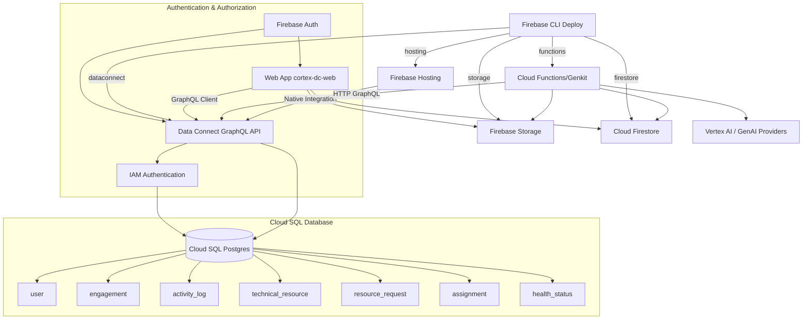
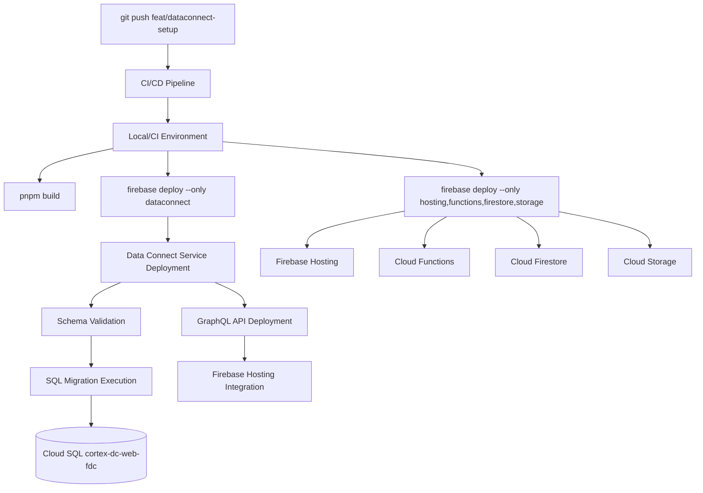
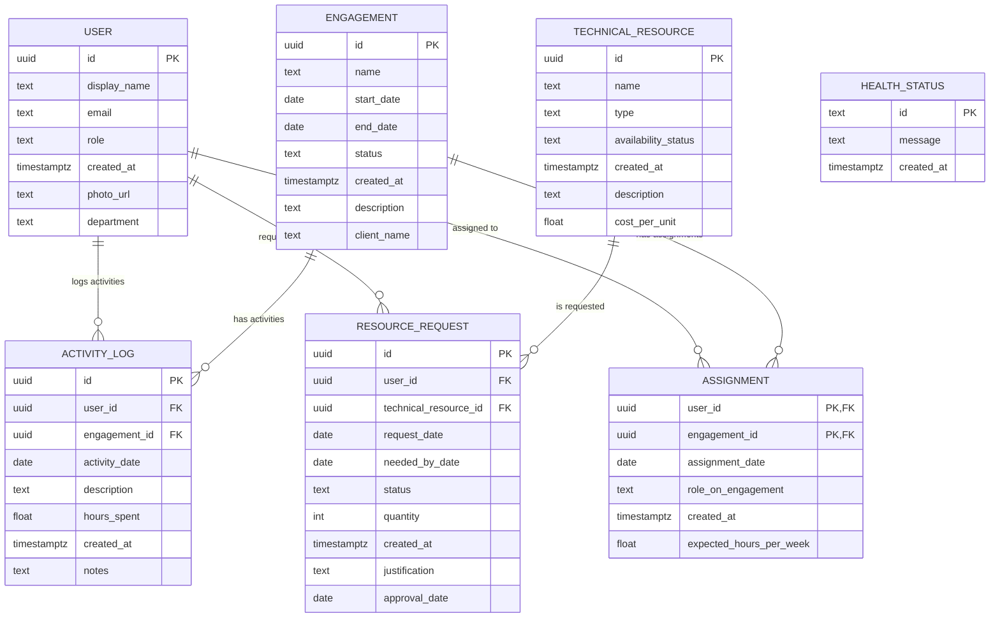

# Firebase Data Connect Architecture for cortex-dc-web

## Executive Summary

This document outlines the Firebase Data Connect implementation for the cortex-dc-web platform, providing GraphQL API access to Cloud SQL Postgres database with integrated Firebase services. The implementation supports the full Domain Consultant workflow including user management, engagement tracking, resource allocation, and health monitoring.

## Component Relationship Architecture



## Deployment Flow Architecture



## Data Connect Service Architecture

### Service Configuration
- **Service ID**: cortex-dc-web  
- **Location**: us-central1
- **Database**: cortex-dc-portal:us-central1:cortex-dc-web-fdc/fdcdb
- **Schema Source**: ./dataconnect/schema/schema.gql
- **Connectors**: ./dataconnect/example/

### GraphQL Schema Structure



## File Layout and Responsibilities

### Core Configuration Files
```
dataconnect/
├── dataconnect.yaml              # Main Data Connect service configuration
├── schema/
│   └── schema.gql               # GraphQL schema with @table directives
├── example/
│   ├── connector.yaml           # SDK generation configuration
│   ├── queries.gql              # GraphQL queries with @auth directives
│   └── mutations.gql            # GraphQL mutations with @auth directives
├── sql/
│   └── 001_init_health.sql      # SQL migration scripts (preserved)
├── docs/
│   ├── dataconnect-setup-notes.md    # Setup documentation
│   └── health.graphql.backup    # Original health schema (preserved)
└── README.md                    # DataConnect overview
```

### Generated Files
```
src/
└── dataconnect-generated/       # Auto-generated TypeScript SDK
    ├── index.ts                 # Generated client code
    └── types.ts                 # Generated TypeScript types
```

## Authentication & Security

### Authentication Levels
- **PUBLIC**: Health status monitoring (GetHealthStatus, CreateHealthStatus)
- **USER**: Domain operations (GetUsers, GetEngagements, CreateUser, CreateEngagement)

### IAM Configuration
- **Cloud SQL IAM Authentication**: Enabled
- **Firebase Authentication**: Integrated with Data Connect
- **Service Account**: Uses Firebase default SA for deployment
- **Runtime Access**: Automatic Cloud SQL Client role assignment

## API Endpoints and Operations

### Available Queries
```graphql
query GetHealthStatus @auth(level: PUBLIC) {
  healthStatuses(orderBy: { createdAt: DESC }, limit: 10) {
    id
    message
    createdAt
  }
}

query GetUsers @auth(level: USER) {
  users(orderBy: { createdAt: DESC }) {
    displayName
    email
    role
    createdAt
  }
}

query GetEngagements @auth(level: USER) {
  engagements(orderBy: { startDate: DESC }) {
    name
    startDate 
    endDate
    status
    description
    clientName
  }
}
```

### Available Mutations
```graphql
mutation CreateHealthStatus($id: String!, $message: String!, $createdAt: Timestamp!) @auth(level: PUBLIC)

mutation CreateUser($displayName: String!, $email: String!, $role: String!, $createdAt: Timestamp!) @auth(level: USER)

mutation CreateEngagement($name: String!, $startDate: Date!, $endDate: Date!, $status: String!, $createdAt: Timestamp!) @auth(level: USER)
```

## Database Schema Migration

### Automatic Schema Management
Firebase Data Connect automatically manages schema migrations by:
1. Comparing GraphQL schema with current database state
2. Generating SQL migration statements
3. Executing migrations with user confirmation
4. Creating required indexes and foreign keys

### Applied Migrations
```sql
-- UUID extension
CREATE EXTENSION IF NOT EXISTS "uuid-ossp";

-- Core tables with relationships
CREATE TABLE "public"."user" (...);
CREATE TABLE "public"."engagement" (...);  
CREATE TABLE "public"."activity_log" (...);
CREATE TABLE "public"."technical_resource" (...);
CREATE TABLE "public"."resource_request" (...);
CREATE TABLE "public"."assignment" (...);
CREATE TABLE "public"."health_status" (...);

-- Foreign key constraints and indexes automatically created
```

## Integration with cortex-dc-web Platform

### Frontend Integration
- **Generated SDK**: TypeScript client automatically generated in `src/dataconnect-generated/`
- **React Integration**: Compatible with React hooks and state management
- **Authentication**: Uses Firebase Auth tokens for secured operations
- **Real-time**: Supports GraphQL subscriptions for live updates

### Backend Integration  
- **Cloud Functions**: Can query GraphQL API directly
- **Genkit Integration**: AI workflows can access structured domain data
- **Firebase Services**: Unified with existing Firestore, Storage, Auth

## Deployment and Operations

### NPM Scripts
```json
{
  "firebase:dataconnect": "firebase deploy --only dataconnect",
  "firebase:deploy:dataconnect": "firebase deploy --only dataconnect", 
  "firebase:deploy:all": "pnpm build && firebase deploy"
}
```

### Emulator Support
```json
{
  "emulators": {
    "dataconnect": {
      "port": 9399,
      "dataDir": "dataconnect/.dataconnect/pgliteData"
    }
  }
}
```

## Monitoring and Observability

### Console Access
- **Firebase Console**: https://console.firebase.google.com/project/cortex-dc-portal/dataconnect/locations/us-central1/services/cortex-dc-web/schema
- **Cloud SQL Console**: https://console.cloud.google.com/sql/instances
- **Cloud Run Logs**: Auto-generated service logs

### Key Metrics to Monitor
- GraphQL query latency and error rates
- Cloud SQL connection pool utilization
- Database query performance
- Authentication success rates

## Rollback Strategy

### Schema Rollbacks
1. **Immediate**: Revert dataconnect.yaml to previous version
2. **Deploy**: `firebase deploy --only dataconnect`
3. **Database**: Manual SQL rollback if schema changes applied
4. **Verification**: Test critical queries and mutations

### Configuration Rollbacks
1. **Git Revert**: `git revert <commit-hash>`
2. **Firebase Restore**: Deploy previous configuration
3. **Emulator Testing**: Validate in local environment first

## Future Enhancements

### Planned Expansions
- **Advanced Auth**: Row-level security policies
- **GraphQL Subscriptions**: Real-time engagement updates  
- **Migration Pipeline**: Automated SQL migration deployment
- **Performance**: Query optimization and caching
- **Integration**: henryreed.ai domain model migration

### Scalability Considerations
- Cloud SQL read replicas for query performance
- Connection pooling optimization
- GraphQL query complexity analysis
- Horizontal scaling of Cloud Run instances

## Change Log

### v1.0.0 (2025-10-08)
- Initial Firebase Data Connect implementation
- Cloud SQL Postgres database provisioned (cortex-dc-web-fdc)
- Core domain schema deployed (User, Engagement, ActivityLog, etc.)
- Authentication and authorization configured
- GraphQL API endpoint deployed and integrated
- Development workflow and scripts established
- Comprehensive documentation and architecture defined

---

*This document serves as the living architectural reference for the cortex-dc-web Firebase Data Connect implementation. All changes should be documented here with appropriate versioning.*