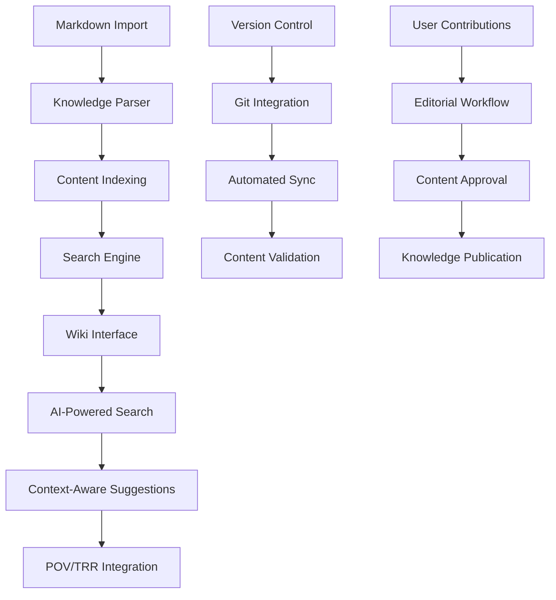
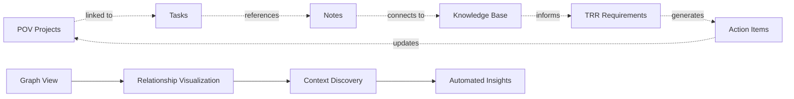
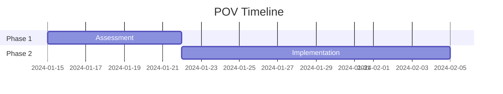
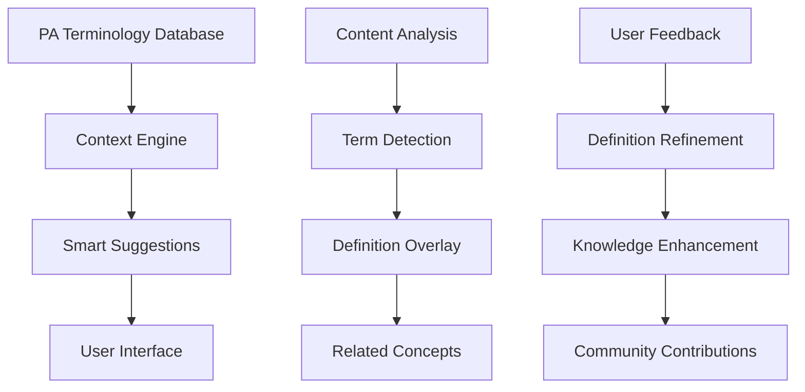
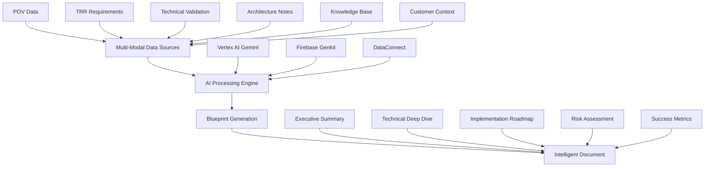
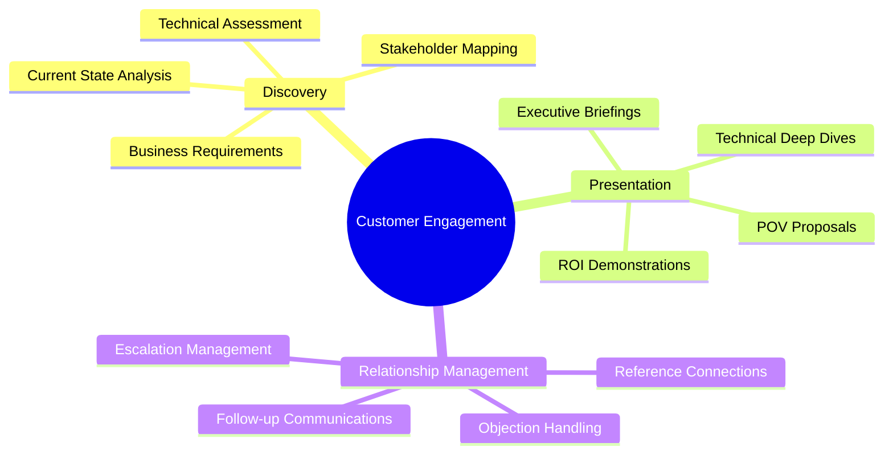

# Enterprise Features Roadmap: Cortex DC Platform

## 🎯 Executive Summary

This document outlines the strategic enhancement of the Cortex Domain Consultant Platform with enterprise-grade features focused on knowledge management, project coordination, and domain-specific tooling. These additions will transform the platform from a workflow management tool into a comprehensive knowledge and collaboration ecosystem for Palo Alto Networks domain consultants.

## 🏢 New Enterprise Features

### 1. Internal Knowledge Base System 📚

#### Strategic Approach: Embedded Wiki-Style Knowledge Management

**Recommended Solution: GitBook-Style Implementation with Custom Extensions**



#### Implementation Strategy

**Phase 1: Foundation (Weeks 9-11)**
- **Knowledge Base Engine**: Custom markdown processor with MDX support
- **Content Management**: File-based system with Git integration
- **Search Infrastructure**: Full-text search with semantic capabilities
- **Import Pipeline**: Automated markdown ingestion from multiple sources

**Technical Stack:**
```typescript
// Knowledge Base Architecture
interface KnowledgeBaseSystem {
  contentEngine: {
    parser: 'MDX' | 'CommonMark';
    processor: 'remark' | 'unified';
    renderer: 'React' | 'Custom';
  };
  searchEngine: {
    backend: 'Elasticsearch' | 'Algolia' | 'Firebase Search';
    features: ['full-text', 'semantic', 'contextual'];
    ai: 'Vertex AI Embeddings';
  };
  storage: {
    content: 'Cloud Storage' | 'Firestore';
    metadata: 'Firestore';
    cache: 'Redis' | 'Memory';
  };
}
```

**Knowledge Base Features:**
- **Continuous Import**: Automated markdown file processing
- **Version Control**: Git-based content versioning
- **Rich Media**: Support for images, videos, diagrams
- **Cross-References**: Automatic link generation between articles
- **Categories**: Technical documentation, best practices, troubleshooting
- **Templates**: Standardized article formats for different content types

#### Open Source Solutions Analysis

| Solution | Pros | Cons | Fit Score |
|----------|------|------|-----------|
| **GitBook** | Rich editor, Git sync, beautiful UI | Closed source, limited customization | 7/10 |
| **BookStack** | Self-hosted, user-friendly, permissions | PHP stack, limited scalability | 6/10 |
| **DokuWiki** | File-based, no database, extensible | Legacy UI, complex customization | 5/10 |
| **TiddlyWiki** | Non-linear, highly flexible | Steep learning curve | 4/10 |
| **Outline** | Modern, team-focused, React-based | Complex setup, heavy dependencies | 8/10 |
| **Siyuan** | Block-based, Obsidian-like | New project, limited enterprise features | 6/10 |

**Recommended Approach: Custom Implementation inspired by Outline + GitBook**

```typescript
// Knowledge Base Component Architecture
const KnowledgeBaseComponents = {
  reader: 'ArticleViewer', // Rich markdown renderer
  editor: 'MarkdownEditor', // WYSIWYG + markdown
  browser: 'ContentExplorer', // Tree navigation
  search: 'SmartSearch', // AI-enhanced search
  import: 'ContentImporter', // Batch markdown import
  export: 'MultiFormatExporter', // PDF, HTML, JSON
};
```

#### Integration Points

**POV Management Integration:**
- Link knowledge articles to POV templates
- Auto-suggest relevant documentation during POV creation
- Embed knowledge snippets in POV reports

**TRR Management Integration:**
- Technical reference lookup during validation
- Compliance documentation access
- Best practices suggestions

### 2. Enhanced Project Management Capabilities 📊

#### Strategic Approach: Obsidian-Style Linked Knowledge with Task Management

**Core Philosophy: Everything is Connected**



#### Feature Set

**Hyperlinked Markdown System:**
```markdown
# POV Project: [[Enterprise Security Assessment]]

## Connected Elements
- **Customer**: [[Acme Corporation]]
- **Scenarios**: [[Insider Threat Detection]], [[Zero Trust Implementation]]
- **TRR Requirements**: [[#TRR-2024-001]], [[#TRR-2024-002]]
- **Team Members**: [[john.doe@paloaltonetworks.com]], [[jane.smith@paloaltonetworks.com]]

## Tasks
- [ ] Complete initial assessment [[2024-01-15]]
- [x] Deploy test environment [[2024-01-10]] ✅
- [ ] Generate POV report → [[POV Templates/Security Assessment]]

## Notes
![[Meeting Notes/2024-01-12 Customer Kickoff]]

## Timeline


**Project Management Components:**

```typescript
interface ProjectManagementSystem {
  tasks: {
    creation: 'Natural Language' | 'Template-based';
    assignment: 'Auto-suggest' | 'Manual';
    tracking: 'Real-time' | 'Batch';
    visualization: 'Kanban' | 'Gantt' | 'Calendar';
  };
  notes: {
    format: 'Markdown' | 'Rich Text';
    linking: 'Bidirectional' | 'Unidirectional';
    tagging: 'Hierarchical' | 'Flat';
    search: 'Full-text' | 'Semantic';
  };
  relationships: {
    discovery: 'Automatic' | 'Manual';
    visualization: 'Graph' | 'Tree' | 'Timeline';
    suggestions: 'AI-powered' | 'Rule-based';
  };
}
```

#### Implementation Features

**Smart Task Management:**
- **Natural Language Processing**: "Schedule demo with Acme next week" → Creates task with date
- **Context Awareness**: Tasks automatically linked to relevant POVs, TRRs, and knowledge
- **Priority Intelligence**: AI-suggested priorities based on deadlines and relationships
- **Automated Follow-ups**: Smart reminders based on project phase and customer engagement

**Note-Taking System:**
- **Bi-directional Linking**: `[[Customer Name]]` creates automatic connections
- **Tag Intelligence**: Smart tags based on content analysis
- **Template Library**: Pre-built templates for meetings, assessments, technical reviews
- **Version History**: Full audit trail of note changes

**Relationship Mapping:**
- **Graph Visualization**: Interactive network of projects, tasks, people, and knowledge
- **Context Discovery**: "Show me everything related to this customer"
- **Impact Analysis**: "What projects are affected if this task is delayed?"
- **Knowledge Gaps**: Identify missing documentation or connections

### 3. Integrated Palo Alto Networks Dictionary 📖

#### Strategic Approach: Context-Aware Terminology System



#### Dictionary Features

**Comprehensive Terminology Database:**
```typescript
interface PADictionaryEntry {
  term: string;
  category: 'Product' | 'Technology' | 'Process' | 'Acronym';
  definition: string;
  context: string[];
  relatedTerms: string[];
  examples: string[];
  lastUpdated: Date;
  confidence: number;
  sources: string[];
}

// Example entries
const sampleEntries: PADictionaryEntry[] = [
  {
    term: "NGFW",
    category: "Product",
    definition: "Next-Generation Firewall - Advanced firewall with application awareness, intrusion prevention, and advanced threat detection capabilities.",
    context: ["Security", "Network", "Infrastructure"],
    relatedTerms: ["Firewall", "IPS", "Application Control", "User-ID"],
    examples: ["PA-220", "PA-3220", "VM-Series"],
    lastUpdated: new Date("2024-01-01"),
    confidence: 0.95,
    sources: ["Product Documentation", "Sales Training"]
  },
  {
    term: "AutoFocus",
    category: "Product",
    definition: "Threat intelligence service that provides contextual information about malware and attacks targeting your network.",
    context: ["Threat Intelligence", "Analysis", "Security"],
    relatedTerms: ["WildFire", "Threat Prevention", "IOCs"],
    examples: ["Campaign Analysis", "Threat Hunting", "IOC Enrichment"],
    lastUpdated: new Date("2024-01-01"),
    confidence: 0.90,
    sources: ["Product Documentation", "Technical Training"]
  }
];
```

**Smart Integration Features:**
- **Contextual Definitions**: Hover-over definitions in all content
- **Smart Search**: Type-ahead with terminology suggestions
- **Content Enhancement**: Automatic term linking in knowledge base articles
- **Acronym Expansion**: Automatic full-form display for acronyms
- **Related Concepts**: Suggested reading based on current terminology
- **Learning Mode**: Progressive disclosure of related terms

### 4. AI-Powered Blueprint Generation 🤖

#### Strategic Approach: Multi-Modal Document Intelligence with Firebase Genkit

**The "Badass Blueprint" - Intelligent Document Synthesis**



#### AI Blueprint System Architecture

**Firebase Genkit Multi-Modal Processing:**
```typescript
// AI Blueprint Generation System
interface AIBlueprintSystem {
  dataIngestion: {
    sources: ['POV', 'TRR', 'Notes', 'Architecture', 'Knowledge Base'];
    formats: ['Text', 'Images', 'Diagrams', 'Tables', 'JSON'];
    preprocessing: 'Vertex AI Document AI';
  };
  aiProcessing: {
    model: 'Vertex AI Gemini Pro';
    capabilities: ['Multi-modal', 'Code Analysis', 'Document Understanding'];
    framework: 'Firebase Genkit';
    techniques: ['RAG', 'Chain-of-Thought', 'Multi-step Reasoning'];
  };
  blueprintGeneration: {
    templates: 'Dynamic Template Engine';
    personalization: 'Customer & Industry Specific';
    formats: ['PDF', 'HTML', 'Markdown', 'Interactive'];
    intelligence: 'Context-Aware Content Selection';
  };
}
```

#### Core Blueprint Features

**1. Intelligent Data Synthesis**
```typescript
// Blueprint Data Aggregation
interface BlueprintDataSources {
  povData: {
    objectives: string[];
    successCriteria: string[];
    timeline: ProjectTimeline;
    stakeholders: Stakeholder[];
    scenarios: ScenarioData[];
  };
  trrValidation: {
    requirements: TechnicalRequirement[];
    validationResults: ValidationResult[];
    riskAssessment: RiskAnalysis;
    complianceStatus: ComplianceCheck[];
  };
  architectureNotes: {
    currentState: ArchitectureDescription;
    proposedSolution: SolutionArchitecture;
    integrationPoints: IntegrationSpec[];
    securityConsiderations: SecurityRequirement[];
  };
  knowledgeContext: {
    relevantArticles: KnowledgeArticle[];
    bestPractices: BestPractice[];
    lessonsLearned: LessonLearned[];
    competitorAnalysis: CompetitiveIntel[];
  };
  customerContext: {
    industry: string;
    size: CompanySize;
    maturityLevel: SecurityMaturity;
    constraints: BusinessConstraint[];
    preferences: CustomerPreference[];
  };
}
```

**2. Multi-Modal Content Processing**
```typescript
// Firebase Genkit Multi-Modal Flow
import { genkit } from 'genkit';
import { vertexAI } from '@genkit-ai/vertexai';

const blueprintFlow = genkit({
  plugins: [vertexAI()],
  flows: {
    generateBlueprint: async (input: BlueprintRequest) => {
      // Step 1: Multi-modal data ingestion
      const processedData = await processMultiModalData({
        textSources: input.notes,
        imageSources: input.architectureDiagrams,
        structuredData: input.povData,
        documentSources: input.technicalSpecs
      });
      
      // Step 2: AI-powered analysis and synthesis
      const analysis = await generate({
        model: 'vertexai/gemini-pro',
        prompt: [
          {text: 'Analyze the following multi-modal project data:'},
          {data: processedData, mimeType: 'application/json'},
          {text: 'Generate a comprehensive project blueprint including executive summary, technical architecture, implementation plan, risk assessment, and success metrics.'}
        ]
      });
      
      // Step 3: Structured document generation
      const blueprint = await generateStructuredDocument(analysis);
      
      return blueprint;
    }
  }
});
```

**3. Dynamic Blueprint Templates**
```typescript
// Intelligent Template System
interface BlueprintTemplate {
  id: string;
  name: string;
  type: 'Executive' | 'Technical' | 'Implementation' | 'Comprehensive';
  audience: 'C-Level' | 'Technical' | 'Operations' | 'Mixed';
  sections: {
    executiveSummary: TemplateSection;
    businessCase: TemplateSection;
    technicalArchitecture: TemplateSection;
    implementationPlan: TemplateSection;
    riskAssessment: TemplateSection;
    successMetrics: TemplateSection;
    appendices: TemplateSection[];
  };
  aiPrompts: {
    contentGeneration: string;
    styleGuide: string;
    qualityChecks: string[];
  };
}

// Smart Template Selection
const selectOptimalTemplate = async (context: ProjectContext): Promise<BlueprintTemplate> => {
  const templateAnalysis = await generate({
    model: 'vertexai/gemini-pro',
    prompt: `
      Based on the following project context, recommend the optimal blueprint template:
      - Customer Industry: ${context.industry}
      - Stakeholder Types: ${context.stakeholders.map(s => s.role).join(', ')}
      - Project Complexity: ${context.complexity}
      - Timeline: ${context.timeline}
      - Business Drivers: ${context.businessDrivers.join(', ')}
      
      Return the template ID and customization recommendations.
    `
  });
  
  return await customizeTemplate(templateAnalysis.output());
};
```

#### Blueprint Generation Workflow

**Phase 1: Data Collection & Preprocessing**
```typescript
// Multi-source data aggregation
const collectBlueprintData = async (projectId: string): Promise<BlueprintDataSources> => {
  const [povData, trrData, notes, architecture, knowledge] = await Promise.all([
    getPOVData(projectId),
    getTRRValidation(projectId),
    getProjectNotes(projectId),
    getArchitectureDocuments(projectId),
    getRelevantKnowledge(projectId)
  ]);
  
  // Process images and diagrams with Document AI
  const processedImages = await processArchitectureDiagrams(architecture.diagrams);
  
  return {
    povData,
    trrValidation: trrData,
    architectureNotes: {
      ...architecture,
      processedDiagrams: processedImages
    },
    knowledgeContext: knowledge,
    customerContext: await getCustomerProfile(povData.customerId)
  };
};
```

**Phase 2: AI-Powered Analysis**
```typescript
// Intelligent content analysis and synthesis
const analyzeProjectData = async (data: BlueprintDataSources): Promise<ProjectAnalysis> => {
  // Multi-step reasoning with Genkit
  const analysisChain = await genkit.run('project-analysis', {
    steps: [
      {
        name: 'risk-assessment',
        prompt: 'Analyze technical and business risks based on the provided data',
        input: data
      },
      {
        name: 'solution-optimization',
        prompt: 'Recommend optimal solution architecture considering constraints',
        input: data
      },
      {
        name: 'implementation-strategy',
        prompt: 'Develop phased implementation plan with milestones',
        input: data
      },
      {
        name: 'success-metrics',
        prompt: 'Define measurable success criteria and KPIs',
        input: data
      }
    ]
  });
  
  return analysisChain.output();
};
```

**Phase 3: Document Generation**
```typescript
// Structured document creation
const generateBlueprint = async (analysis: ProjectAnalysis, template: BlueprintTemplate): Promise<GeneratedBlueprint> => {
  const sections = await Promise.all(
    Object.entries(template.sections).map(async ([sectionName, sectionTemplate]) => {
      const content = await generate({
        model: 'vertexai/gemini-pro',
        prompt: [
          {text: sectionTemplate.aiPrompts.contentGeneration},
          {data: analysis, mimeType: 'application/json'},
          {text: `Generate ${sectionName} section following the style guide: ${sectionTemplate.styleGuide}`}
        ]
      });
      
      return {
        name: sectionName,
        content: content.output(),
        metadata: {
          generatedAt: new Date(),
          confidence: content.metadata.confidence,
          sources: content.metadata.sources
        }
      };
    })
  );
  
  return {
    id: generateId(),
    title: analysis.projectTitle,
    sections,
    metadata: {
      generatedAt: new Date(),
      template: template.id,
      dataVersion: analysis.version
    },
    formats: {
      pdf: await generatePDF(sections),
      html: await generateHTML(sections),
      markdown: await generateMarkdown(sections)
    }
  };
};
```

#### Integration with Existing Systems

**POV Management Integration:**
- Automatic blueprint generation when POV reaches milestones
- Real-time updates as POV data changes
- Custom executive summaries for stakeholder meetings

**TRR Management Integration:**
- Technical validation summaries in blueprints
- Compliance documentation generation
- Risk mitigation plan integration

**Knowledge Base Integration:**
- Contextual best practice recommendations
- Automatic reference linking
- Industry-specific guidance inclusion

**Customer Context Awareness:**
- Industry-specific language and examples
- Compliance requirement integration
- Stakeholder role-appropriate content

#### Advanced Features

**1. Real-time Blueprint Updates**
```typescript
// Live document updates as project data changes
const setupBlueprintSync = (blueprintId: string) => {
  // Listen for data changes
  onDataChange(['pov', 'trr', 'notes', 'architecture'], async (changes) => {
    const impact = await assessUpdateImpact(changes);
    
    if (impact.requiresRegeneration) {
      await regenerateBlueprintSections(blueprintId, impact.affectedSections);
      await notifyStakeholders(blueprintId, impact.summary);
    }
  });
};
```

**2. Interactive Blueprint Elements**
```typescript
// Dynamic, interactive document sections
interface InteractiveBlueprint {
  sections: {
    timeline: InteractiveGanttChart;
    architecture: InteractiveDiagram;
    riskMatrix: InteractiveRiskHeatmap;
    metrics: InteractiveDashboard;
  };
  navigation: SmartTableOfContents;
  collaboration: {
    comments: InlineCommentSystem;
    approvals: WorkflowApprovalSystem;
    versioning: DocumentVersionControl;
  };
}
```

**3. Multi-Audience Optimization**
```typescript
// Audience-specific content generation
const generateAudienceOptimizedContent = async (baseBlueprint: GeneratedBlueprint, audience: AudienceType): Promise<GeneratedBlueprint> => {
  const optimizationPrompt = {
    'C-Level': 'Focus on business impact, ROI, and strategic value. Minimize technical details.',
    'Technical': 'Emphasize implementation details, architecture specifics, and technical risks.',
    'Operations': 'Highlight operational procedures, maintenance requirements, and day-to-day impact.',
    'Security': 'Focus on security implications, compliance requirements, and risk mitigation.'
  };
  
  return await regenerateWithFocus(baseBlueprint, optimizationPrompt[audience]);
};
```

## 🚀 Domain Consultant Activity Analysis

### Core Activity Categories

#### 1. Customer Engagement Activities


**Specific Activities:**
- **Initial Customer Discovery**: Technical landscape assessment, security posture evaluation
- **Stakeholder Mapping**: Decision maker identification, influence network analysis
- **Requirements Gathering**: Business drivers documentation, technical constraints capture
- **Solution Design**: Architecture recommendations, implementation roadmaps
- **Executive Presentations**: Business value articulation, ROI calculations
- **Technical Demonstrations**: Product showcases, custom scenario creation
- **Proof of Value Planning**: Success criteria definition, timeline establishment
- **Reference Facilitation**: Peer customer connections, case study sharing

#### 2. Technical Validation Activities

**Pre-Sales Engineering:**
- **Architecture Reviews**: Solution design validation, integration planning
- **Technical Workshops**: Customer team enablement, best practices sharing
- **POC/POV Execution**: Controlled testing environments, success metric tracking
- **Competitive Positioning**: Alternative solution analysis, differentiation messaging
- **Integration Planning**: Third-party compatibility assessment, deployment roadmaps

**Post-Sales Support:**
- **Implementation Guidance**: Deployment best practices, configuration optimization
- **Knowledge Transfer**: Customer team training, operational handover
- **Health Checks**: Performance monitoring, optimization recommendations
- **Expansion Planning**: Additional use case identification, growth roadmaps

#### 3. Knowledge Management Activities

**Content Creation:**
- **Technical Documentation**: Implementation guides, troubleshooting procedures
- **Best Practices**: Methodology documentation, lessons learned capture
- **Training Materials**: Customer presentations, technical deep-dives
- **Case Studies**: Success story documentation, reference materials

**Knowledge Sharing:**
- **Internal Training**: Team knowledge transfer, skill development
- **Community Contributions**: Technical forums, knowledge base updates
- **Mentoring**: New consultant guidance, expertise development
- **Cross-team Collaboration**: SE partnership, product team feedback

#### 4. Administrative & Process Activities

**Project Management:**
- **Timeline Management**: Milestone tracking, deadline coordination
- **Resource Coordination**: Team member scheduling, expert consultation
- **Status Reporting**: Progress updates, stakeholder communication
- **Risk Management**: Issue identification, mitigation planning

**CRM & Documentation:**
- **Opportunity Management**: Sales stage progression, forecast updates
- **Activity Logging**: Customer interaction tracking, next steps documentation
- **Competitive Intelligence**: Market feedback capture, product enhancement requests
- **Performance Metrics**: Success rate tracking, process improvement identification

### Activity-to-Feature Mapping

| Domain Consultant Activity | Current Features | Proposed Enhancements |
|----------------------------|------------------|----------------------|
| **Customer Discovery** | Basic POV templates | Smart questionnaire with KB integration |
| **Technical Validation** | Scenario engine | Enhanced scenarios with customer context |
| **Knowledge Creation** | Content hub | Collaborative editing with expert review |
| **Stakeholder Management** | Manual tracking | Relationship mapping with CRM integration |
| **Timeline Management** | Basic project views | Gantt charts with dependency tracking |
| **Competitive Analysis** | Static documents | Dynamic comparison matrices |
| **Training Delivery** | File sharing | Interactive presentation builder |
| **Reference Management** | Contact lists | Relationship network with matching logic |

## 🛠 Implementation Roadmap

### Phase 4: Knowledge Management Foundation (Weeks 9-12)
- **Knowledge Base Engine**: Custom markdown processor with search
- **Content Import Pipeline**: Automated document ingestion
- **Basic Dictionary**: Core PA terminology with contextual definitions
- **Search Infrastructure**: Full-text and semantic search capabilities
- **AI Foundation**: Firebase Genkit setup with Vertex AI integration

### Phase 5: Project Intelligence (Weeks 13-16) 
- **Task Management**: Smart task creation with natural language processing
- **Note System**: Obsidian-style linking with bi-directional references
- **Relationship Mapping**: Graph visualization of project connections
- **Template Library**: Pre-built templates for common consultant activities
- **Multi-Modal Processing**: Document AI integration for image/diagram analysis

### Phase 6: Advanced Integration (Weeks 17-20)
- **AI-Powered Suggestions**: Context-aware recommendations
- **Dictionary Integration**: Smart term detection and definition overlay
- **Knowledge Graph**: Advanced relationship discovery and visualization
- **Collaborative Features**: Multi-user editing and approval workflows
- **Blueprint Engine Core**: Basic document synthesis capabilities

### Phase 7: AI Blueprint Generation (Weeks 21-26)
- **Multi-Modal Data Ingestion**: Aggregate data from POV, TRR, notes, architecture
- **Intelligent Document Synthesis**: AI-powered content generation with Genkit
- **Dynamic Template System**: Audience-specific blueprint customization
- **Interactive Elements**: Gantt charts, risk matrices, architecture diagrams
- **Real-time Updates**: Live blueprint synchronization with data changes
- **Multi-Format Export**: PDF, HTML, Markdown, and interactive formats

### Phase 8: Intelligence Layer (Weeks 27-30)
- **Predictive Analytics**: Success probability scoring for POVs
- **Automated Insights**: Pattern recognition in consultant activities
- **Knowledge Recommendations**: AI-suggested documentation improvements
- **Performance Optimization**: Activity efficiency analysis and suggestions
- **Advanced Blueprint Features**: Multi-audience optimization, collaborative editing

## 📊 Success Metrics

### Knowledge Base Adoption
- **Content Volume**: 500+ articles within 6 months
- **User Engagement**: 80% of consultants using KB weekly
- **Search Success**: 85% search queries returning relevant results
- **Contribution Rate**: 50+ new articles per month from users

### Project Management Efficiency
- **Task Completion**: 25% improvement in on-time delivery
- **Relationship Discovery**: 40% increase in cross-project insights
- **Time Savings**: 15 hours per week saved through automation
- **Knowledge Reuse**: 60% of new projects leverage existing templates

### Dictionary Utilization
- **Term Coverage**: 1000+ PA-specific terms and definitions
- **Integration Usage**: Definition lookups in 90% of documents
- **User Feedback**: 4.5/5 star rating for terminology accuracy
- **Content Enhancement**: 30% improvement in document clarity

## 🔮 Future Vision

### Year 1 Goals
- **Unified Knowledge Ecosystem**: Single source of truth for all PA consultant knowledge
- **Intelligent Project Management**: AI-assisted planning and execution
- **Comprehensive Terminology**: Complete PA product and technology dictionary
- **Seamless Workflow Integration**: Natural incorporation into daily consultant activities

### Year 2 Aspirations
- **Predictive Consulting**: AI recommendations for optimal customer engagement
- **Knowledge Evolution**: Self-improving knowledge base through usage analytics
- **Cross-Customer Insights**: Pattern recognition across consultant portfolios
- **Automated Expertise**: AI-powered first-draft document generation

---

## 📈 Business Impact

These enterprise enhancements will transform the Cortex DC Platform into a **comprehensive consulting intelligence system** that not only manages workflows but actively enhances consultant effectiveness through:

- **Accelerated Onboarding**: New consultants productive in weeks, not months
- **Enhanced Customer Experience**: Consistent, high-quality engagements
- **Knowledge Multiplication**: Expertise amplification across the entire team
- **Process Innovation**: Continuous improvement through data-driven insights

The platform will evolve from a task management system into a **strategic consulting advantage** that differentiates Palo Alto Networks in competitive engagements.

<function_calls>
<invoke name="read_todos">
</invoke>