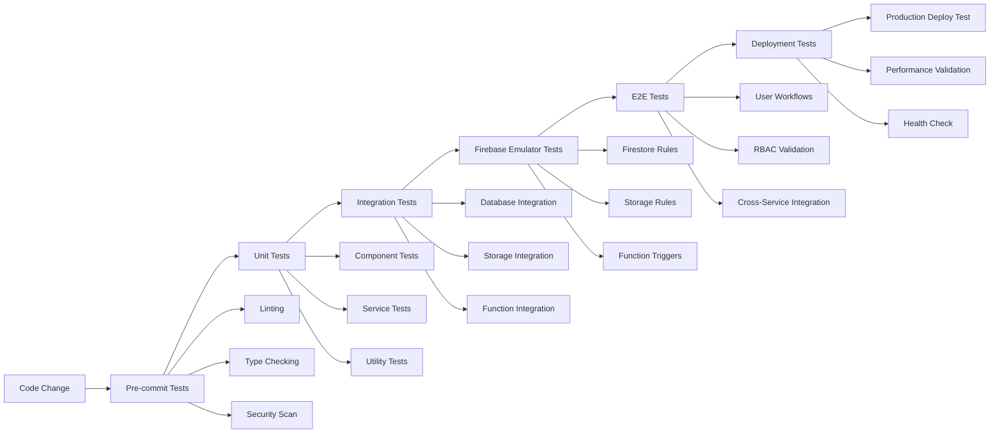

# Firebase Service Testing Strategy

## Overview

This document outlines comprehensive testing scenarios for each Cortex-DC capability, ensuring that changes do not disrupt existing functionality while validating Firebase service integrations.

## Testing Architecture

```mermaid
graph TB
    A[Test Suite] --> B[POV Management Tests]
    A --> C[TRR Management Tests]
    A --> D[Scenario Engine Tests]
    A --> E[Content Hub Tests]
    A --> F[XSIAM Integration Tests]
    A --> G[BigQuery Export Tests]
    A --> H[Terminal System Tests]
    A --> I[Auth & RBAC Tests]
    
    B --> B1[Firebase Firestore]
    B --> B2[Firebase Storage]
    B --> B3[DataConnect]
    
    C --> C1[Firestore Database]
    C --> C2[Cloud Functions]
    C --> C3[Vertex AI]
    
    D --> D1[Cloud Functions]
    D --> D2[Firebase Storage]
    D --> D3[Remote Config]
    
    E --> E1[Firestore Collections]
    E --> E2[Storage Buckets]
    E --> E3[Analytics]
    
    F --> F1[External API]
    F --> F2[Encrypted Storage]
    F --> F3[Health Monitoring]
    
    G --> G1[BigQuery Dataset]
    G --> G2[Cloud Functions]
    G3[Export Pipeline]
    
    H --> H1[Command Registry]
    H --> H2[Terminal State]
    H --> H3[Service Integration]
    
    I --> I1[Authentication]
    I --> I2[Role Permissions]
    I --> I3[Access Control]
```



## Service-Specific Testing Scenarios

### 1. POV Management Testing Suite

#### 1.1 Firestore Database Operations

**Test Category**: POV Document CRUD Operations
**Firebase Service**: Firestore
**Collection**: `povs`

```typescript
describe('POV Management - Firestore Integration', () => {
  beforeEach(() => {
    // Initialize test Firestore instance
    // Seed with baseline POV documents
  });

  test('POV Creation Preserves Required Fields', async () => {
    const testPOV = {
      id: 'test-pov-001',
      title: 'Zero Trust Implementation',
      customer: 'Acme Corp',
      status: 'draft',
      scenarios: ['network-segmentation', 'identity-verification'],
      timeline: {
        start: new Date(),
        end: new Date(Date.now() + 30 * 24 * 60 * 60 * 1000)
      },
      consultant: 'user-dc-001',
      createdAt: new Date(),
      updatedAt: new Date()
    };

    const result = await povService.createPOV(testPOV);
    
    expect(result.id).toBe(testPOV.id);
    expect(result.status).toBe('draft');
    expect(result.scenarios).toEqual(testPOV.scenarios);
    
    // Validate Firestore document structure
    const firestoreDoc = await db.collection('povs').doc(result.id).get();
    expect(firestoreDoc.exists).toBe(true);
    expect(firestoreDoc.data()?.timeline).toBeDefined();
  });

  test('POV Update Maintains Data Integrity', async () => {
    const existingPOV = await povService.getPOV('existing-pov-001');
    const originalTimeline = existingPOV.timeline;
    
    const updates = {
      status: 'in-progress',
      scenarios: [...existingPOV.scenarios, 'endpoint-protection'],
      updatedAt: new Date()
    };

    const updated = await povService.updatePOV('existing-pov-001', updates);
    
    expect(updated.status).toBe('in-progress');
    expect(updated.scenarios).toContain('endpoint-protection');
    expect(updated.timeline).toEqual(originalTimeline); // Timeline preserved
    expect(updated.updatedAt).toBeInstanceOf(Date);
  });

  test('POV Deletion Handles Dependencies', async () => {
    const povWithScenarios = await povService.getPOV('pov-with-scenarios-001');
    const associatedScenarios = povWithScenarios.scenarios;
    
    await povService.deletePOV('pov-with-scenarios-001');
    
    // Verify POV is soft-deleted, not hard-deleted
    const deletedPOV = await povService.getPOV('pov-with-scenarios-001');
    expect(deletedPOV.status).toBe('archived');
    expect(deletedPOV.deletedAt).toBeInstanceOf(Date);
    
    // Verify scenarios are not orphaned
    for (const scenarioId of associatedScenarios) {
      const scenario = await scenarioService.getScenario(scenarioId);
      expect(scenario).toBeDefined();
      expect(scenario.povReferences).not.toContain('pov-with-scenarios-001');
    }
  });
});
```

#### 1.2 Firebase Storage Integration

**Test Category**: POV Document Attachments
**Firebase Service**: Storage
**Bucket**: `povs/{povId}/attachments`

```typescript
describe('POV Management - Storage Integration', () => {
  test('POV Attachment Upload Preserves Metadata', async () => {
    const povId = 'test-pov-001';
    const testFile = new File(['test content'], 'requirements.pdf', {
      type: 'application/pdf'
    });

    const uploadResult = await povService.uploadAttachment(povId, testFile);
    
    expect(uploadResult.url).toBeDefined();
    expect(uploadResult.metadata.originalName).toBe('requirements.pdf');
    expect(uploadResult.metadata.contentType).toBe('application/pdf');
    
    // Verify storage path structure
    const storagePath = `povs/${povId}/attachments/${uploadResult.fileName}`;
    const storageRef = storage.ref(storagePath);
    const metadata = await storageRef.getMetadata();
    
    expect(metadata.contentType).toBe('application/pdf');
    expect(metadata.customMetadata?.povId).toBe(povId);
  });

  test('POV Attachment Deletion Cleans Up References', async () => {
    const povId = 'test-pov-001';
    const attachmentId = 'attachment-001';
    
    // Verify attachment exists
    const povBefore = await povService.getPOV(povId);
    expect(povBefore.attachments).toContain(attachmentId);
    
    await povService.deleteAttachment(povId, attachmentId);
    
    // Verify POV reference is removed
    const povAfter = await povService.getPOV(povId);
    expect(povAfter.attachments).not.toContain(attachmentId);
    
    // Verify storage file is removed
    const storagePath = `povs/${povId}/attachments/${attachmentId}`;
    await expect(storage.ref(storagePath).getDownloadURL())
      .rejects.toThrow('object-not-found');
  });
});
```

#### 1.3 DataConnect Integration

**Test Category**: POV Analytics and Relationships
**Firebase Service**: DataConnect
**Schema**: POV relationship queries

```typescript
describe('POV Management - DataConnect Integration', () => {
  test('POV Scenario Relationship Queries', async () => {
    const povId = 'test-pov-001';
    
    const query = `
      query GetPOVWithScenarios($povId: String!) {
        pov(id: $povId) {
          id
          title
          status
          scenarios {
            id
            name
            category
            executionCount
          }
        }
      }
    `;

    const result = await dataConnect.query(query, { povId });
    
    expect(result.data.pov).toBeDefined();
    expect(result.data.pov.scenarios).toBeInstanceOf(Array);
    expect(result.data.pov.scenarios.length).toBeGreaterThan(0);
    
    // Validate scenario relationship integrity
    const scenarios = result.data.pov.scenarios;
    for (const scenario of scenarios) {
      expect(scenario.id).toBeDefined();
      expect(scenario.executionCount).toBeGreaterThanOrEqual(0);
    }
  });

  test('POV Performance Analytics Aggregation', async () => {
    const consultantId = 'user-dc-001';
    
    const query = `
      query GetConsultantPOVMetrics($consultantId: String!) {
        consultant(id: $consultantId) {
          povMetrics {
            totalPOVs
            activePOVs
            completedPOVs
            averageCompletionTime
            successRate
          }
        }
      }
    `;

    const result = await dataConnect.query(query, { consultantId });
    
    expect(result.data.consultant.povMetrics).toBeDefined();
    expect(result.data.consultant.povMetrics.totalPOVs).toBeGreaterThanOrEqual(0);
    expect(result.data.consultant.povMetrics.successRate).toBeLessThanOrEqual(1);
  });
});
```

### 2. TRR Management Testing Suite

#### 2.1 Cloud Functions Integration

**Test Category**: TRR Workflow Automation
**Firebase Service**: Cloud Functions
**Functions**: `trrWorkflowTrigger`, `trrValidation`, `trrSignoff`

```typescript
describe('TRR Management - Cloud Functions Integration', () => {
  test('TRR Creation Triggers Workflow Function', async () => {
    const testTRR = {
      id: 'test-trr-001',
      povId: 'pov-001',
      phase: 'requirements-gathering',
      status: 'draft',
      consultant: 'user-dc-001',
      customer: 'Acme Corp',
      requirements: ['network-topology', 'security-policies']
    };

    // Mock Cloud Function trigger
    const mockTrigger = jest.fn();
    jest.spyOn(functions, 'httpsCallable').mockReturnValue(mockTrigger);
    mockTrigger.mockResolvedValue({ data: { success: true, trrId: testTRR.id } });

    const result = await trrService.createTRR(testTRR);
    
    expect(mockTrigger).toHaveBeenCalledWith({
      action: 'create',
      trr: testTRR
    });
    
    expect(result.id).toBe(testTRR.id);
    expect(result.status).toBe('draft');
    expect(result.workflowStatus).toBe('initiated');
  });

  test('TRR Validation Function Maintains Data Integrity', async () => {
    const trrId = 'test-trr-001';
    const validationData = {
      requirements: ['network-topology', 'security-policies'],
      evidence: ['network-diagram.pdf', 'policy-export.json'],
      testResults: {
        connectivity: 'pass',
        policies: 'pass',
        performance: 'warning'
      }
    };

    const validateTRR = functions.httpsCallable('trrValidation');
    const result = await validateTRR({ trrId, validationData });
    
    expect(result.data.validationStatus).toBe('partial'); // Due to warning
    expect(result.data.issues).toContain('performance');
    expect(result.data.passedChecks).toEqual(['connectivity', 'policies']);
    
    // Verify TRR document is updated
    const updatedTRR = await trrService.getTRR(trrId);
    expect(updatedTRR.validation).toEqual(result.data);
    expect(updatedTRR.status).toBe('validation-partial');
  });
});
```

#### 2.2 Vertex AI Integration

**Test Category**: TRR AI-Powered Analysis
**Firebase Service**: Vertex AI via Cloud Functions
**Model**: Gemini Pro

```typescript
describe('TRR Management - Vertex AI Integration', () => {
  test('AI Analysis Preserves TRR Context', async () => {
    const trrId = 'test-trr-001';
    const trr = await trrService.getTRR(trrId);
    
    const aiAnalysisRequest = {
      trrId,
      requirements: trr.requirements,
      evidence: trr.evidence,
      analysisType: 'risk-assessment'
    };

    const aiAnalysis = functions.httpsCallable('trrAIAnalysis');
    const result = await aiAnalysis(aiAnalysisRequest);
    
    expect(result.data.analysis).toBeDefined();
    expect(result.data.recommendations).toBeInstanceOf(Array);
    expect(result.data.riskScore).toBeGreaterThanOrEqual(0);
    expect(result.data.riskScore).toBeLessThanOrEqual(100);
    
    // Verify analysis is linked to TRR
    const updatedTRR = await trrService.getTRR(trrId);
    expect(updatedTRR.aiAnalysis).toEqual(result.data);
    expect(updatedTRR.lastAnalyzed).toBeInstanceOf(Date);
  });

  test('AI Recommendations Do Not Override Human Decisions', async () => {
    const trrId = 'test-trr-001';
    const humanDecisions = {
      approvedRequirements: ['network-topology'],
      rejectedRequirements: ['additional-firewall'],
      customNotes: 'Customer budget constraints'
    };

    // Set human decisions first
    await trrService.updateTRR(trrId, { humanDecisions });
    
    // Run AI analysis
    const aiAnalysis = functions.httpsCallable('trrAIAnalysis');
    await aiAnalysis({ trrId, analysisType: 'recommendations' });
    
    // Verify human decisions are preserved
    const finalTRR = await trrService.getTRR(trrId);
    expect(finalTRR.humanDecisions).toEqual(humanDecisions);
    expect(finalTRR.aiAnalysis).toBeDefined();
    expect(finalTRR.aiAnalysis.recommendations).toBeDefined();
  });
});
```

### 3. Scenario Engine Testing Suite

#### 3.1 Scenario Orchestration

**Test Category**: Scenario Lifecycle Management
**Firebase Service**: Cloud Functions + Storage
**Functions**: `scenarioOrchestration`, `scenarioExecutor`

```typescript
describe('Scenario Engine - Orchestration Integration', () => {
  test('Scenario Deployment Maintains Configuration Integrity', async () => {
    const scenarioConfig = {
      id: 'network-segmentation-v2',
      name: 'Network Segmentation Test',
      category: 'security',
      steps: [
        { id: 'step-1', type: 'network-config', config: { vlan: 100 } },
        { id: 'step-2', type: 'policy-apply', config: { rules: ['deny-all'] } },
        { id: 'step-3', type: 'test-connectivity', config: { endpoints: ['host-a', 'host-b'] } }
      ],
      timeout: 1800, // 30 minutes
      cleanup: true
    };

    const deployScenario = functions.httpsCallable('scenarioOrchestration');
    const result = await deployScenario({ action: 'deploy', scenario: scenarioConfig });
    
    expect(result.data.deploymentId).toBeDefined();
    expect(result.data.status).toBe('deploying');
    expect(result.data.estimatedDuration).toBeLessThanOrEqual(scenarioConfig.timeout);
    
    // Verify scenario state is tracked
    const scenarioState = await scenarioService.getScenarioState(result.data.deploymentId);
    expect(scenarioState.config).toEqual(scenarioConfig);
    expect(scenarioState.steps).toHaveLength(3);
    expect(scenarioState.currentStep).toBe(0);
  });

  test('Scenario Execution Handles Step Failures Gracefully', async () => {
    const deploymentId = 'deploy-001';
    const failingStep = {
      id: 'step-2',
      type: 'policy-apply',
      config: { rules: ['invalid-rule'] }
    };

    // Mock step execution failure
    jest.spyOn(scenarioExecutor, 'executeStep').mockRejectedValueOnce(
      new Error('Invalid policy rule: invalid-rule')
    );

    const executeScenario = functions.httpsCallable('scenarioExecutor');
    const result = await executeScenario({ deploymentId, stepId: failingStep.id });
    
    expect(result.data.status).toBe('failed');
    expect(result.data.error).toContain('Invalid policy rule');
    expect(result.data.rollbackInitiated).toBe(true);
    
    // Verify scenario state reflects failure
    const scenarioState = await scenarioService.getScenarioState(deploymentId);
    expect(scenarioState.status).toBe('failed');
    expect(scenarioState.failedStep).toBe(failingStep.id);
    expect(scenarioState.rollbackStatus).toBe('in-progress');
  });
});
```

#### 3.2 Remote Config Integration

**Test Category**: Dynamic Scenario Configuration
**Firebase Service**: Remote Config
**Parameters**: `scenario-defaults`, `feature-flags`, `timeout-settings`

```typescript
describe('Scenario Engine - Remote Config Integration', () => {
  test('Scenario Defaults Are Applied Correctly', async () => {
    // Mock Remote Config values
    const mockRemoteConfig = {
      'scenario-defaults': JSON.stringify({
        timeout: 1800,
        retryAttempts: 3,
        cleanupEnabled: true,
        logLevel: 'info'
      }),
      'feature-flags': JSON.stringify({
        parallelExecution: true,
        advancedRollback: false,
        aiRecommendations: true
      })
    };

    jest.spyOn(remoteConfig, 'getAll').mockReturnValue(mockRemoteConfig);

    const scenarioConfig = {
      id: 'test-scenario',
      name: 'Test Scenario',
      steps: [{ id: 'step-1', type: 'test', config: {} }]
      // Note: no timeout or other defaults specified
    };

    const processedConfig = await scenarioService.processScenarioConfig(scenarioConfig);
    
    expect(processedConfig.timeout).toBe(1800);
    expect(processedConfig.retryAttempts).toBe(3);
    expect(processedConfig.cleanupEnabled).toBe(true);
    expect(processedConfig.features.parallelExecution).toBe(true);
    expect(processedConfig.features.advancedRollback).toBe(false);
  });

  test('Feature Flags Control Scenario Behavior', async () => {
    const mockRemoteConfig = {
      'feature-flags': JSON.stringify({
        parallelExecution: false,
        advancedRollback: true
      })
    };

    jest.spyOn(remoteConfig, 'getAll').mockReturnValue(mockRemoteConfig);

    const scenario = await scenarioService.createScenarioExecution('test-scenario');
    
    expect(scenario.executionMode).toBe('sequential'); // Due to parallelExecution: false
    expect(scenario.rollbackStrategy).toBe('advanced'); // Due to advancedRollback: true
  });
});
```

### 4. Content Hub Testing Suite

#### 4.1 Content Management Operations

**Test Category**: Content CRUD and Analytics
**Firebase Service**: Firestore + Storage + Analytics
**Collections**: `content`, `content-analytics`, `content-library`

```typescript
describe('Content Hub - Management Integration', () => {
  test('Content Creation Preserves Metadata and Relationships', async () => {
    const contentData = {
      id: 'guide-zero-trust-v2',
      title: 'Zero Trust Implementation Guide',
      type: 'guide',
      category: 'security',
      tags: ['zero-trust', 'network-security', 'implementation'],
      author: 'user-dc-001',
      povReferences: ['pov-001', 'pov-003'],
      scenarioReferences: ['network-segmentation', 'identity-verification'],
      content: {
        markdown: '# Zero Trust Guide...',
        assets: ['diagram-1.png', 'checklist.pdf']
      }
    };

    const result = await contentService.createContent(contentData);
    
    expect(result.id).toBe(contentData.id);
    expect(result.version).toBe(1);
    expect(result.status).toBe('draft');
    
    // Verify Firestore document structure
    const firestoreDoc = await db.collection('content').doc(result.id).get();
    expect(firestoreDoc.data()?.povReferences).toEqual(contentData.povReferences);
    expect(firestoreDoc.data()?.scenarioReferences).toEqual(contentData.scenarioReferences);
    
    // Verify reverse references are created
    for (const povId of contentData.povReferences) {
      const pov = await povService.getPOV(povId);
      expect(pov.contentReferences).toContain(result.id);
    }
  });

  test('Content Analytics Track Usage Correctly', async () => {
    const contentId = 'guide-zero-trust-v2';
    const userId = 'user-dc-001';
    const povId = 'pov-001';

    // Simulate content access
    await contentService.trackContentAccess(contentId, userId, {
      context: 'pov',
      contextId: povId,
      accessType: 'view',
      duration: 300 // 5 minutes
    });

    // Verify analytics are recorded
    const analytics = await contentService.getContentAnalytics(contentId);
    expect(analytics.totalViews).toBeGreaterThanOrEqual(1);
    expect(analytics.uniqueUsers).toContain(userId);
    expect(analytics.povContexts).toContain(povId);
    expect(analytics.averageViewDuration).toBeGreaterThan(0);
  });
});
```

### 5. XSIAM Integration Testing Suite

#### 5.1 External API Integration

**Test Category**: XSIAM API Connectivity and Error Handling
**Firebase Service**: Encrypted Storage + Health Monitoring
**Integration**: External XSIAM API

```typescript
describe('XSIAM Integration - API Connectivity', () => {
  test('XSIAM Authentication Maintains Security', async () => {
    const credentials = {
      apiKey: 'test-api-key',
      apiKeyId: 'test-key-id',
      fqdn: 'test.xdr.us.paloaltonetworks.com'
    };

    // Test credential encryption/decryption
    const encrypted = await xsiamService.encryptCredentials(credentials);
    expect(encrypted).not.toContain(credentials.apiKey);
    
    const decrypted = await xsiamService.decryptCredentials(encrypted);
    expect(decrypted).toEqual(credentials);

    // Test API authentication
    const authResult = await xsiamService.testConnection(credentials);
    expect(authResult.authenticated).toBe(true);
    expect(authResult.permissions).toContain('read');
  });

  test('XSIAM API Failure Handling Preserves System Stability', async () => {
    // Mock API failure
    jest.spyOn(xsiamService, 'makeAPIRequest').mockRejectedValue(
      new Error('XSIAM API unavailable')
    );

    const query = {
      queryString: 'dataset = xdr_data | limit 10',
      timeRange: { start: new Date(), end: new Date() }
    };

    const result = await xsiamService.executeQuery(query);
    
    expect(result.success).toBe(false);
    expect(result.error).toContain('XSIAM API unavailable');
    expect(result.fallbackData).toBeDefined(); // System provides fallback
    
    // Verify health monitoring is updated
    const healthStatus = await xsiamService.getHealthStatus();
    expect(healthStatus.status).toBe('degraded');
    expect(healthStatus.lastError).toBeDefined();
  });
});
```

### 6. BigQuery Export Testing Suite

#### 6.1 Export Pipeline Integrity

**Test Category**: Data Export and Schema Validation
**Firebase Service**: Cloud Functions + BigQuery
**Functions**: `bigqueryExport`

```typescript
describe('BigQuery Export - Pipeline Integration', () => {
  test('POV Data Export Maintains Schema Consistency', async () => {
    const povData = {
      id: 'pov-001',
      title: 'Zero Trust Implementation',
      status: 'completed',
      metrics: {
        duration: 30,
        scenariosExecuted: 5,
        successRate: 0.8
      },
      exportTimestamp: new Date()
    };

    const exportFunction = functions.httpsCallable('bigqueryExport');
    const result = await exportFunction({
      dataType: 'pov',
      data: povData,
      dataset: 'cortex_dc_analytics',
      table: 'pov_metrics'
    });

    expect(result.data.success).toBe(true);
    expect(result.data.rowsInserted).toBe(1);
    
    // Verify BigQuery table schema
    const query = `
      SELECT * FROM \`cortex_dc_analytics.pov_metrics\`
      WHERE id = '${povData.id}'
      LIMIT 1
    `;
    
    const [rows] = await bigquery.query(query);
    expect(rows).toHaveLength(1);
    expect(rows[0].id).toBe(povData.id);
    expect(rows[0].metrics.duration).toBe(30);
  });

  test('Export Error Handling Prevents Data Loss', async () => {
    // Mock BigQuery insertion failure
    jest.spyOn(bigquery, 'dataset').mockReturnValue({
      table: jest.fn().mockReturnValue({
        insert: jest.fn().mockRejectedValue(new Error('Schema mismatch'))
      })
    });

    const testData = {
      id: 'test-001',
      invalidField: 'this should cause schema error'
    };

    const exportFunction = functions.httpsCallable('bigqueryExport');
    const result = await exportFunction({
      dataType: 'test',
      data: testData
    });

    expect(result.data.success).toBe(false);
    expect(result.data.error).toContain('Schema mismatch');
    
    // Verify data is queued for retry
    const retryQueue = await exportService.getRetryQueue();
    expect(retryQueue).toContain(testData.id);
  });
});
```

### 7. Terminal System Testing Suite

#### 7.1 Command Registry and Execution

**Test Category**: Command System Integrity
**Firebase Service**: Multiple (depends on command)
**Components**: Command registry, argument parsing, service integration

```typescript
describe('Terminal System - Command Integration', () => {
  test('POV Commands Maintain Data Consistency', async () => {
    const command = 'pov create "Test POV" --customer "Acme Corp" --scenarios network-segmentation,identity-verification';
    
    const parseResult = commandParser.parse(command);
    expect(parseResult.command).toBe('pov');
    expect(parseResult.subcommand).toBe('create');
    expect(parseResult.args.customer).toBe('Acme Corp');
    expect(parseResult.args.scenarios).toEqual(['network-segmentation', 'identity-verification']);

    const executionResult = await commandRegistry.execute(parseResult);
    expect(executionResult.success).toBe(true);
    expect(executionResult.data.povId).toBeDefined();

    // Verify POV was created correctly
    const createdPOV = await povService.getPOV(executionResult.data.povId);
    expect(createdPOV.title).toBe('Test POV');
    expect(createdPOV.customer).toBe('Acme Corp');
    expect(createdPOV.scenarios).toEqual(['network-segmentation', 'identity-verification']);
  });

  test('Invalid Commands Handle Gracefully', async () => {
    const invalidCommand = 'invalid-command --invalid-flag';
    
    const parseResult = commandParser.parse(invalidCommand);
    expect(parseResult.valid).toBe(false);
    expect(parseResult.error).toContain('Unknown command');

    const executionResult = await commandRegistry.execute(parseResult);
    expect(executionResult.success).toBe(false);
    expect(executionResult.help).toBeDefined();
    expect(executionResult.suggestions).toBeInstanceOf(Array);
  });
});
```

### 8. Authentication & RBAC Testing Suite

#### 8.1 Role-Based Access Control

**Test Category**: Permission Enforcement Across Services
**Firebase Service**: Authentication + Firestore Security Rules
**Components**: Auth provider, role validation, service access control

```typescript
describe('Authentication & RBAC - Service Integration', () => {
  test('User Role Permissions Are Enforced Consistently', async () => {
    const userToken = await generateTestToken('user', 'user-dc-001');
    const managementToken = await generateTestToken('management', 'mgmt-dc-001');
    const adminToken = await generateTestToken('admin', 'admin-dc-001');

    // Test POV access permissions
    const testPOV = { id: 'pov-001', consultant: 'user-dc-001' };
    
    // User can access own POV
    const userAccess = await povService.getPOV('pov-001', { auth: userToken });
    expect(userAccess).toBeDefined();
    
    // User cannot access other's POV
    const otherPOV = { id: 'pov-002', consultant: 'user-dc-002' };
    await expect(povService.getPOV('pov-002', { auth: userToken }))
      .rejects.toThrow('Insufficient permissions');
    
    // Management can access team POVs
    const managementAccess = await povService.getPOV('pov-002', { auth: managementToken });
    expect(managementAccess).toBeDefined();
    
    // Admin can access all POVs
    const adminAccess = await povService.getPOV('pov-002', { auth: adminToken });
    expect(adminAccess).toBeDefined();
  });

  test('Service-Level Permissions Are Validated', async () => {
    const userToken = await generateTestToken('user', 'user-dc-001');
    
    // User cannot access admin-only services
    await expect(bigqueryService.exportData({}, { auth: userToken }))
      .rejects.toThrow('Admin access required');
    
    await expect(xsiamService.configureCredentials({}, { auth: userToken }))
      .rejects.toThrow('Management access required');
    
    // User can access allowed services
    const scenarioAccess = await scenarioService.listScenarios({ auth: userToken });
    expect(scenarioAccess).toBeDefined();
    
    const contentAccess = await contentService.getContent('guide-001', { auth: userToken });
    expect(contentAccess).toBeDefined();
  });
});
```

## Automated Testing Pipeline

### Test Execution Strategy



### Firebase Testing Configuration

```typescript
// jest.config.js
module.exports = {
  preset: 'ts-jest',
  testEnvironment: 'node',
  setupFilesAfterEnv: ['<rootDir>/tests/setup.ts'],
  testMatch: [
    '<rootDir>/tests/**/*.test.ts',
    '<rootDir>/tests/**/*.spec.ts'
  ],
  collectCoverageFrom: [
    'lib/**/*.ts',
    'components/**/*.tsx',
    'app/**/*.tsx',
    '!**/*.d.ts',
    '!**/node_modules/**'
  ],
  coverageThreshold: {
    global: {
      branches: 80,
      functions: 80,
      lines: 80,
      statements: 80
    }
  },
  globals: {
    'ts-jest': {
      tsconfig: 'tsconfig.json'
    }
  },
  moduleNameMapping: {
    '^@/(.*)$': '<rootDir>/$1',
    '^@cortex-dc/ui$': '<rootDir>/packages/ui/src'
  }
};
```

### Test Environment Setup

```typescript
// tests/setup.ts
import { initializeApp } from 'firebase/app';
import { connectFirestoreEmulator } from 'firebase/firestore';
import { connectStorageEmulator } from 'firebase/storage';
import { connectFunctionsEmulator } from 'firebase/functions';

// Initialize Firebase emulators for testing
const app = initializeApp({
  projectId: 'cortex-dc-test'
});

// Connect to emulators
connectFirestoreEmulator(db, 'localhost', 8080);
connectStorageEmulator(storage, 'localhost', 9199);
connectFunctionsEmulator(functions, 'localhost', 5001);

// Global test utilities
global.testUtils = {
  generateTestToken,
  createTestUser,
  seedTestData,
  cleanupTestData
};
```

## Baseline Protection Strategy

### Critical Path Validation

1. **POV Management**: Create → Update → Attach Files → Generate Reports → Archive
2. **TRR Management**: Draft → Validate → AI Analysis → Approval → Export
3. **Scenario Engine**: Configure → Deploy → Execute → Monitor → Cleanup
4. **Content Hub**: Create → Categorize → Link → Track Analytics → Export
5. **XSIAM Integration**: Authenticate → Query → Process → Display Results
6. **BigQuery Export**: Queue → Validate → Transform → Insert → Verify

### Rollback Procedures

```typescript
// tests/rollback.test.ts
describe('Rollback Procedures', () => {
  test('Database Schema Changes Are Reversible', async () => {
    const originalSchema = await getFirestoreSchema();
    
    // Apply schema change
    await applySchemaChange('add-field-to-pov');
    
    // Verify change is applied
    const updatedSchema = await getFirestoreSchema();
    expect(updatedSchema.collections.povs.fields).toHaveProperty('newField');
    
    // Test rollback
    await rollbackSchemaChange('add-field-to-pov');
    
    // Verify rollback is successful
    const rolledBackSchema = await getFirestoreSchema();
    expect(rolledBackSchema).toEqual(originalSchema);
  });
});
```

## Success Metrics

### Testing Coverage Goals

- **Unit Test Coverage**: 90%+
- **Integration Test Coverage**: 85%+
- **E2E Test Coverage**: Critical user paths 100%
- **Firebase Service Coverage**: All services tested
- **Performance Test Coverage**: All major operations benchmarked

### Quality Gates

1. **All tests pass** before deployment
2. **No security vulnerabilities** in dependencies
3. **Performance benchmarks** within acceptable ranges
4. **Firebase quotas** within limits
5. **Error rates** below 1% in staging environment

This comprehensive testing strategy ensures that your Firebase-backed Cortex-DC platform maintains reliability and functionality while allowing for safe feature development and deployment.