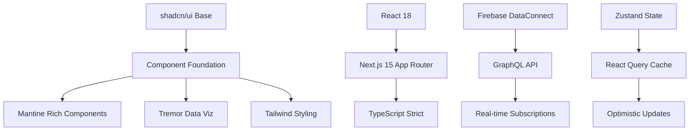
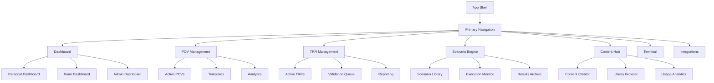

# Frontend UI Migration Strategy: Cortex Domain Consultant Platform

## Executive Summary

This document outlines a comprehensive strategy for migrating the sophisticated frontend UI from the henryreed.ai source repository to the modern cortex-dc-web platform. The migration focuses on creating a scalable, accessible, and performance-optimized user experience while preserving the powerful domain consultant workflows that make this platform unique.

## Source Repository Analysis

### Current Architecture
- **Framework**: Next.js with experimental webpack features + TypeScript
- **UI Libraries**: Mixed implementation using Chakra UI, Tailwind CSS, and custom components
- **State Management**: Hybrid approach with local storage + optional Firestore sync
- **Terminal System**: Advanced terminal emulator with 200+ commands
- **Component Count**: 50+ sophisticated React components
- **Routing**: App Router with complex nested layouts

### Key User Workflows Identified

1. **Domain Consultant Dashboard**
   - Engagement tracking and metrics
   - Quick actions and shortcuts
   - Real-time activity monitoring

2. **POV (Proof of Value) Management**
   - Complete lifecycle management
   - Template-based POV creation
   - Timeline tracking and milestone management
   - Customer-specific field management
   - Scenario integration

3. **TRR (Technical Requirements Review) Management**
   - Workflow-driven TRR creation
   - Evidence collection and validation
   - Blockchain-based signoff system
   - Risk assessment and mitigation

4. **Scenario Engine**
   - Library of 20+ security scenarios
   - Real-time scenario execution
   - MITRE ATT&CK framework integration
   - Business value mapping

5. **Content Hub**
   - Unified content creation
   - Template management
   - Analytics and usage tracking
   - Multi-format export capabilities

6. **Terminal Interface**
   - Advanced command system
   - GUI/Terminal hybrid workflows
   - Context-aware command suggestions
   - Session persistence

7. **XSIAM Integration**
   - Health monitoring
   - API connectivity management
   - Real-time alerts
   - Performance metrics

8. **BigQuery Analytics**
   - Visual query builder
   - Data export management
   - Results visualization
   - Saved query templates

## Target Architecture Strategy

### UI Framework Consolidation

#### Primary Stack


#### Framework Selection Rationale

1. **shadcn/ui** (Primary Base)
   - Copy-paste components with full ownership
   - Built on Radix + Tailwind for accessibility
   - Minimal abstraction overhead
   - Gradual adoption possible

2. **Mantine** (Rich Components)
   - 120+ production-ready components
   - Excellent TypeScript support
   - Strong defaults and theming
   - Perfect for data-heavy interfaces

3. **Tremor** (Data Visualization)
   - Dashboard-oriented components
   - 35+ chart and metric components
   - Ideal for analytics workflows
   - Tailwind-based consistency

4. **Tailwind CSS** (Styling Foundation)
   - Design system consistency
   - Performance optimization
   - Custom component integration
   - Responsive design patterns

### Component Architecture

```
packages/ui/
├── src/
│   ├── components/
│   │   ├── base/                 # shadcn/ui components
│   │   │   ├── Button.tsx
│   │   │   ├── Card.tsx
│   │   │   ├── Input.tsx
│   │   │   └── ...
│   │   ├── domain/               # Domain-specific components
│   │   │   ├── consultant/
│   │   │   │   ├── DashboardCard.tsx
│   │   │   │   ├── EngagementList.tsx
│   │   │   │   └── MetricsOverview.tsx
│   │   │   ├── pov/
│   │   │   │   ├── POVTimeline.tsx
│   │   │   │   ├── ScenarioMapper.tsx
│   │   │   │   └── TemplateSelector.tsx
│   │   │   ├── trr/
│   │   │   │   ├── TRRWorkflow.tsx
│   │   │   │   ├── EvidenceUpload.tsx
│   │   │   │   └── ValidationSteps.tsx
│   │   │   └── scenario/
│   │   │       ├── ScenarioLibrary.tsx
│   │   │       ├── ExecutionMonitor.tsx
│   │   │       └── MitreMapping.tsx
│   │   ├── layout/               # Layout components
│   │   │   ├── AppShell.tsx
│   │   │   ├── Navigation.tsx
│   │   │   ├── Sidebar.tsx
│   │   │   └── Breadcrumbs.tsx
│   │   ├── terminal/             # Terminal system
│   │   │   ├── Terminal.tsx
│   │   │   ├── CommandPalette.tsx
│   │   │   ├── TerminalPanel.tsx
│   │   │   └── OutputRenderer.tsx
│   │   └── integration/          # External integrations
│   │       ├── XSIAMPanel.tsx
│   │       ├── BigQueryExplorer.tsx
│   │       └── AIAssistant.tsx
│   ├── hooks/                    # Custom React hooks
│   │   ├── useDataConnect.ts
│   │   ├── useTerminal.ts
│   │   ├── useWorkflow.ts
│   │   └── useRealtime.ts
│   ├── providers/                # Context providers
│   │   ├── ThemeProvider.tsx
│   │   ├── AuthProvider.tsx
│   │   ├── WorkflowProvider.tsx
│   │   └── TerminalProvider.tsx
│   └── utils/                    # Utility functions
│       ├── cn.ts
│       ├── formatters.ts
│       └── validation.ts
```

### User Journey Optimization

#### Navigation System



#### Role-Based Access Control

```typescript
interface UserRole {
  name: 'user' | 'management' | 'admin';
  permissions: {
    // Dashboard access
    viewPersonalDashboard: boolean;
    viewTeamDashboard: boolean;
    viewAdminDashboard: boolean;
    
    // POV Management
    createPOV: boolean;
    editPOV: boolean;
    approvePOV: boolean;
    viewAllPOVs: boolean;
    
    // TRR Management
    createTRR: boolean;
    assignTRR: boolean;
    validateTRR: boolean;
    signoffTRR: boolean;
    
    // Scenario Engine
    executeScenarios: boolean;
    createScenarios: boolean;
    manageTemplates: boolean;
    
    // System Administration
    manageUsers: boolean;
    viewAnalytics: boolean;
    configureIntegrations: boolean;
  };
}
```

## Migration Implementation Phases

### Phase 1: Foundation & Infrastructure (Week 1-2)

#### 1.1 Modern Design System Setup
```bash
# Install core UI dependencies
pnpm add @radix-ui/react-* 
pnpm add @mantine/core @mantine/hooks @mantine/form
pnpm add @tremor/react
pnpm add lucide-react
pnpm add class-variance-authority clsx tailwind-merge
```

#### 1.2 Component Library Structure
- Set up packages/ui with modern build tooling
- Implement shadcn/ui base components
- Create design tokens and theme system
- Establish component documentation with Storybook

#### 1.3 App Shell Architecture
```typescript
// apps/web/app/layout.tsx
export default function RootLayout({
  children,
}: {
  children: React.ReactNode;
}) {
  return (
    <html lang="en" className="h-full">
      <body className="h-full">
        <Providers>
          <AppShell>
            {children}
          </AppShell>
        </Providers>
      </body>
    </html>
  );
}
```

### Phase 2: Core Navigation & Authentication (Week 2-3)

#### 2.1 Navigation System
- Responsive navigation with role-based visibility
- Breadcrumb system with dynamic updates
- Search and command palette integration
- Mobile-optimized navigation patterns

#### 2.2 Authentication Integration
```typescript
// Integration with Firebase Auth + DataConnect
const useAuth = () => {
  const [user, setUser] = useState<User | null>(null);
  const [role, setRole] = useState<UserRole | null>(null);
  
  // Firebase Auth integration
  useEffect(() => {
    const unsubscribe = onAuthStateChanged(auth, async (firebaseUser) => {
      if (firebaseUser) {
        // Fetch user role from DataConnect
        const userData = await getUserData(firebaseUser.uid);
        setUser(firebaseUser);
        setRole(userData.role);
      } else {
        setUser(null);
        setRole(null);
      }
    });
    
    return unsubscribe;
  }, []);
  
  return { user, role, loading };
};
```

### Phase 3: Domain Consultant Dashboard (Week 3-4)

#### 3.1 Dashboard Components Migration
- Port DomainConsultantWorkspace with real-time metrics
- Implement ManagementDashboard with analytics integration
- Create UserTimelineView with activity tracking
- Build notification system integration

#### 3.2 Data Integration
```typescript
// GraphQL integration with DataConnect
const GET_CONSULTANT_METRICS = gql`
  query GetConsultantMetrics($userId: String!) {
    users(where: { id: { _eq: $userId } }) {
      id
      displayName
      assignments {
        engagement {
          name
          status
          startDate
          endDate
        }
      }
    }
    
    activities: activity_logs(
      where: { user_id: { _eq: $userId } }
      orderBy: { created_at: DESC }
      limit: 10
    ) {
      description
      hours_spent
      activity_date
    }
  }
`;
```

### Phase 4: POV Management System (Week 4-6)

#### 4.1 POV Lifecycle Components
```typescript
// Enhanced POV Management with DataConnect
interface POVFormData {
  name: string;
  customerId: string;
  objectives: string[];
  timeline: {
    start: Date;
    end: Date;
    milestones: Milestone[];
  };
  scenarios: POVScenario[];
  successCriteria: string[];
  stakeholders: Stakeholder[];
  resources: Resource[];
}

const POVManagement: React.FC = () => {
  const { data: povs } = useQuery(GET_POVS_QUERY);
  const [createPOV] = useMutation(CREATE_POV_MUTATION);
  
  return (
    <div className="space-y-6">
      <POVHeader />
      <POVFilters />
      <POVList povs={povs} />
      <POVCreationModal />
    </div>
  );
};
```

#### 4.2 Timeline Visualization
```typescript
// POV Timeline with Tremor charts
const POVTimeline: React.FC<{ pov: POV }> = ({ pov }) => {
  const timelineData = useMemo(() => 
    pov.milestones.map(milestone => ({
      date: milestone.date,
      status: milestone.status,
      description: milestone.description,
    }))
  , [pov.milestones]);
  
  return (
    <Card>
      <Title>Project Timeline</Title>
      <AreaChart
        className="mt-6"
        data={timelineData}
        index="date"
        categories={["progress"]}
        colors={["blue"]}
        valueFormatter={(value) => `${value}%`}
      />
    </Card>
  );
};
```

### Phase 5: TRR Management System (Week 6-8)

#### 5.1 TRR Workflow Engine
```typescript
// TRR State Machine
type TRRState = 
  | 'draft'
  | 'review' 
  | 'validation'
  | 'evidence-collection'
  | 'signoff'
  | 'completed'
  | 'archived';

interface TRRWorkflow {
  currentState: TRRState;
  availableActions: string[];
  requiredFields: string[];
  validators: ValidationRule[];
}

const TRRManagement: React.FC = () => {
  const [selectedTRR, setSelectedTRR] = useState<TRR | null>(null);
  const workflow = useTRRWorkflow(selectedTRR);
  
  return (
    <div className="grid grid-cols-1 lg:grid-cols-3 gap-6">
      <div className="lg:col-span-2">
        <TRRWorkflowStepper workflow={workflow} />
        <TRRFormFields trr={selectedTRR} workflow={workflow} />
        <EvidenceCollectionPanel trr={selectedTRR} />
      </div>
      <div>
        <TRRValidationChecklist trr={selectedTRR} />
        <BlockchainSignoffPanel trr={selectedTRR} />
        <RelatedTRRs trr={selectedTRR} />
      </div>
    </div>
  );
};
```

### Phase 6: Scenario Engine Interface (Week 8-10)

#### 6.1 Scenario Library & Execution
```typescript
// Modern Scenario Engine with real-time monitoring
const ScenarioEngine: React.FC = () => {
  const { data: scenarios } = useQuery(GET_SCENARIOS_QUERY);
  const [executeScenario] = useMutation(EXECUTE_SCENARIO_MUTATION);
  const [selectedScenario, setSelectedScenario] = useState<Scenario | null>(null);
  
  return (
    <div className="grid grid-cols-1 xl:grid-cols-4 gap-6">
      <div className="xl:col-span-3">
        <ScenarioLibraryGrid scenarios={scenarios} />
        <ScenarioExecutionPanel scenario={selectedScenario} />
        <MITREATTACKMapping scenario={selectedScenario} />
      </div>
      <div>
        <ScenarioFilters />
        <BusinessValueMapper />
        <ExecutionHistory />
      </div>
    </div>
  );
};
```

#### 6.2 Real-time Execution Monitoring
```typescript
// WebSocket integration for real-time scenario updates
const useScenarioExecution = (scenarioId: string) => {
  const [status, setStatus] = useState<ExecutionStatus>('idle');
  const [logs, setLogs] = useState<ExecutionLog[]>([]);
  
  useEffect(() => {
    const ws = new WebSocket(`wss://api.example.com/scenarios/${scenarioId}/execution`);
    
    ws.onmessage = (event) => {
      const update = JSON.parse(event.data);
      setStatus(update.status);
      setLogs(prev => [...prev, update.log]);
    };
    
    return () => ws.close();
  }, [scenarioId]);
  
  return { status, logs };
};
```

### Phase 7: Terminal Interface Modernization (Week 10-12)

#### 7.1 Modern Terminal Component
```typescript
// Enhanced terminal with better UX
const ModernTerminal: React.FC = () => {
  const terminal = useTerminal();
  const [isPopout, setIsPopout] = useState(false);
  
  return (
    <Card className={cn(
      "relative",
      isPopout && "fixed inset-4 z-50 shadow-2xl"
    )}>
      <div className="flex items-center justify-between p-3 border-b">
        <div className="flex items-center gap-2">
          <Terminal className="w-4 h-4" />
          <span className="text-sm font-medium">Terminal</span>
        </div>
        <div className="flex items-center gap-2">
          <Button
            size="sm"
            variant="ghost"
            onClick={() => setIsPopout(!isPopout)}
          >
            {isPopout ? <Minimize2 /> : <Maximize2 />}
          </Button>
          <Button
            size="sm"
            variant="ghost"
            onClick={terminal.clear}
          >
            <X />
          </Button>
        </div>
      </div>
      
      <div className="p-4 font-mono text-sm bg-gray-900 text-green-400 min-h-[400px]">
        <TerminalHistory commands={terminal.history} />
        <TerminalInput 
          value={terminal.input}
          onChange={terminal.setInput}
          onExecute={terminal.execute}
        />
      </div>
      
      <CommandPalette 
        isOpen={terminal.showPalette}
        onClose={() => terminal.setShowPalette(false)}
        commands={terminal.availableCommands}
      />
    </Card>
  );
};
```

#### 7.2 Command System Integration
```typescript
// Command system with context awareness
interface CommandContext {
  user: User;
  currentView: string;
  selectedItems: any[];
  environment: 'dev' | 'staging' | 'production';
}

const useCommandSystem = () => {
  const context = useContext(AppStateContext);
  
  const executeCommand = useCallback(async (command: string) => {
    const [cmd, ...args] = command.split(' ');
    const handler = commandRegistry[cmd];
    
    if (!handler) {
      throw new Error(`Command not found: ${cmd}`);
    }
    
    return await handler(args, {
      user: context.user,
      currentView: context.currentView,
      selectedItems: context.selectedItems,
      environment: context.environment,
    });
  }, [context]);
  
  return { executeCommand };
};
```

### Phase 8: Integration Systems (Week 12-14)

#### 8.1 XSIAM Integration Panel
```typescript
// Real-time XSIAM health monitoring
const XSIAMIntegration: React.FC = () => {
  const { data: healthStatus } = useQuery(XSIAM_HEALTH_QUERY, {
    pollInterval: 5000, // Poll every 5 seconds
  });
  
  const { data: metrics } = useQuery(XSIAM_METRICS_QUERY, {
    pollInterval: 30000, // Poll every 30 seconds
  });
  
  return (
    <div className="grid grid-cols-1 md:grid-cols-2 lg:grid-cols-3 gap-6">
      <Card>
        <CardHeader>
          <CardTitle className="flex items-center gap-2">
            <Activity className="w-5 h-5" />
            Connection Status
          </CardTitle>
        </CardHeader>
        <CardContent>
          <div className={cn(
            "flex items-center gap-2 text-sm font-medium",
            healthStatus?.connected ? "text-green-600" : "text-red-600"
          )}>
            <div className={cn(
              "w-3 h-3 rounded-full",
              healthStatus?.connected ? "bg-green-500" : "bg-red-500"
            )} />
            {healthStatus?.connected ? "Connected" : "Disconnected"}
          </div>
        </CardContent>
      </Card>
      
      <Card>
        <CardHeader>
          <CardTitle>Performance Metrics</CardTitle>
        </CardHeader>
        <CardContent>
          <AreaChart
            className="h-32"
            data={metrics?.responseTime || []}
            index="timestamp"
            categories={["responseTime"]}
            colors={["blue"]}
            showGridLines={false}
            showXAxis={false}
            showYAxis={false}
          />
        </CardContent>
      </Card>
      
      <Card>
        <CardHeader>
          <CardTitle>Recent Alerts</CardTitle>
        </CardHeader>
        <CardContent>
          <div className="space-y-2">
            {healthStatus?.alerts?.slice(0, 3).map((alert, index) => (
              <div key={index} className="flex items-center gap-2 text-sm">
                <AlertTriangle className="w-4 h-4 text-amber-500" />
                <span className="truncate">{alert.message}</span>
              </div>
            ))}
          </div>
        </CardContent>
      </Card>
    </div>
  );
};
```

#### 8.2 BigQuery Explorer
```typescript
// Visual query builder with Tremor charts
const BigQueryExplorer: React.FC = () => {
  const [query, setQuery] = useState('');
  const [results, setResults] = useState<any[]>([]);
  const [isLoading, setIsLoading] = useState(false);
  
  const executeQuery = useCallback(async () => {
    setIsLoading(true);
    try {
      const response = await fetch('/api/bigquery/execute', {
        method: 'POST',
        headers: { 'Content-Type': 'application/json' },
        body: JSON.stringify({ query }),
      });
      const data = await response.json();
      setResults(data.rows);
    } catch (error) {
      console.error('Query execution failed:', error);
    } finally {
      setIsLoading(false);
    }
  }, [query]);
  
  return (
    <div className="space-y-6">
      <Card>
        <CardHeader>
          <CardTitle>Query Builder</CardTitle>
        </CardHeader>
        <CardContent>
          <Textarea
            value={query}
            onChange={(e) => setQuery(e.target.value)}
            placeholder="SELECT * FROM dataset.table LIMIT 10"
            className="font-mono"
            rows={6}
          />
          <Button 
            onClick={executeQuery} 
            disabled={isLoading}
            className="mt-4"
          >
            {isLoading ? <Loader2 className="w-4 h-4 animate-spin mr-2" /> : null}
            Execute Query
          </Button>
        </CardContent>
      </Card>
      
      {results.length > 0 && (
        <Card>
          <CardHeader>
            <CardTitle>Results</CardTitle>
          </CardHeader>
          <CardContent>
            <DataTable
              columns={Object.keys(results[0]).map(key => ({
                accessorKey: key,
                header: key,
              }))}
              data={results}
            />
          </CardContent>
        </Card>
      )}
    </div>
  );
};
```

## Performance & Optimization Strategy

### Bundle Optimization
```javascript
// next.config.ts optimization
export default {
  experimental: {
    optimizePackageImports: ['@mantine/core', '@tremor/react'],
  },
  
  // Code splitting strategy
  webpack: (config) => {
    config.optimization.splitChunks = {
      chunks: 'all',
      cacheGroups: {
        vendor: {
          test: /[\\/]node_modules[\\/]/,
          name: 'vendors',
          priority: 10,
        },
        ui: {
          test: /packages[\\/]ui/,
          name: 'ui',
          priority: 5,
        },
        terminal: {
          test: /terminal|command/,
          name: 'terminal',
          priority: 3,
        },
      },
    };
    return config;
  },
};
```

### Data Fetching Strategy
```typescript
// Optimistic updates with React Query
const usePOVMutations = () => {
  const queryClient = useQueryClient();
  
  const createPOV = useMutation({
    mutationFn: createPOVMutation,
    onMutate: async (newPOV) => {
      await queryClient.cancelQueries({ queryKey: ['povs'] });
      const previousPOVs = queryClient.getQueryData(['povs']);
      
      queryClient.setQueryData(['povs'], (old: POV[]) => [
        ...old,
        { ...newPOV, id: 'temp-' + Date.now(), status: 'creating' },
      ]);
      
      return { previousPOVs };
    },
    onError: (err, newPOV, context) => {
      queryClient.setQueryData(['povs'], context?.previousPOVs);
    },
    onSettled: () => {
      queryClient.invalidateQueries({ queryKey: ['povs'] });
    },
  });
  
  return { createPOV };
};
```

## Testing Strategy

### Component Testing
```typescript
// Comprehensive component tests
describe('POVManagement', () => {
  it('renders POV list with proper data', async () => {
    render(
      <QueryClient client={queryClient}>
        <POVManagement />
      </QueryClient>
    );
    
    await waitFor(() => {
      expect(screen.getByText('Active POVs')).toBeInTheDocument();
    });
    
    expect(screen.getByText('Financial Services POV')).toBeInTheDocument();
  });
  
  it('creates new POV with form validation', async () => {
    const user = userEvent.setup();
    
    render(<POVCreationForm onSubmit={jest.fn()} />);
    
    await user.click(screen.getByText('Create POV'));
    
    expect(screen.getByText('Name is required')).toBeInTheDocument();
  });
});
```

### E2E Testing
```typescript
// Critical user journey tests
test.describe('Domain Consultant Workflows', () => {
  test('complete POV lifecycle', async ({ page }) => {
    await page.goto('/pov');
    
    // Create POV
    await page.click('[data-testid="create-pov"]');
    await page.fill('[data-testid="pov-name"]', 'Test POV');
    await page.selectOption('[data-testid="customer"]', 'acme-corp');
    await page.click('[data-testid="submit"]');
    
    // Verify creation
    await expect(page.locator('[data-testid="pov-list"]')).toContainText('Test POV');
    
    // Execute scenario
    await page.click('[data-testid="add-scenario"]');
    await page.selectOption('[data-testid="scenario-type"]', 'insider-threat');
    await page.click('[data-testid="execute-scenario"]');
    
    // Verify execution
    await expect(page.locator('[data-testid="scenario-status"]')).toContainText('Running');
  });
});
```

## Accessibility & Responsive Design

### Accessibility Standards
- WCAG 2.1 AA compliance
- Screen reader support with proper ARIA labels
- Keyboard navigation for all interactive elements
- Focus management and visual indicators
- Color contrast ratios meeting accessibility standards

### Responsive Design Patterns
```typescript
// Mobile-first responsive components
const ResponsiveDashboard: React.FC = () => {
  return (
    <div className="grid grid-cols-1 md:grid-cols-2 lg:grid-cols-3 xl:grid-cols-4 gap-4">
      {/* Mobile: 1 column, Tablet: 2 columns, Desktop: 3-4 columns */}
      <MetricCard className="col-span-1" />
      <ChartCard className="col-span-1 md:col-span-2" />
      <ActivityFeed className="col-span-1 lg:col-span-3 xl:col-span-1" />
    </div>
  );
};

// Touch-optimized interactions
const TouchOptimizedButton: React.FC = () => {
  return (
    <Button className="min-h-[44px] min-w-[44px] touch-manipulation">
      {/* iOS/Android touch target minimum */}
    </Button>
  );
};
```

## Deployment & CI/CD Integration

### Build Pipeline
```yaml
# .github/workflows/frontend-deployment.yml
name: Frontend Deployment

on:
  push:
    branches: [main]
    paths: ['apps/web/**', 'packages/ui/**']

jobs:
  test-and-deploy:
    runs-on: ubuntu-latest
    steps:
      - uses: actions/checkout@v3
      
      - name: Setup Node.js
        uses: actions/setup-node@v3
        with:
          node-version: '18'
          cache: 'pnpm'
          
      - name: Install dependencies
        run: pnpm install --frozen-lockfile
        
      - name: Run tests
        run: pnpm test:coverage
        
      - name: Build application
        run: pnpm build
        
      - name: Deploy to Firebase
        run: pnpm firebase:deploy
        env:
          FIREBASE_TOKEN: ${{ secrets.FIREBASE_TOKEN }}
```

## Migration Timeline & Success Metrics

### Timeline Summary
- **Phase 1-2**: Foundation (2 weeks)
- **Phase 3-4**: Core Dashboard (2 weeks) 
- **Phase 4-6**: POV Management (2 weeks)
- **Phase 6-8**: TRR & Scenario Systems (4 weeks)
- **Phase 8-10**: Terminal & Integrations (4 weeks)

### Success Metrics
1. **Performance**: <2s initial load time, <300ms navigation
2. **Accessibility**: WCAG 2.1 AA compliance score >95%
3. **Test Coverage**: >85% component coverage, >90% critical path coverage
4. **User Experience**: <5 clicks to complete core workflows
5. **Mobile Support**: Full functionality on devices >375px width
6. **Bundle Size**: <500KB initial JS bundle, <1MB total assets

## Risk Mitigation

### Technical Risks
- **State Management Complexity**: Use Zustand for simple global state, React Query for server state
- **Bundle Size Bloat**: Implement strict import analysis and tree-shaking
- **Performance Regression**: Establish performance budgets and monitoring
- **Integration Breaking Changes**: Maintain comprehensive integration tests

### User Experience Risks
- **Learning Curve**: Provide guided onboarding and contextual help
- **Feature Parity**: Create feature comparison matrix and migration checklist
- **Workflow Disruption**: Implement phased rollout with feature flags
- **Data Migration**: Ensure seamless data transition and backup procedures

This migration strategy provides a comprehensive roadmap for transforming the sophisticated henryreed.ai frontend into a modern, scalable, and maintainable user interface that preserves all critical domain consultant workflows while significantly enhancing the user experience.