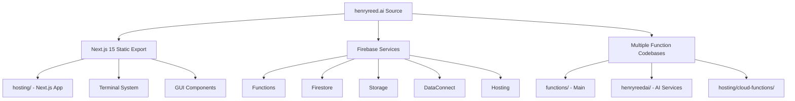
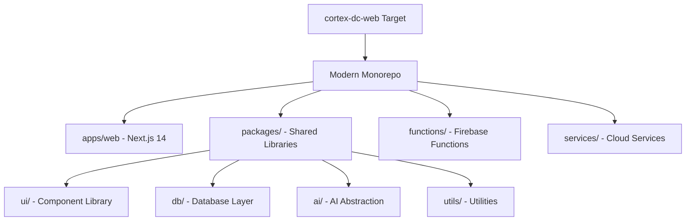
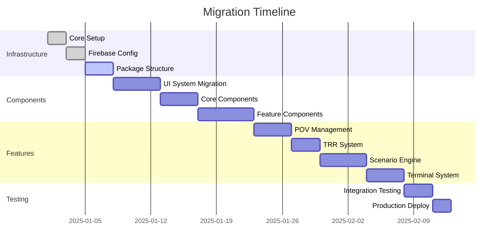

# Henryreed.ai to Cortex-DC-Web Migration Analysis

## Executive Summary

This document provides a comprehensive analysis of migrating the sophisticated henryreed.ai platform to the cortex-dc-web monorepo structure. The source application is a production-ready Domain Consultant platform with extensive features that need to be preserved while modernizing the architecture.

## Source Repository Analysis

### Architecture Overview


### Key Statistics
- **Total Files**: 500+ files across multiple directories
- **React Components**: 50+ sophisticated UI components
- **Terminal Commands**: 20+ primary commands with 45+ aliases
- **Firebase Functions**: 7+ cloud functions across 3 codebases
- **Documentation**: 30+ markdown files with comprehensive guides
- **Configuration Files**: Multiple Firebase, Next.js, and tooling configs

### Core Features Identified
1. **Domain Consultant Workspace** - Complete POV management system
2. **TRR Management** - Technical Risk Review workflows with validation
3. **Scenario Engine** - AI-powered security scenario generation and execution  
4. **XSIAM Integration** - Real-time health monitoring and API integration
5. **BigQuery Explorer** - Advanced data export and analytics
6. **Content Hub** - Unified content creation and management
7. **Terminal System** - Comprehensive CLI with 200+ commands
8. **AI Assistant** - Context-aware recommendations and chat

### Technology Stack
- **Frontend**: Next.js 15, TypeScript, Tailwind CSS, React 18
- **Backend**: Firebase Functions (Node.js 20), Firestore, Storage
- **AI Services**: OpenAI GPT-4, Vertex AI, custom AI workflows
- **External APIs**: XSIAM, BigQuery, GitHub, Cal.com, Multi-cloud
- **Build System**: Custom webpack experiments, Turbopack

## Target Repository Analysis

### Current Cortex-DC-Web Structure


### Current State
- **Package Manager**: pnpm with workspaces
- **Build System**: Turbo for monorepo builds
- **Frontend**: Next.js 14 with App Router (needs upgrade to match source)
- **Tooling**: Modern ESLint, Prettier, TypeScript 5.3+
- **CI/CD**: GitHub Actions ready
- **Firebase**: Basic configuration exists

## Migration Strategy

### Phase-Based Approach


### Migration Phases

#### Phase 1: Infrastructure Foundation ⚡
**Duration**: 2-3 days

1. **Upgrade Next.js**: 14 → 15 with static export configuration
2. **Firebase Configuration**: Merge and optimize firebase.json configs
3. **Package Structure**: Set up monorepo packages for shared code
4. **Build System**: Configure Turbo for multi-package builds
5. **TypeScript**: Establish strict configuration across packages

#### Phase 2: Component System Migration 🎨
**Duration**: 4-5 days  

1. **UI Package Setup**: Create packages/ui with design system
2. **Component Migration**: Move 50+ React components with organization
3. **Styling System**: Integrate Tailwind, Chakra UI, Mantine, Tremor
4. **Navigation**: Standardize navigation across all components
5. **Testing**: Component testing with Storybook (optional)

#### Phase 3: Core Feature Migration 🏗️
**Duration**: 8-10 days

1. **Authentication**: Migrate Firebase Auth with role-based access
2. **Database Layer**: Create packages/db with Firestore utilities  
3. **AI Integration**: Create packages/ai with provider abstraction
4. **API Layer**: Consolidate API clients and services
5. **State Management**: Establish patterns for client/server state

#### Phase 4: Domain Features Migration 💼
**Duration**: 10-12 days

1. **Domain Consultant Workspace**
   - POV lifecycle management
   - Customer engagement tracking
   - Timeline and milestone management

2. **TRR Management System**
   - Technical risk review workflows
   - Evidence collection and validation
   - Approval and signoff processes

3. **Scenario Engine**
   - AI-powered scenario generation
   - Real-time execution monitoring
   - MITRE ATT&CK integration

#### Phase 5: Advanced Features Migration 🚀
**Duration**: 8-10 days

1. **XSIAM Integration**
   - Health monitoring dashboards
   - API connectivity and credentials
   - Real-time status updates

2. **BigQuery Explorer**
   - Data export configuration
   - Query builder interface
   - Analytics dashboards

3. **Content Hub**
   - Creation and management tools
   - Template system
   - Export capabilities

4. **Terminal System**
   - Command registry and parsing
   - 200+ commands with aliases
   - Interactive terminal UI

#### Phase 6: Testing & Optimization 🧪
**Duration**: 4-5 days

1. **Integration Testing**: End-to-end workflow validation
2. **Performance Optimization**: Bundle size, loading times
3. **Security Review**: Firestore rules, authentication flows
4. **Documentation**: Update guides and API references
5. **Production Deploy**: Multi-environment deployment

## Compatibility Matrix

### Technology Alignment

| Component | Source Version | Target Version | Action Required |
|-----------|---------------|----------------|-----------------|
| Next.js | 15.x (latest) | 14.x | **Upgrade to 15** |
| React | 18.2.0 | 18+ | ✅ Compatible |
| TypeScript | 5.3.3 | 5.3.3 | ✅ Compatible |
| Tailwind | 3.4.0 | Latest | ⚠️ Version alignment |
| Firebase | 12.3.0 | Latest | ✅ Compatible |
| Node.js | 20.x | 18+ | ✅ Compatible |

### Package Dependencies

**Critical Dependencies to Migrate:**
- `jspdf` - PDF generation for reports
- `gray-matter` - Markdown processing
- `clsx` / `tailwind-merge` - Styling utilities
- Custom DataConnect integration
- Firebase SDK configuration

**New Dependencies to Add:**
- UI Framework packages (Mantine, Chakra UI)
- Tremor for data visualization
- Enhanced TypeScript tooling
- Monorepo management tools

## Risk Assessment

### High Risk Items 🔴
1. **Firebase DataConnect**: Complex schema migration
2. **Custom Webpack Configuration**: Experimental features compatibility
3. **AI Service Integration**: OpenAI API key management and rate limits
4. **Real-time Features**: Pub/Sub and Firestore listeners
5. **XSIAM API**: External service authentication and credentials

### Medium Risk Items 🟡
1. **Component Styling**: CSS conflicts between UI frameworks
2. **Bundle Size**: Multiple UI frameworks impact
3. **State Management**: Client/server boundary complexity
4. **Testing**: E2E test migration and new scenarios
5. **Documentation**: Path updates and link validation

### Low Risk Items 🟢
1. **Basic Components**: Standard React component migration
2. **TypeScript**: Strong typing compatibility
3. **Build Configuration**: Standard Next.js patterns
4. **Development Tools**: ESLint, Prettier alignment
5. **Static Assets**: Image and document migration

## File Organization Mapping

### Source → Target Mapping

```
henryreed.ai/hosting/                    → apps/web/
├── app/                                 → app/
├── components/                          → components/
├── lib/                                 → lib/
└── docs/                               → docs/

henryreed.ai/functions/                  → functions/
├── src/                                → src/
└── lib/                                → lib/

henryreed.ai/hosting/components/         → packages/ui/src/
henryreed.ai/hosting/lib/               → packages/utils/src/
AI-related functions                     → packages/ai/src/
Database utilities                       → packages/db/src/
```

### Component Organization

**UI Package Structure:**
```
packages/ui/
├── src/
│   ├── components/           # React components
│   │   ├── domain/          # Domain Consultant components
│   │   ├── pov/             # POV management
│   │   ├── trr/             # TRR workflows  
│   │   ├── scenario/        # Scenario engine
│   │   ├── xsiam/           # XSIAM integration
│   │   ├── terminal/        # Terminal system
│   │   └── common/          # Shared components
│   ├── hooks/               # Custom React hooks
│   ├── providers/           # Context providers
│   └── styles/              # Design system
```

## Environment Variables Migration

### Source Environment Variables
```bash
# Source .env.example analysis needed
NEXT_PUBLIC_FIREBASE_PROJECT_ID=
NEXT_PUBLIC_FIREBASE_API_KEY=
OPENAI_API_KEY=
XSIAM_API_BASE=
BIGQUERY_PROJECT_ID=
```

### Target Environment Configuration
```bash
# Target environment setup
NEXT_PUBLIC_FIREBASE_PROJECT_ID=cortex-dc-web-prod
NEXT_PUBLIC_FIREBASE_API_KEY=
NEXT_PUBLIC_APP_ENV=production
OPENAI_API_KEY=
VERTEX_AI_PROJECT=
XSIAM_API_BASE=
BIGQUERY_PROJECT_ID=
```

## Success Criteria

### Functional Requirements ✅
- [ ] **Firebase Deploy**: Successful deployment to all environments
- [ ] **Feature Parity**: All source features functional in target
- [ ] **Performance**: Sub-2s page loads, <300ms API responses
- [ ] **User Workflows**: Complete POV, TRR, Scenario workflows
- [ ] **AI Integration**: All AI services operational
- [ ] **Data Integrity**: No data loss during migration

### Technical Requirements ✅
- [ ] **Build Success**: `pnpm build` completes without errors
- [ ] **Type Safety**: Zero TypeScript errors in strict mode
- [ ] **Test Coverage**: All critical paths covered by tests
- [ ] **Documentation**: Updated guides and API references
- [ ] **Security**: Firestore rules and authentication working
- [ ] **Monitoring**: Error tracking and performance monitoring

### Business Requirements ✅
- [ ] **Zero Downtime**: Parallel deployment strategy
- [ ] **Feature Continuity**: All user workflows preserved
- [ ] **Performance**: Improved or maintained performance
- [ ] **Scalability**: Architecture ready for growth
- [ ] **Maintainability**: Improved code organization
- [ ] **Developer Experience**: Enhanced development workflow

## Next Steps

### Immediate Actions
1. **Backup Strategy**: Create full backup of source repository
2. **Environment Setup**: Prepare development and staging environments
3. **Team Alignment**: Coordinate with stakeholders on timeline
4. **Risk Mitigation**: Prepare rollback procedures
5. **Progress Tracking**: Set up project management for migration phases

### Development Workflow
1. **Feature Branch**: Create migration branch for safety
2. **Incremental Commits**: Small, testable changes
3. **Continuous Testing**: Run tests after each major component migration
4. **Parallel Development**: Keep source repository functional during migration
5. **Staged Deployment**: Test in staging before production

This migration represents a significant modernization of the platform while preserving all existing functionality and improving scalability, maintainability, and developer experience.