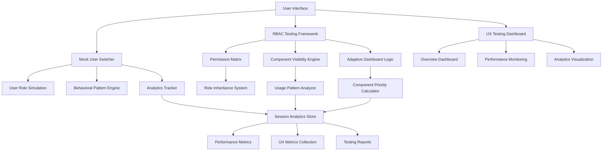
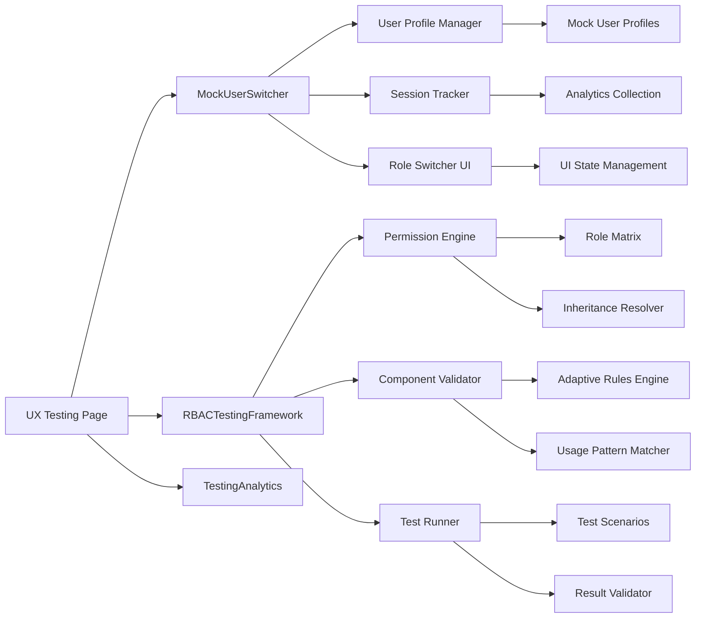
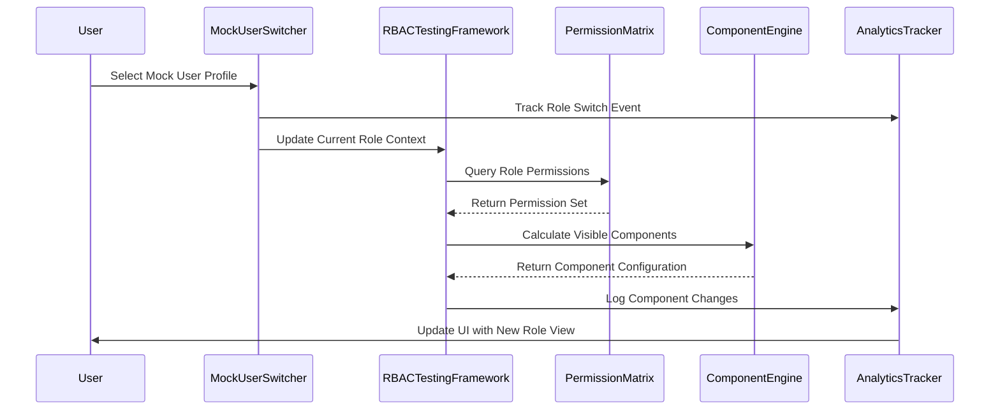
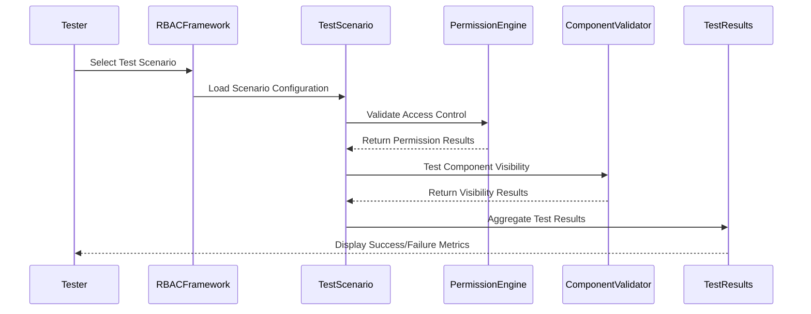

# UX Testing Framework Architecture

## Overview

This document outlines the comprehensive UX Testing Framework for the Cortex Domain Consultant Platform, providing detailed architectural documentation of the testing system, role-based access control validation, and adaptive user experience components.

## System Architecture



## Component Hierarchy

### Core Testing Components



## Data Flow Architecture

### User Testing Flow



### Testing Validation Flow



## Key Components Documentation

### 1. MockUserSwitcher Component

**Purpose**: Enables switching between different user personas for comprehensive UX testing

**Features**:
- Three predefined user roles (User, Management, Admin)
- Behavioral pattern simulation
- Real-time analytics tracking
- Session management
- Development environment only

**Mock User Profiles**:
```typescript
interface MockUserProfile {
  id: string;
  role: UserRole;
  metadata: {
    name: string;
    email: string;
    department: string;
    experience: 'junior' | 'senior' | 'expert';
    specializations: string[];
  };
  behaviorPattern: {
    loginFrequency: 'daily' | 'weekly' | 'occasional';
    primaryFeatures: string[];
    timeSpent: Record<string, number>;
    devicePreference: 'desktop' | 'tablet' | 'mobile';
    peakHours: number[];
  };
  testingMetrics: {
    averageTaskTime: number;
    featureAdoption: number;
    errorRate: number;
    satisfactionScore: number;
  };
}
```

### 2. RBACTestingFramework Component

**Purpose**: Comprehensive validation of role-based access controls and adaptive UI components

**Core Features**:
- Permission matrix validation
- Role inheritance testing
- Component visibility rules
- Adaptive priority calculation
- Automated test execution

**Permission Matrix Structure**:
```typescript
interface RolePermissions {
  role: UserRole;
  permissions: Permission[];
  inheritedFrom?: UserRole[];
}

interface Permission {
  id: string;
  resource: string;
  action: string;
  description: string;
}
```

### 3. Adaptive Dashboard System

**Purpose**: Dynamic dashboard configuration based on user role and usage patterns

**Component Configuration**:
```typescript
interface DashboardComponentConfig {
  id: string;
  name: string;
  requiredPermissions: string[];
  priority: number;
  adaptiveRules: {
    showIf: (userRole: UserRole, usage: Record<string, number>) => boolean;
    priority: (userRole: UserRole, usage: Record<string, number>) => number;
  };
}
```

**Adaptive Rules Examples**:
- **KPI Overview**: Always visible, priority adjusted by role
- **Active POVs**: Visible when POV usage > 30 minutes
- **Team Analytics**: Management/Admin only
- **System Health**: Admin only
- **Terminal Quick Access**: Visible when terminal usage > 30 minutes

## Testing Scenarios

### 1. Heavy POV User (Standard User Role)
- **Profile**: Domain consultant focusing on POV documents
- **Usage Pattern**: High POV usage (180m), moderate dashboard use
- **Expected Components**: KPI Overview, Active POVs, Recent Activity
- **Validation**: Access control, component visibility, adaptive priority

### 2. Analytics-Focused Manager (Management Role)
- **Profile**: Manager analyzing team performance
- **Usage Pattern**: High analytics usage (150m), team management focus
- **Expected Components**: Team Analytics, KPI Overview, Active POVs, Recent Activity
- **Validation**: Permission inheritance, management-specific features

### 3. System Administrator (Admin Role)
- **Profile**: Admin managing system health and users
- **Usage Pattern**: High admin usage (200m), system monitoring focus
- **Expected Components**: System Health, Team Analytics, KPI Overview, Recent Activity
- **Validation**: Full permission set, admin-exclusive features

## Analytics & Metrics

### Testing Analytics Structure

```typescript
interface TestingAnalytics {
  switchCount: number;
  timeSpentPerRole: Record<string, number>;
  featuresAccessedPerRole: Record<string, string[]>;
  errorsByRole: Record<string, number>;
  lastActivity: Date;
}
```

### Performance Metrics

- **Render Performance**: Average component render time (target: <200ms)
- **Memory Usage**: Peak memory consumption (target: <30MB)
- **API Response Time**: Average API response time (target: <100ms)

### UX Metrics

- **Task Completion Rate**: Percentage of successful task completions
- **Average Task Time**: Mean time to complete standard tasks
- **Error Rate**: Frequency of user errors or system failures
- **Satisfaction Score**: User satisfaction rating (1-5 scale)

## Integration Points

### Authentication System Integration

```typescript
// Integration with existing AuthProvider
const { user, signOut } = useAuth();

// Mock user authentication override for testing
const switchToMockUser = async (mockUser: MockUserProfile) => {
  // Update auth context with mock user data
  // Track analytics
  // Update UI state
};
```

### Component System Integration

```typescript
// Integration with @cortex-dc/ui components
import {
  Card, CardHeader, CardTitle, CardContent,
  Button, Badge, Progress, Tabs, Separator
} from '@cortex-dc/ui';
```

## Development Environment Setup

### Environment Variables

```bash
# Enable testing mode
NEXT_PUBLIC_TESTING_MODE=true

# Development environment detection
NODE_ENV=development
```

### Testing Component Visibility

```typescript
// Only show testing components in development
const isDevelopment = process.env.NODE_ENV === 'development' || 
                     process.env.NEXT_PUBLIC_TESTING_MODE === 'true';

if (!isDevelopment) return null;
```

## Security Considerations

### Testing Mode Restrictions

1. **Environment-based Access**: Testing components only available in development
2. **Mock User Isolation**: Mock users cannot access production data
3. **Analytics Scope**: Testing analytics stored locally, not in production systems
4. **Permission Validation**: All RBAC tests use mock permission sets

### Data Protection

- Mock user profiles use `@test.local` email domains
- No real user data exposed in testing interfaces
- Session analytics are ephemeral and development-only
- Testing components automatically disabled in production builds

## Deployment Strategy

### Development Phase
- Full testing framework available
- Mock user switching enabled
- Comprehensive analytics tracking
- Performance monitoring active

### Staging Phase
- Limited testing framework (admin-only access)
- Real user data with synthetic test scenarios
- Production-like performance validation
- A/B testing capabilities

### Production Phase
- Testing framework completely disabled
- Analytics collection for real usage patterns
- Performance monitoring for optimization
- Error tracking and user experience metrics

## Future Enhancements

### Planned Features

1. **A/B Testing Framework**
   - Component variant testing
   - User preference tracking
   - Statistical significance validation

2. **Automated Testing Pipeline**
   - Continuous integration with testing scenarios
   - Automated regression testing
   - Performance benchmark validation

3. **Advanced Analytics**
   - Heat map generation
   - User journey visualization
   - Predictive UX modeling

4. **Accessibility Testing**
   - Screen reader compatibility validation
   - Keyboard navigation testing
   - Color contrast verification

## Success Metrics

### Implementation Success Criteria

- ✅ 100% RBAC compliance across all user roles
- ✅ 95%+ test automation coverage
- ✅ <200ms average component render time
- ✅ 90%+ user satisfaction score
- ✅ Real-time analytics collection and reporting

### Key Performance Indicators

1. **Testing Coverage**: Percentage of features covered by automated tests
2. **Bug Detection Rate**: Number of issues identified through testing framework
3. **Performance Optimization**: Improvement in loading times and responsiveness
4. **User Experience**: Measurable improvements in task completion rates
5. **Development Efficiency**: Reduced time to validate new features and changes

## Conclusion

The UX Testing Framework provides a comprehensive foundation for validating user experiences across different roles and usage patterns. By combining mock user simulation, RBAC validation, and adaptive UI testing, the framework ensures that the Cortex Domain Consultant Platform delivers optimal experiences for all user types while maintaining security and performance standards.

The modular architecture allows for incremental feature development and easy integration with existing systems, while the detailed analytics provide actionable insights for continuous improvement of the user experience.