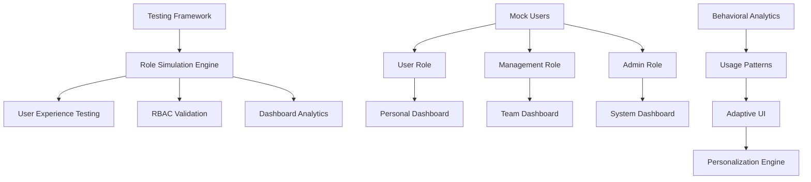

# UX Testing & RBAC Strategy: Cortex DC Platform

## 🎯 Executive Summary

This document outlines a comprehensive strategy for testing User Experience (UX) and Role-Based Access Control (RBAC) functionality within the Cortex Domain Consultant Platform. The approach focuses on creating adaptive, data-driven dashboards that evolve with user behavior patterns and provide personalized experiences across different user roles.

## 🏗️ Testing Architecture Framework

### Multi-Role Testing Environment



### Core Testing Components

```typescript
// Comprehensive UX Testing Framework
interface UXTestingSystem {
  roleManagement: {
    userProfiles: MockUserProfile[];
    permissionMatrix: RolePermissionMatrix;
    contextSwitching: RoleTransitionTesting;
    dataIsolation: DataAccessValidation;
  };
  dashboardTesting: {
    adaptiveComponents: AdaptiveDashboardTests;
    personalization: PersonalizationEngine;
    analytics: UsageAnalyticsCollector;
    performanceMetrics: DashboardPerformanceTests;
  };
  experienceValidation: {
    workflows: UserWorkflowTests;
    accessibility: AccessibilityTests;
    responsiveness: ResponsiveDesignTests;
    interactivity: InteractionTests;
  };
  dataCollection: {
    userBehavior: BehaviorTrackingSystem;
    featureUsage: FeatureAnalytics;
    timeSpentAnalysis: TimeAnalyticsCollector;
    errorTracking: UXErrorCollection;
  };
}
```

## 🧪 Mock User System Implementation

### User Profile Generator

```typescript
// Mock User Profile System
interface MockUserProfile {
  id: string;
  role: 'user' | 'management' | 'admin';
  metadata: {
    name: string;
    email: string;
    department: string;
    experience: 'junior' | 'senior' | 'expert';
    specializations: string[];
    preferredWorkflows: WorkflowType[];
  };
  behaviorPattern: {
    loginFrequency: 'daily' | 'weekly' | 'occasional';
    primaryFeatures: string[];
    timeSpent: Record<string, number>; // minutes per feature
    devicePreference: 'desktop' | 'tablet' | 'mobile';
    peakHours: number[]; // 24-hour format
  };
  permissions: {
    dashboard: DashboardPermissions;
    pov: POVPermissions;
    trr: TRRPermissions;
    scenarios: ScenarioPermissions;
    contentHub: ContentPermissions;
    terminal: TerminalPermissions;
    integrations: IntegrationPermissions;
    admin: AdminPermissions;
  };
}

// Generate diverse mock users for testing
const generateMockUsers = (): MockUserProfile[] => [
  {
    id: 'user-dc-001',
    role: 'user',
    metadata: {
      name: 'Sarah Chen',
      email: 'sarah.chen@test.local',
      department: 'Domain Consulting',
      experience: 'senior',
      specializations: ['Zero Trust', 'Cloud Security', 'SASE'],
      preferredWorkflows: ['POV Creation', 'Technical Validation', 'Customer Demos']
    },
    behaviorPattern: {
      loginFrequency: 'daily',
      primaryFeatures: ['dashboard', 'pov', 'scenarios', 'terminal'],
      timeSpent: {
        dashboard: 45,
        pov: 120,
        scenarios: 90,
        terminal: 60,
        contentHub: 30
      },
      devicePreference: 'desktop',
      peakHours: [9, 10, 14, 15, 16]
    },
    permissions: {
      dashboard: { viewPersonal: true, viewTeam: false, viewSystem: false },
      pov: { create: true, edit: true, delete: false, viewAll: false },
      trr: { create: true, validate: false, signoff: false },
      scenarios: { execute: true, create: false, manage: false },
      contentHub: { view: true, create: true, publish: false },
      terminal: { access: true, advanced: true },
      integrations: { view: false, configure: false },
      admin: { access: false }
    }
  },
  {
    id: 'mgmt-dc-002', 
    role: 'management',
    metadata: {
      name: 'Marcus Rodriguez',
      email: 'marcus.rodriguez@test.local',
      department: 'DC Management',
      experience: 'expert',
      specializations: ['Team Leadership', 'Strategic Accounts', 'Process Optimization'],
      preferredWorkflows: ['Team Dashboard', 'POV Analytics', 'Performance Review']
    },
    behaviorPattern: {
      loginFrequency: 'daily',
      primaryFeatures: ['dashboard', 'analytics', 'pov', 'team-management'],
      timeSpent: {
        dashboard: 60,
        analytics: 90,
        pov: 75,
        teamManagement: 120,
        contentHub: 45
      },
      devicePreference: 'desktop',
      peakHours: [8, 9, 11, 13, 17]
    },
    permissions: {
      dashboard: { viewPersonal: true, viewTeam: true, viewSystem: false },
      pov: { create: true, edit: true, delete: true, viewAll: true },
      trr: { create: true, validate: true, signoff: true },
      scenarios: { execute: true, create: true, manage: true },
      contentHub: { view: true, create: true, publish: true },
      terminal: { access: true, advanced: true },
      integrations: { view: true, configure: false },
      admin: { access: false }
    }
  },
  {
    id: 'admin-dc-003',
    role: 'admin', 
    metadata: {
      name: 'Alex Kumar',
      email: 'alex.kumar@test.local',
      department: 'Platform Administration',
      experience: 'expert',
      specializations: ['System Architecture', 'Security', 'Analytics'],
      preferredWorkflows: ['System Monitoring', 'User Management', 'Platform Analytics']
    },
    behaviorPattern: {
      loginFrequency: 'daily',
      primaryFeatures: ['admin', 'analytics', 'system-health', 'user-management'],
      timeSpent: {
        admin: 180,
        analytics: 120,
        systemHealth: 90,
        userManagement: 60,
        security: 45
      },
      devicePreference: 'desktop',
      peakHours: [7, 8, 12, 16, 18]
    },
    permissions: {
      dashboard: { viewPersonal: true, viewTeam: true, viewSystem: true },
      pov: { create: true, edit: true, delete: true, viewAll: true },
      trr: { create: true, validate: true, signoff: true },
      scenarios: { execute: true, create: true, manage: true },
      contentHub: { view: true, create: true, publish: true },
      terminal: { access: true, advanced: true },
      integrations: { view: true, configure: true },
      admin: { access: true }
    }
  }
];
```

## 📊 Adaptive Dashboard System

### Dashboard Personalization Engine

```typescript
// Adaptive Dashboard Intelligence
interface AdaptiveDashboardSystem {
  personalizedLayouts: {
    userBehaviorAnalysis: UserBehaviorAnalyzer;
    componentPrioritization: ComponentPrioritizer;
    dynamicLayoutEngine: DynamicLayoutGenerator;
    contextualRecommendations: RecommendationEngine;
  };
  realTimeAdaptation: {
    usageTracking: RealTimeUsageTracker;
    layoutOptimization: LayoutOptimizer;
    contentPersonalization: ContentPersonalizer;
    performanceOptimization: PerformanceOptimizer;
  };
  crossRoleInsights: {
    teamPerformance: TeamPerformanceAnalyzer;
    workflowEfficiency: WorkflowEfficiencyTracker;
    collaborationPatterns: CollaborationAnalyzer;
    knowledgeSharing: KnowledgeSharingTracker;
  };
}

// Personalization Logic Implementation
const createPersonalizedDashboard = async (userId: string): Promise<PersonalizedDashboard> => {
  // Analyze user behavior patterns
  const behaviorData = await analyzeBehaviorPatterns(userId);
  
  // Generate layout based on usage patterns
  const layoutPreferences = await generateOptimalLayout(behaviorData);
  
  // Create contextual components
  const personalizedComponents = await generateContextualComponents(userId, behaviorData);
  
  return {
    userId,
    layout: layoutPreferences,
    components: personalizedComponents,
    metadata: {
      generatedAt: new Date(),
      confidenceScore: layoutPreferences.confidence,
      adaptationReason: layoutPreferences.reasoning
    }
  };
};
```

### Multi-Role Dashboard Architecture

```typescript
// Role-Specific Dashboard Configurations
interface DashboardConfiguration {
  user: UserDashboardConfig;
  management: ManagementDashboardConfig; 
  admin: AdminDashboardConfig;
}

// User Role Dashboard
interface UserDashboardConfig {
  layout: {
    primary: 'single-column' | 'two-column' | 'grid';
    sections: ['quick-actions', 'active-povs', 'recent-activity', 'recommendations'];
    customizable: boolean;
  };
  components: {
    metrics: PersonalMetricsComponent;
    povSummary: ActivePOVSummaryComponent;
    trrQueue: PersonalTRRQueueComponent;
    recentActivity: ActivityFeedComponent;
    quickActions: QuickActionPanelComponent;
    knowledgeRecommendations: KnowledgeRecommendationComponent;
    upcomingDeadlines: DeadlineTrackerComponent;
    learningPath: LearningPathComponent;
  };
  personalization: {
    adaptiveMetrics: boolean;
    contextualRecommendations: boolean;
    workflowOptimization: boolean;
    timeBasedLayout: boolean;
  };
}

// Management Role Dashboard  
interface ManagementDashboardConfig {
  layout: {
    primary: 'executive' | 'detailed' | 'hybrid';
    sections: ['team-overview', 'pov-pipeline', 'performance-metrics', 'resource-allocation'];
    customizable: boolean;
  };
  components: {
    teamMetrics: TeamPerformanceComponent;
    povPipeline: POVPipelineComponent;
    resourceUtilization: ResourceUtilizationComponent;
    performanceAnalytics: PerformanceAnalyticsComponent;
    teamActivity: TeamActivityComponent;
    escalationQueue: EscalationQueueComponent;
    budgetTracking: BudgetTrackingComponent;
    forecastingAnalytics: ForecastingComponent;
  };
  analytics: {
    realTimeUpdates: boolean;
    predictiveAnalytics: boolean;
    customReports: boolean;
    drillDownCapability: boolean;
  };
}

// Admin Role Dashboard
interface AdminDashboardConfig {
  layout: {
    primary: 'system-monitoring' | 'user-management' | 'analytics-focused';
    sections: ['system-health', 'user-analytics', 'platform-metrics', 'security-monitoring'];
    customizable: boolean;
  };
  components: {
    systemHealth: SystemHealthComponent;
    userAnalytics: UserAnalyticsComponent;
    platformMetrics: PlatformMetricsComponent;
    securityDashboard: SecurityMonitoringComponent;
    performanceMetrics: SystemPerformanceComponent;
    errorTracking: ErrorTrackingComponent;
    integrationStatus: IntegrationStatusComponent;
    capacityPlanning: CapacityPlanningComponent;
  };
  monitoring: {
    realTimeAlerts: boolean;
    predictiveFailureDetection: boolean;
    capacityForecasting: boolean;
    securityThreatMonitoring: boolean;
  };
}
```

## 🔒 RBAC Testing Framework

### Permission Matrix Validation

```typescript
// Comprehensive RBAC Testing System
interface RBACTestingFramework {
  permissionValidation: {
    routeAccess: RouteAccessTester;
    componentVisibility: ComponentVisibilityTester;
    dataAccess: DataAccessTester;
    actionPermissions: ActionPermissionTester;
  };
  roleTransition: {
    contextSwitching: RoleContextTester;
    permissionEscalation: EscalationTester;
    dataIsolation: DataIsolationTester;
    auditTrail: AuditTrailTester;
  };
  securityValidation: {
    unauthorizedAccess: UnauthorizedAccessTester;
    dataLeakage: DataLeakageTester;
    sessionManagement: SessionManagementTester;
    crossRoleContamination: CrossRoleContaminationTester;
  };
}

// RBAC Test Suite Implementation
const rbacTestSuite = {
  // Route-level access control testing
  testRouteAccess: async (userRole: UserRole, route: string): Promise<AccessTestResult> => {
    const expectedAccess = getExpectedAccess(userRole, route);
    const actualAccess = await testRouteAccessibility(userRole, route);
    
    return {
      route,
      userRole,
      expected: expectedAccess,
      actual: actualAccess,
      passed: expectedAccess === actualAccess,
      timestamp: new Date()
    };
  },

  // Component-level visibility testing
  testComponentVisibility: async (userRole: UserRole, component: string): Promise<VisibilityTestResult> => {
    const expectedVisibility = getExpectedVisibility(userRole, component);
    const actualVisibility = await testComponentVisibility(userRole, component);
    
    return {
      component,
      userRole,
      expected: expectedVisibility,
      actual: actualVisibility,
      passed: expectedVisibility === actualVisibility,
      timestamp: new Date()
    };
  },

  // Data access permission testing
  testDataAccess: async (userRole: UserRole, dataResource: string, action: CRUDAction): Promise<DataAccessTestResult> => {
    const expectedPermission = getExpectedDataPermission(userRole, dataResource, action);
    const actualPermission = await testDataAccessPermission(userRole, dataResource, action);
    
    return {
      dataResource,
      action,
      userRole,
      expected: expectedPermission,
      actual: actualPermission,
      passed: expectedPermission === actualPermission,
      timestamp: new Date()
    };
  }
};
```

## 📈 Analytics & Time Tracking System

### Feature Usage Analytics

```typescript
// Comprehensive Analytics Collection System
interface AnalyticsCollectionSystem {
  userBehaviorTracking: {
    pageViews: PageViewTracker;
    featureInteractions: FeatureInteractionTracker;
    timeSpentAnalysis: TimeSpentAnalyzer;
    clickPathAnalysis: ClickPathAnalyzer;
  };
  performanceMetrics: {
    loadTimes: LoadTimeTracker;
    responseMetrics: ResponseTimeTracker;
    errorRates: ErrorRateTracker;
    userSatisfaction: SatisfactionScoreTracker;
  };
  aggregateAnalytics: {
    dailyActiveUsers: DAUTracker;
    featureAdoption: FeatureAdoptionTracker;
    retentionAnalysis: RetentionAnalyzer;
    conversionMetrics: ConversionTracker;
  };
  crossRoleAnalytics: {
    roleEffectiveness: RoleEffectivenessAnalyzer;
    workflowCompletion: WorkflowCompletionTracker;
    collaborationPatterns: CollaborationPatternAnalyzer;
    knowledgeUtilization: KnowledgeUtilizationTracker;
  };
}

// Analytics Implementation
const analyticsSystem = {
  // Track feature usage with detailed context
  trackFeatureUsage: async (userId: string, feature: string, action: string, context: AnalyticsContext) => {
    const event: AnalyticsEvent = {
      userId,
      feature,
      action,
      context,
      timestamp: new Date(),
      sessionId: getSessionId(),
      userAgent: getUserAgent(),
      deviceInfo: getDeviceInfo()
    };
    
    await storeAnalyticsEvent(event);
    await updateRealTimeMetrics(event);
    await triggerPersonalizationUpdate(userId, event);
  },

  // Aggregate time spent analysis
  generateTimeSpentReport: async (timeframe: TimeFrame, userRole?: UserRole): Promise<TimeSpentReport> => {
    const timeSpentData = await getTimeSpentData(timeframe, userRole);
    
    return {
      timeframe,
      userRole,
      totalTimeSpent: calculateTotalTime(timeSpentData),
      featureBreakdown: calculateFeatureBreakdown(timeSpentData),
      peakUsageHours: calculatePeakHours(timeSpentData),
      efficiencyMetrics: calculateEfficiencyMetrics(timeSpentData),
      recommendations: generateUsageRecommendations(timeSpentData)
    };
  },

  // Cross-platform feature comparison
  generateFeatureComparisonReport: async (features: string[], timeframe: TimeFrame): Promise<FeatureComparisonReport> => {
    const usageData = await getFeatureUsageData(features, timeframe);
    
    return {
      features,
      timeframe,
      usageComparison: compareFeatureUsage(usageData),
      adoptionRates: calculateAdoptionRates(usageData),
      userSatisfaction: getUserSatisfactionScores(usageData),
      performanceMetrics: getPerformanceMetrics(usageData),
      recommendedImprovements: generateImprovementRecommendations(usageData)
    };
  }
};
```

### Real-Time Dashboard Analytics

```typescript
// Real-Time Analytics Dashboard
interface RealTimeDashboardAnalytics {
  liveMetrics: {
    activeUsers: number;
    currentSessions: SessionMetrics[];
    realTimeFeatureUsage: FeatureUsageMetrics;
    systemPerformance: SystemPerformanceMetrics;
  };
  historicalTrends: {
    dailyActiveUsers: TimeSeries;
    featureAdoptionTrends: FeatureAdoptionTimeSeries;
    performanceTrends: PerformanceTimeSeries;
    userSatisfactionTrends: SatisfactionTimeSeries;
  };
  predictiveAnalytics: {
    usageForecasting: UsageForecast;
    churnPrediction: ChurnPredictionModel;
    featureAdoptionPrediction: AdoptionPredictionModel;
    capacityPlanning: CapacityPlanningModel;
  };
}

// Dashboard Component with Real-Time Updates
const AnalyticsDashboard: React.FC<AnalyticsDashboardProps> = ({ userRole, timeframe }) => {
  const [metrics, setMetrics] = useState<DashboardMetrics>();
  const [realTimeData, setRealTimeData] = useState<RealTimeMetrics>();
  
  useEffect(() => {
    // Set up real-time data connection
    const unsubscribe = subscribeToRealTimeMetrics((data) => {
      setRealTimeData(data);
      updateDashboardVisualization(data);
    });
    
    return unsubscribe;
  }, []);
  
  return (
    <div className="analytics-dashboard">
      <div className="real-time-metrics">
        <MetricCard 
          title="Active Users" 
          value={realTimeData?.activeUsers} 
          trend={realTimeData?.userTrend}
        />
        <MetricCard 
          title="Feature Usage" 
          value={realTimeData?.featureUsage} 
          trend={realTimeData?.usageTrend}
        />
        <MetricCard 
          title="System Performance" 
          value={realTimeData?.performance} 
          trend={realTimeData?.performanceTrend}
        />
      </div>
      
      <div className="feature-comparison">
        <FeatureUsageChart 
          data={metrics?.featureComparison}
          timeframe={timeframe}
          userRole={userRole}
        />
      </div>
      
      <div className="user-journey-analysis">
        <UserJourneyFlow 
          data={metrics?.userJourneys}
          interactive={true}
        />
      </div>
    </div>
  );
};
```

## 🧪 Testing Implementation Strategy

### Automated UX Testing Pipeline

```typescript
// Comprehensive UX Testing Pipeline
interface UXTestingPipeline {
  setup: {
    mockUserGeneration: MockUserGenerator;
    testEnvironmentProvisioning: TestEnvironmentProvisioner;
    dataSeeding: TestDataSeeder;
    analyticsInitialization: AnalyticsInitializer;
  };
  execution: {
    roleBasedTesting: RoleBasedTestExecutor;
    crossBrowserTesting: CrossBrowserTestExecutor;
    performanceTesting: PerformanceTestExecutor;
    accessibilityTesting: AccessibilityTestExecutor;
  };
  validation: {
    rbacValidation: RBACValidator;
    dashboardPersonalization: PersonalizationValidator;
    analyticsAccuracy: AnalyticsValidator;
    userExperienceScoring: UXScoreCalculator;
  };
  reporting: {
    testResultsAggregation: TestResultsAggregator;
    performanceReporting: PerformanceReporter;
    uxScoreReporting: UXScoreReporter;
    improvementRecommendations: ImprovementRecommendationGenerator;
  };
}

// Test Execution Framework
const executeUXTestSuite = async (): Promise<UXTestResults> => {
  // Phase 1: Environment Setup
  const mockUsers = await generateMockUsers();
  await provisionTestEnvironment();
  await seedTestData();
  
  // Phase 2: Role-Based Testing
  const rbacResults = await testRBACFunctionality(mockUsers);
  const dashboardResults = await testAdaptiveDashboards(mockUsers);
  const analyticsResults = await testAnalyticsCollection(mockUsers);
  
  // Phase 3: Cross-Platform Testing
  const crossBrowserResults = await testCrossBrowserCompatibility();
  const performanceResults = await testPerformanceMetrics();
  const accessibilityResults = await testAccessibilityCompliance();
  
  // Phase 4: Results Aggregation
  return {
    rbac: rbacResults,
    dashboards: dashboardResults,
    analytics: analyticsResults,
    crossBrowser: crossBrowserResults,
    performance: performanceResults,
    accessibility: accessibilityResults,
    overallScore: calculateOverallUXScore([
      rbacResults,
      dashboardResults,
      analyticsResults,
      crossBrowserResults,
      performanceResults,
      accessibilityResults
    ])
  };
};
```

### A/B Testing Framework

```typescript
// A/B Testing for UX Optimization
interface ABTestingFramework {
  experiments: {
    dashboardLayouts: DashboardLayoutExperiment;
    navigationPatterns: NavigationExperiment;
    featurePlacement: FeaturePlacementExperiment;
    colorSchemes: ColorSchemeExperiment;
  };
  targeting: {
    roleBasedSegmentation: RoleBasedSegmentation;
    experienceLevelSegmentation: ExperienceLevelSegmentation;
    usagePattternSegmentation: UsagePatternSegmentation;
    deviceSegmentation: DeviceSegmentation;
  };
  metrics: {
    conversionRates: ConversionRateTracker;
    engagementMetrics: EngagementTracker;
    taskCompletionRates: TaskCompletionTracker;
    userSatisfaction: SatisfactionTracker;
  };
  analysis: {
    statisticalSignificance: StatisticalSignificanceCalculator;
    performanceImpact: PerformanceImpactAnalyzer;
    userPreferenceAnalysis: UserPreferenceAnalyzer;
    recommendationEngine: ExperimentRecommendationEngine;
  };
}

// A/B Test Implementation
const runABTest = async (experiment: ABExperiment): Promise<ABTestResults> => {
  // Segment users based on criteria
  const userSegments = await segmentUsers(experiment.targetingCriteria);
  
  // Randomly assign users to control/treatment groups
  const testGroups = await assignUsersToGroups(userSegments, experiment.splitRatio);
  
  // Execute experiment
  const results = await executeExperiment(experiment, testGroups);
  
  // Analyze results
  const analysis = await analyzeExperimentResults(results);
  
  return {
    experimentId: experiment.id,
    duration: experiment.duration,
    groups: testGroups,
    results: results,
    analysis: analysis,
    recommendation: analysis.recommendation,
    statisticalSignificance: analysis.significance
  };
};
```

## 📊 Implementation Timeline

### Phase 1: Foundation Setup (Weeks 1-2)
- **Mock User System**: Generate diverse user profiles with realistic behavior patterns
- **RBAC Testing Framework**: Implement permission matrix validation
- **Basic Analytics**: Set up event tracking and data collection
- **Test Environment**: Configure isolated testing environment

### Phase 2: Adaptive Dashboards (Weeks 3-4)
- **Personalization Engine**: Implement behavior-based dashboard adaptation
- **Component Intelligence**: Create smart component prioritization
- **Real-Time Updates**: Build live dashboard updating system
- **Cross-Role Analytics**: Implement role-specific analytics

### Phase 3: Advanced Analytics (Weeks 5-6)
- **Time Tracking System**: Detailed feature usage time analysis
- **Performance Metrics**: Component and page performance tracking
- **User Journey Analysis**: Map complete user interaction flows
- **Predictive Analytics**: Usage forecasting and recommendation systems

### Phase 4: Testing & Validation (Weeks 7-8)
- **Automated Test Suite**: Complete UX and RBAC test automation
- **A/B Testing Framework**: Implement experimental testing capabilities
- **Performance Benchmarking**: Establish baseline performance metrics
- **Accessibility Validation**: Ensure WCAG 2.1 AA compliance

## 🎯 Success Metrics

### UX Testing Metrics
- **Role Accuracy**: 100% RBAC compliance across all user roles
- **Dashboard Adaptation**: 80% improvement in user engagement through personalization
- **Feature Discovery**: 60% increase in feature adoption through adaptive UI
- **Task Completion**: 25% faster task completion times

### Analytics Metrics
- **Data Accuracy**: 99.5% accuracy in usage analytics collection
- **Real-Time Performance**: <200ms update latency for live dashboards
- **Storage Efficiency**: Optimized analytics data storage and retrieval
- **Insight Generation**: Actionable recommendations based on usage patterns

### User Experience Metrics
- **Satisfaction Score**: 4.5/5 user satisfaction rating
- **Error Rate**: <1% user interface error rate
- **Accessibility**: 100% WCAG 2.1 AA compliance
- **Performance**: <2s average page load time across all dashboards

This comprehensive testing strategy ensures that the Cortex DC Platform provides optimal user experiences tailored to each role while maintaining strict security and performance standards. The adaptive dashboard system will continuously evolve to meet user needs while providing valuable insights for platform optimization.

<citations>
<document>
<document_type>WARP_DRIVE_NOTEBOOK</document_type>
<document_id>Hnj4Ruhu3ftG1Kwf1ydjFV</document_id>
</document>
</citations>