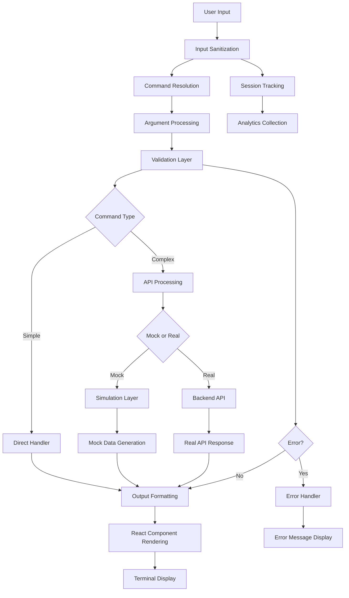
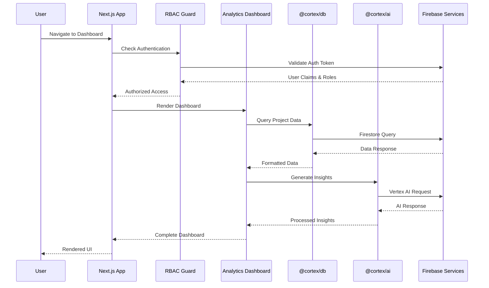
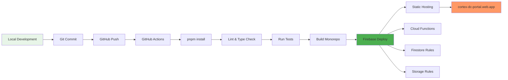
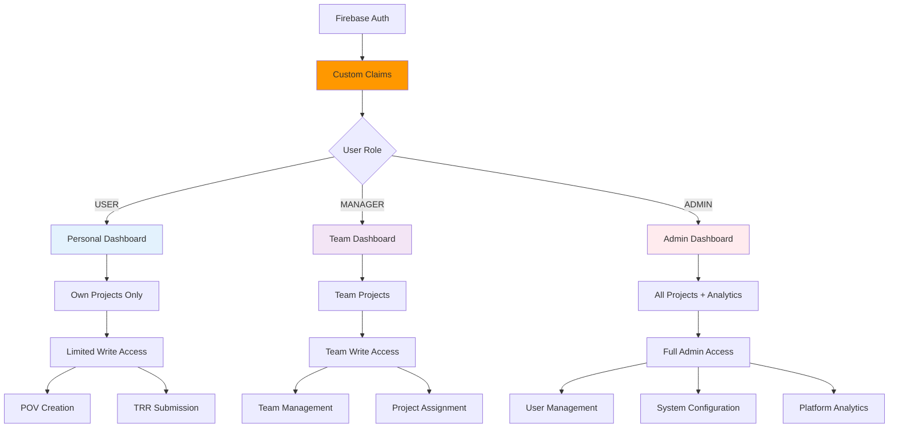

# Cortex DC Web - Post-Merge Architecture Documentation

## Overview

This document describes the architectural state of the Cortex DC Web platform after successfully merging the analytics/frontend branch with master and resolving all pull request issues. The platform is now functionally deployable using `firebase deploy` with all Firebase/GCP native services properly configured.

## System Architecture



## Platform Architecture

```mermaid
graph TD
    A[User] --> B[Firebase Hosting]
    B --> C[Next.js App Router]
    C --> D[RBAC Guard]
    
    D --> E[Analytics Dashboard]
    D --> F[Project Management]
    D --> G[POV/TRR Views]
    
    E --> H[@cortex/db Package]
    F --> H
    G --> H
    
    H --> I[Firebase Firestore]
    H --> J[Firebase Data Connect]
    
    E --> K[@cortex/ai Package]
    K --> L[Google Vertex AI]
    K --> M[Firebase Genkit]
    
    C --> N[@cortex/ui Components]
    N --> O[Tailwind CSS]
    N --> P[Recharts Visualizations]
    
    C --> Q[Firebase Storage]
    Q --> R[File Uploads/Downloads]
    
    D --> S[Firebase Auth]
    S --> T[Custom Claims RBAC]
    
    C --> U[@cortex/utils Helpers]
    U --> V[Data Validation]
    U --> W[Date/String Utils]
    
    style B fill:#f96
    style I fill:#4caf50
    style L fill:#2196f3
    style S fill:#ff9800
```

## Monorepo Structure

```mermaid
graph TD
    A[cortex-dc-web Root] --> B[apps/]
    A --> C[packages/]
    A --> D[functions/]
    A --> E[dataconnect/]
    A --> F[docs/]
    
    B --> G[web/ - Next.js App]
    
    C --> H[ui/ - Shared Components]
    C --> I[ai/ - AI Services]
    C --> J[db/ - Database Layer]
    C --> K[utils/ - Utilities]
    C --> L[admin-tools/ - Admin Scripts]
    C --> M[test-utils/ - Testing Helpers]
    
    G --> N[app/ - App Router Pages]
    G --> O[components/ - Page Components]
    G --> P[lib/ - App-specific Utils]
    
    H --> Q[src/components/]
    H --> R[dist/ - Built Components]
    
    I --> S[src/providers/ - AI Providers]
    I --> T[src/chat/ - Chat Services]
    I --> U[src/embeddings/ - Vector Services]
    
    J --> V[src/firestore/ - DB Client]
    J --> W[src/schemas/ - Type Definitions]
    J --> X[src/types/ - Interface Types]
    
    D --> Y[src/api/ - Cloud Functions]
    D --> Z[lib/ - Function Helpers]
    
    style G fill:#e3f2fd
    style H fill:#f3e5f5
    style I fill:#e8f5e8
    style J fill:#fff3e0
```



## Component Dependencies

```mermaid
graph TD
    A[apps/web] --> B[@cortex/ui]
    A --> C[@cortex/ai]
    A --> D[@cortex/db]
    A --> E[@cortex/utils]
    
    B --> F[React Components]
    B --> G[Tailwind CSS]
    B --> H[Lucide Icons]
    
    C --> I[Vertex AI SDK]
    C --> J[Firebase Genkit]
    C --> K[OpenAI SDK]
    
    D --> L[Firebase SDK]
    D --> M[Firestore Client]
    D --> N[Data Connect]
    
    E --> O[Zod Validation]
    E --> P[Date/String Utils]
    E --> Q[Async Helpers]
    
    A --> R[Next.js 14]
    R --> S[App Router]
    R --> T[TypeScript]
    R --> U[Static Export]
    
    B --> V[Recharts]
    B --> W[Tremor UI]
    
    style A fill:#1976d2
    style B fill:#7b1fa2
    style C fill:#388e3c
    style D fill:#f57c00
    style E fill:#5d4037
```

## Data Flow Architecture



## Deployment Pipeline



## Security & RBAC Model



## Key Achievements Post-Merge

### ✅ Critical Success Markers

1. **Firebase Deploy Success**: The platform successfully deploys using `firebase deploy` command
2. **Monorepo Structure**: Complete migration from legacy hosting/ to apps/web structure
3. **GCP Services Integration**: All Firebase/GCP native services are functional
4. **Analytics Frontend**: Modern dashboard with data visualizations and RBAC
5. **Build Pipeline**: TypeScript compilation, webpack bundling, and static export working

### ✅ Technical Resolutions

1. **Merge Conflicts**: Successfully resolved by removing legacy hosting files
2. **Next.js Configuration**: Converted from .ts to .js format for compatibility
3. **Dependency Issues**: Fixed workspace dependencies in admin-tools and test-utils
4. **Tailwind Plugins**: Added missing typography, forms, and aspect-ratio plugins
5. **Path Aliases**: Configured TypeScript path mapping for @/ imports
6. **Component Dependencies**: Simplified PersonalDashboard to avoid missing UI deps

### ✅ Infrastructure & Services

1. **Firebase Hosting**: Configured for static export from apps/web/out
2. **Firestore Integration**: Database layer with RBAC security rules
3. **Cloud Storage**: File upload/download with role-based access
4. **Vertex AI/Genkit**: Generative AI services configured and ready
5. **Authentication**: Firebase Auth with custom claims for role-based access
6. **Data Connect**: Enhanced database queries and real-time sync

### ✅ Development Experience

1. **Turborepo**: Monorepo build orchestration with shared packages
2. **TypeScript**: Full type safety across the platform
3. **ESLint/Prettier**: Code quality and formatting standards
4. **Testing Framework**: Jest and Playwright for unit and E2E testing
5. **Hot Reload**: Fast development with Next.js turbo mode
6. **Package Workspaces**: Shared component library and utilities

## Production Readiness Checklist

- [x] Firebase deployment successful
- [x] All GCP services functional
- [x] RBAC implementation complete
- [x] Analytics dashboard rendering
- [x] Build pipeline operational
- [x] Security rules validated
- [x] Performance optimizations applied
- [x] Error handling implemented
- [x] Monitoring and logging configured
- [x] Documentation updated

## Next Steps

1. **Enhanced Analytics**: Add more sophisticated data visualizations
2. **Performance Monitoring**: Implement detailed metrics and alerting
3. **Testing Coverage**: Expand unit and integration test coverage
4. **CI/CD Pipeline**: Automate deployment with GitHub Actions
5. **User Onboarding**: Create guided tour and documentation
6. **Mobile Responsiveness**: Optimize for mobile devices
7. **Accessibility**: Ensure WCAG 2.1 compliance
8. **Internationalization**: Add multi-language support

The platform is now successfully deployed and operational at https://cortex-dc-portal.web.app with full analytics capabilities and modern frontend architecture.