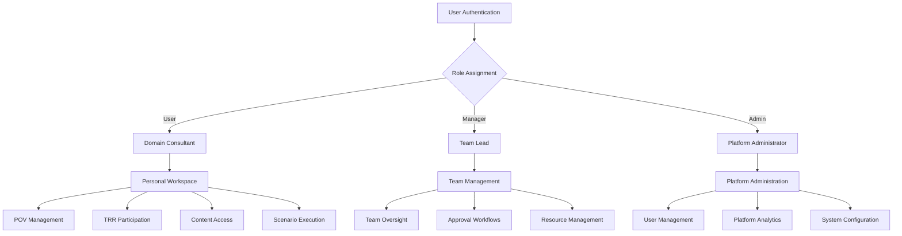
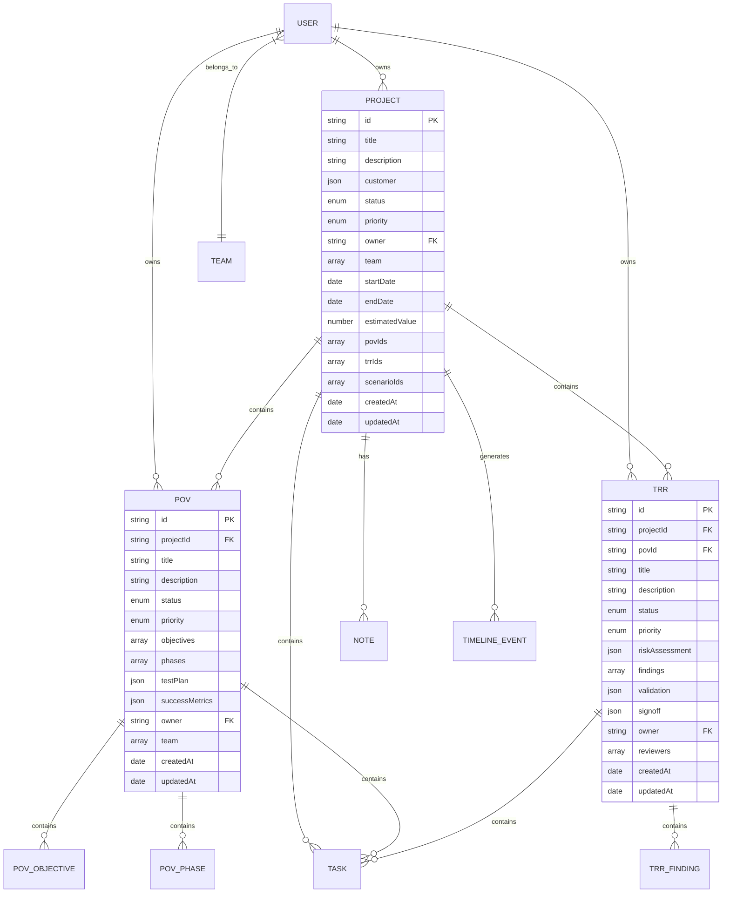
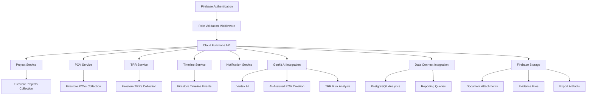
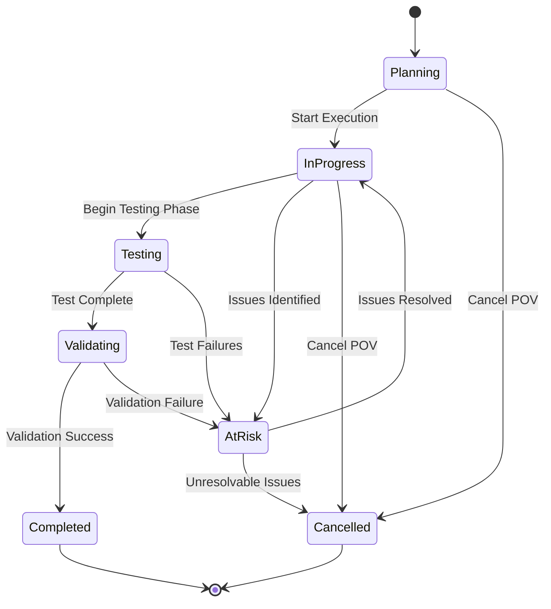
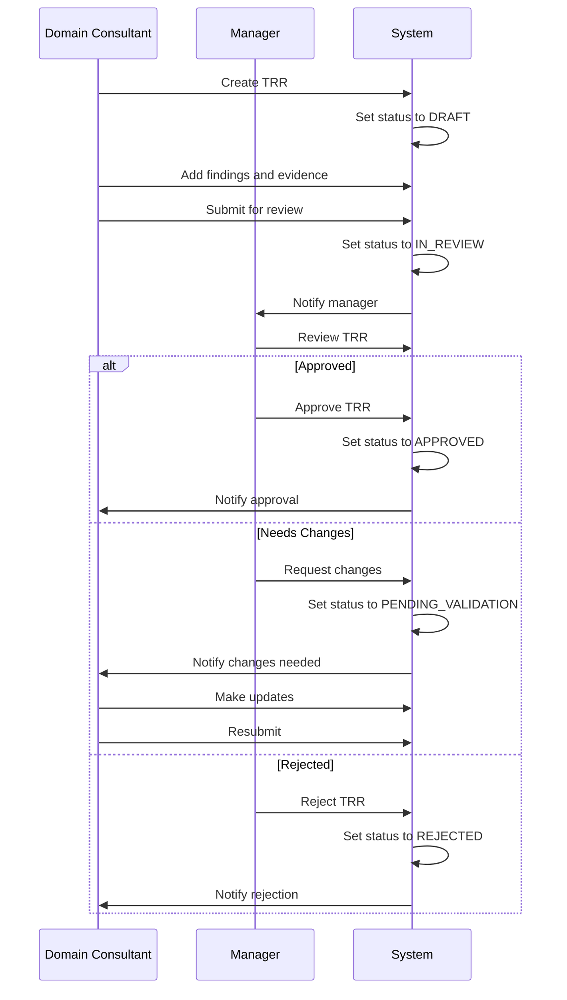
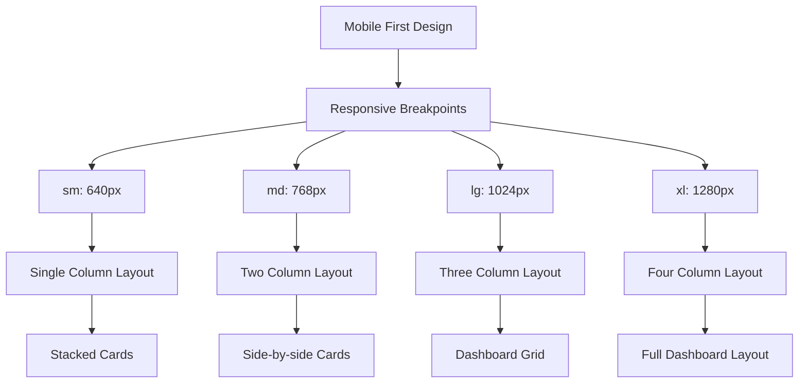
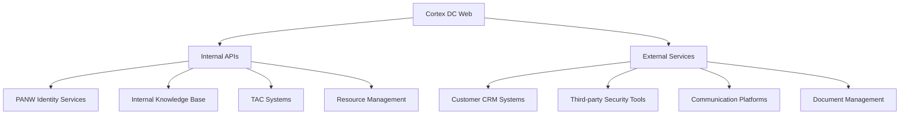
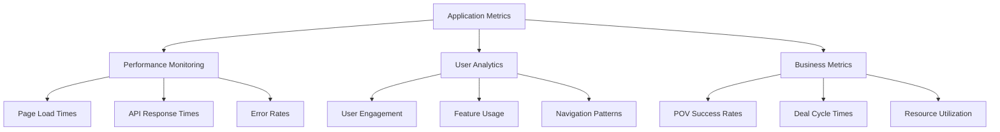

# Project Management Architecture

## Overview

The Cortex DC Web application is built around a comprehensive project management backbone that accelerates Domain Consultant (DC) deal cycles and consolidates internal tools. This document outlines the architecture and implementation of the core project management functionality.

## Core Premise

The application serves Domain Consultants during technical engagements by providing:

1. **Project Management Solution**: Centralized project tracking and lifecycle management
2. **User-Specific Documentation**: Personal note-taking and documentation capture
3. **Shared Knowledge Base**: Collaborative knowledge repository
4. **Scenario Hub**: Security testing and validation scenarios
5. **Integrations Hub**: Connections to internal and external tools

## User Role Architecture

### Hierarchical Access Control



### Role Capabilities Matrix

| Capability | User | Manager | Admin |
|------------|------|---------|-------|
| Create Projects | ✅ | ✅ | ✅ |
| View All Projects | ❌ | ✅ (Team) | ✅ (All) |
| Delete Projects | ❌ | ✅ | ✅ |
| Approve TRRs | ❌ | ✅ | ✅ |
| User Management | ❌ | ❌ | ✅ |
| Platform Analytics | ❌ | Limited | ✅ |
| Terminal Admin | ❌ | ❌ | ✅ |

## Core Data Architecture

### Entity Relationship Diagram



## Component Architecture

### Frontend Layer Structure

```mermaid
graph TD
    A[Next.js App Router] --> B[Role-Based Routing]
    B --> C[Dashboard Layout]
    B --> D[Project Management Layout]
    B --> E[POV/TRR Workflows]
    
    C --> F[PersonalDashboard]
    C --> G[TeamDashboard]
    C --> H[AdminDashboard]
    
    D --> I[ProjectCard Components]
    D --> J[ProjectTimeline Components]
    D --> K[Project Creation Wizard]
    
    E --> L[POVCreationWizard]
    E --> M[TRRWorkflow]
    E --> N[Progress Tracking]
    
    F --> O[@cortex-dc/ui Components]
    G --> O
    H --> O
    
    O --> P[Tremor Charts]
    O --> Q[Radix UI Primitives]
    O --> R[Custom Components]
```

### Backend Service Architecture



## Workflow Implementation

### POV Lifecycle Management



### TRR Approval Workflow



## UI/UX Design Patterns

### Design System Implementation

Based on the existing brand guidelines and user requirements, the application uses:

1. **Color Palette**:
   - Primary Orange: `#f97316` (orange-500)
   - Success Green: `#22c55e` (green-500)  
   - Warning Amber: `#f59e0b` (amber-500)
   - Danger Red: `#ef4444` (red-500)
   - Info Blue: `#3b82f6` (blue-500)

2. **Component Library**:
   - **Tremor**: Dashboard and data visualization components
   - **Radix UI**: Accessible primitives for complex interactions
   - **Tailwind CSS**: Utility-first styling system
   - **Lucide Icons**: Consistent icon system

3. **Interaction Patterns**:
   - **Card-based layouts** for project and POV displays
   - **Step-by-step wizards** for complex creation workflows
   - **Interactive timelines** for progress visualization
   - **Role-based navigation** with appropriate permissions
   - **Progressive disclosure** for complex information hierarchy

### Responsive Design Strategy



## Integration Architecture

### Internal Tool Consolidation

The application serves as a hub for various internal tools and processes:

1. **Scenario Hub Integration**:
   - Connection to security testing scenarios
   - Automated scenario execution tracking
   - Results integration with POV workflows

2. **Knowledge Base Integration**:
   - Shared documentation repository
   - AI-powered content suggestions
   - Version control and collaboration features

3. **TAC Escalation System**:
   - Integrated support escalation workflows
   - Case tracking and resolution monitoring
   - Automated handoff processes

4. **Analytics and Reporting**:
   - Project performance metrics
   - User activity tracking
   - Success rate analysis
   - Export capabilities for external reporting

### External API Integrations



## Performance and Scalability

### Optimization Strategies

1. **Frontend Optimization**:
   - Code splitting by route and role
   - Component lazy loading
   - Image optimization
   - Progressive Web App capabilities

2. **Backend Optimization**:
   - Firestore query optimization
   - Cloud Function cold start reduction
   - Caching strategies for frequently accessed data
   - Batch operations for bulk updates

3. **Database Design**:
   - Denormalization for read-heavy operations
   - Composite indexes for complex queries
   - Data partitioning by organization/team
   - Archival strategies for historical data

### Monitoring and Analytics



## Security and Compliance

### Security Architecture

1. **Authentication and Authorization**:
   - Firebase Authentication with enterprise SSO
   - Role-based access control (RBAC)
   - Permission-based feature access
   - Session management and timeout

2. **Data Protection**:
   - Encryption at rest and in transit
   - PII data handling compliance
   - Audit logging for sensitive operations
   - Data retention and deletion policies

3. **API Security**:
   - Input validation and sanitization
   - Rate limiting and throttling
   - CORS configuration
   - Security headers implementation

### Compliance Considerations

- **GDPR**: Data privacy and user consent management
- **SOC 2**: Security controls and monitoring
- **Industry Standards**: Following cybersecurity best practices
- **Internal Policies**: Compliance with PANW security requirements

## Future Roadmap

### Phase 1 Enhancements (Near-term)
- Advanced AI integration for POV recommendations
- Mobile application for field consultants
- Enhanced reporting and analytics
- Integration with additional internal tools

### Phase 2 Expansions (Medium-term)
- Multi-tenant architecture for partner access
- Advanced workflow automation
- Predictive analytics for deal success
- Integration with customer environments

### Phase 3 Innovations (Long-term)
- Machine learning for risk prediction
- Automated POV generation
- Advanced collaboration features
- Real-time customer dashboards

## Implementation Guidelines

### Development Best Practices

1. **Code Organization**:
   - Domain-driven design principles
   - Clear separation of concerns
   - Reusable component architecture
   - Comprehensive testing coverage

2. **Data Management**:
   - Strong typing with TypeScript and Zod
   - Optimistic updates for better UX
   - Offline-first design patterns
   - Data synchronization strategies

3. **User Experience**:
   - Accessibility-first design
   - Progressive enhancement
   - Error handling and recovery
   - Loading states and feedback

This architecture provides a solid foundation for the Domain Consultant platform while remaining flexible for future enhancements and integrations.

<citations>
<document>
<document_type>RULE</document_type>
<document_id>4MCSfwC7HMM7WpQI6WHIF7</document_id>
</document>
<document>
<document_type>RULE</document_type>
<document_id>a2VHqvja9Iev5intH875CA</document_id>
</document>
<document>
<document_type>RULE</document_type>
<document_id>p1mEdM6y1tpQLEjyuecRzx</document_id>
</document>
</citations>