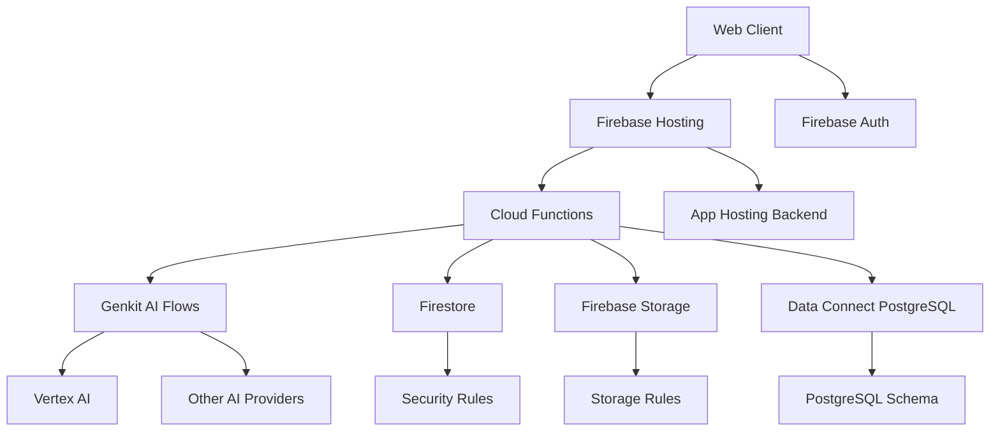
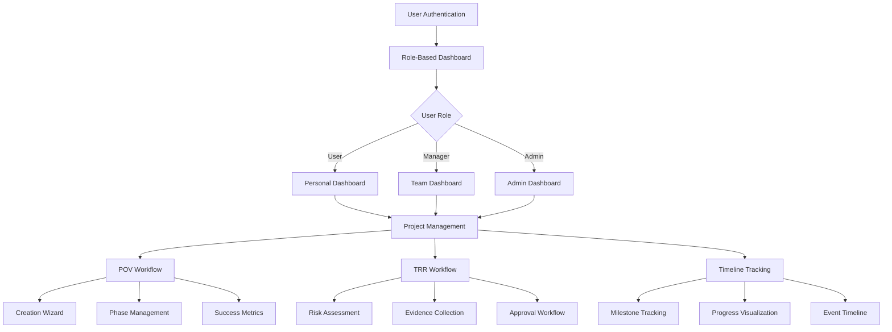

# WARP.md

This file provides guidance to WARP (warp.dev) when working with code in this repository.

## Overview

Cortex DC Web is a Firebase-based monorepo for a Domain Consultant (DC) portal that provides:
- AI-powered proof-of-value (POV) management
- Technical Risk Review (TRR) workflows  
- Scenario management and execution
- Terminal interface for technical operations
- Advanced analytics and reporting

**Critical Success Requirement**: Being able to functionally deploy the application using `firebase deploy` is the critical marker of success, ensuring that all of the Firebase/GCP native services are functional and implemented correctly.

## Prerequisites

- Node.js 18+ or 22+ (recommended)
- Firebase CLI: `npm i -g firebase-tools`
- Google Cloud SDK (recommended for GenAI/Data Connect)
- Package manager: pnpm (detected via pnpm-workspace.yaml)

### Authentication Setup
```bash
# Firebase login
firebase login

# Optional: GCP credentials for AI services
gcloud auth application-default login

# Verify project access
firebase projects:list
firebase use cortex-dc-web-dev  # or appropriate project
```

## Project Architecture

This is a **Firebase monorepo** with the following structure:

```
cortex-dc-web/
├── apps/
│   └── web/                    # Next.js 14 main application
├── packages/
│   ├── ui/                     # Shared UI components (@cortex-dc/ui)
│   ├── ai/                     # AI platform abstraction (@cortex/ai)
│   ├── db/                     # Database layer
│   └── utils/                  # Shared utilities
├── functions/                  # Firebase Cloud Functions
├── dataconnect/               # Firebase Data Connect (PostgreSQL)
├── cortex-dc-web-functions/   # Additional Python functions
├── firebase.json              # Firebase configuration
├── firestore.rules           # Security rules
├── storage.rules             # Storage security rules
└── turbo.json                # Turborepo configuration
```

### Technology Stack

**Frontend:**
- Next.js 14 with App Router
- TypeScript (strict mode)
- Tailwind CSS with Tremor design system
- Radix UI components
- React 18

**Backend Services:**
- Firebase Cloud Functions (Node.js 20 runtime)
- Python functions for specialized processing
- Firebase Data Connect (PostgreSQL backend)
- Genkit for AI orchestration

**AI Integration:**
- Vertex AI (primary provider)
- Multi-provider abstraction layer
- Genkit flows for AI orchestration

**Database & Storage:**
- Firestore for operational data
- Firebase Storage for assets
- Data Connect (PostgreSQL) for structured data

## Development Commands

### Workspace Commands (Turborepo)
```bash
# Install dependencies
pnpm install

# Start all development servers
pnpm dev

# Build all packages
pnpm build

# Run all tests
pnpm test

# Lint and type-check
pnpm lint
pnpm type-check

# Clean build artifacts
pnpm clean
```

### Individual Package Commands
```bash
# Web app development
cd apps/web
pnpm dev          # Start Next.js dev server with Turbopack
pnpm build        # Build for production
pnpm start        # Start production server

# UI package development  
cd packages/ui
pnpm dev          # Watch mode for component changes
pnpm storybook    # Start Storybook dev server

# Functions development
cd functions
pnpm serve        # Start local functions emulator
pnpm deploy       # Deploy functions only
pnpm logs         # View function logs
```

### Firebase Commands
```bash
# Start all emulators
firebase emulators:start

# Deploy everything
firebase deploy

# Deploy specific targets
firebase deploy --only hosting
firebase deploy --only functions
firebase deploy --only firestore:rules
firebase deploy --only storage

# Deploy to preview channel
firebase hosting:channel:deploy PREVIEW_ID
```

### Genkit Development
```bash
# Start Genkit development server
cd functions
pnpm genkit:start

# Access Genkit UI at http://localhost:4000
```

## Firebase Configuration

### Services Enabled
- **Hosting**: Static site hosting with CDN
- **Cloud Functions**: Serverless compute (Node.js 20, Python 3.11)
- **Firestore**: NoSQL database with security rules
- **Storage**: File storage with security rules  
- **Authentication**: User management
- **Data Connect**: PostgreSQL backend for structured data
- **App Hosting**: Cloud Run backend (experimental)

### Emulator Configuration
The project uses comprehensive emulator setup for local development:

```json
{
  "auth": { "port": 9099 },
  "functions": { "port": 5001 },
  "firestore": { "port": 8080 },
  "hosting": { "port": 5000 },
  "storage": { "port": 9199 },
  "dataconnect": { "port": 9399 },
  "ui": { "port": 4040 }
}
```

### Security Rules
- **Firestore**: User-scoped access with organization-level permissions
- **Storage**: Protected uploads with content type validation
- **Functions**: CORS-enabled with proper authentication checks

## Local Development Workflow

### Standard Development Loop
1. **Start Firebase Emulators**:
   ```bash
   firebase emulators:start
   ```

2. **Start Web Application**:
   ```bash
   cd apps/web
   pnpm dev
   ```

3. **Access Services**:
   - Web App: http://localhost:3000
   - Emulator UI: http://localhost:4040
   - Genkit UI: http://localhost:4000 (if running)

### Data Connect Development
```bash
# Initialize Data Connect (if needed)
firebase init dataconnect

# Deploy schema to local emulator
firebase dataconnect:sql:migrate

# Access PostgreSQL directly (if needed)
firebase dataconnect:sql:shell
```

## Architecture Diagrams

### High-Level System Architecture


### Component Architecture  
```mermaid
graph TD
    A[User Input] --> B[Next.js App Router]
    B --> C[Page Components]
    C --> D[@cortex-dc/ui Components]
    
    D --> E[Tremor Charts]
    D --> F[Radix UI Primitives]
    D --> G[Custom Components]
    
    C --> H[Firebase SDK]
    H --> I[Firestore Client]
    H --> J[Storage Client]
    H --> K[Functions Client]
    
    C --> L[@cortex/ai Package]
    L --> M[Provider Abstraction]
    M --> N[Vertex AI]
    M --> O[OpenAI]
    
    K --> P[Genkit Flows]
    P --> Q[AI Model Providers]
    
    B --> R[Server Components]
    B --> S[Client Components]
    R --> T[Data Fetching]
    S --> U[Interactivity]
```

## Environment Variables

### Required Variables
```bash
# Firebase Configuration (auto-injected)
FIREBASE_PROJECT_ID=cortex-dc-web-dev
FIREBASE_API_KEY=<auto-generated>
FIREBASE_AUTH_DOMAIN=<auto-generated>

# AI Provider Configuration (Functions only)
VERTEX_AI_PROJECT=<gcp-project>
VERTEX_AI_LOCATION=us-central1
GENKIT_ENV=dev

# Data Connect (if using)
DATA_CONNECT_INSTANCE=cortex-dc-web-fdc
DATA_CONNECT_DATABASE=fdcdb
```

### Environment Setup
1. Copy environment template: `cp .env.example .env.local`
2. Configure Firebase project: `firebase use PROJECT_ALIAS`  
3. Set up GCP credentials for AI services
4. Configure emulators to use local environment

## Testing Strategy

### Unit Testing
```bash
# Run all tests
pnpm test

# Watch mode
pnpm test:watch

# Coverage report
pnpm test:coverage
```

### Integration Testing
- Firebase emulators provide isolated test environment
- AI services use mock providers in test mode
- Database tests use emulator data

### End-to-End Testing
```bash
# Run E2E tests (if configured)
pnpm test:e2e
```

## Deployment Process

### Development Deployment
```bash
# Deploy to development environment
firebase use cortex-dc-web-dev
firebase deploy
```

### Production Deployment
```bash
# Deploy to production
firebase use cortex-dc-web-prod

# Build and deploy
pnpm build
firebase deploy

# Verify deployment
curl -f https://cortex-dc-web-prod.web.app/api/health
```

### Framework-Aware Hosting
This project uses Firebase's experimental framework-aware hosting. Ensure experiments are enabled:

```bash
firebase experiments:enable webframeworks
```

## Critical Service Validations

### Generative AI Services
```bash
# Test Genkit flow execution
curl -X POST http://localhost:5001/cortex-dc-web-dev/us-central1/genkitFlow \
  -H "Content-Type: application/json" \
  -d '{"prompt": "Hello, world"}'
```

### Storage Services  
```bash
# Test file upload/download
curl -X POST http://localhost:9199/v0/b/cortex-dc-web-dev.appspot.com/o/test.txt \
  -H "Content-Type: text/plain" \
  -d "test content"
```

### Database Services
```bash
# Test Firestore connection
curl http://localhost:8080/v1/projects/cortex-dc-web-dev/databases/(default)/documents/users

# Test Data Connect (if available)
curl http://localhost:9399/graphql \
  -H "Content-Type: application/json" \
  -d '{"query": "query { __typename }"}'
```

## Troubleshooting

### Common Issues

**Firebase Deploy Fails**:
1. Verify project access: `firebase projects:list`
2. Check active project: `firebase use`
3. Ensure all services are enabled in Firebase Console
4. Verify billing is set up for paid services

**Emulators Won't Start**:
1. Check port conflicts: `lsof -i :5000,8080,9099`
2. Clear emulator data: `firebase emulators:start --import=./emulator-data --export-on-exit`
3. Update Firebase CLI: `npm i -g firebase-tools@latest`

**AI Services Not Working**:
1. Verify GCP credentials: `gcloud auth application-default print-access-token`
2. Check project permissions for Vertex AI
3. Ensure Genkit is properly configured in functions

**Build Failures**:
1. Clear node_modules and reinstall: `rm -rf node_modules pnpm-lock.yaml && pnpm install`
2. Check TypeScript errors: `pnpm type-check`
3. Verify all packages build: `pnpm build`

### Log Analysis
```bash
# Firebase Functions logs
firebase functions:log

# Local emulator logs
firebase emulators:start --debug

# Next.js build analysis
cd apps/web
ANALYZE=true pnpm build
```

## Code Standards and Practices

### Never Delete Code Rule
When making functional changes, **never delete code**. Instead:
1. Comment out specific code blocks that would be removed
2. Add detailed comments explaining the change rationale
3. Create searchable index of commented code
4. Consider creating separate markdown documentation for removed functionality

This prevents broken links, orphaned components, and incorrect state references while maintaining evolution history.

### Component Development
- Follow Tremor design system patterns
- Use TypeScript strict mode
- Implement proper error boundaries
- Write comprehensive tests for business logic

### State Management
- Server Components for data fetching
- Client Components for interactivity  
- Minimize client-side state
- Use Firebase SDK for real-time updates

## Project Management Backbone

This application is built around a comprehensive project management system that serves as the backbone for Domain Consultant workflows. The system supports three user roles with distinct capabilities:

### User Role Structure

**User (Domain Consultants):**
- Personal Dashboard with POV/TRR focus
- Project creation and management
- POV lifecycle management with creation wizard
- TRR workflow participation
- Content Hub access
- Scenario Engine execution
- Terminal UI for technical operations
- Personal preferences and TAC escalation

**Manager (Team Leads):**
- Team Dashboard with oversight capabilities
- POV and Activity dashboards
- Team member management
- Approval workflows for TRRs
- Advanced terminal and scenario capabilities
- Management settings and user preferences

**Admin (Platform Administrators):**
- Admin UI with full platform control
- User and platform settings management
- Comprehensive analytics and detailed reporting
- All system capabilities with administrative privileges

### Core Features

#### Project Management System
- **Projects**: Central entity linking POVs, TRRs, and activities
- **Customer Information**: Comprehensive customer profiles with industry data
- **Timeline Tracking**: Interactive timelines with milestone management
- **Team Collaboration**: Role-based access and team assignment
- **Progress Monitoring**: Real-time progress tracking and health indicators

#### POV (Proof of Value) Management
- **Creation Wizard**: Step-by-step POV creation with objectives and phases
- **Success Objectives**: Measurable goals with weighted importance
- **Phase Management**: Execution phases with task tracking
- **Test Plans**: Environment configuration and resource planning
- **Timeline Integration**: Automated progress updates and milestone tracking

#### TRR (Technical Risk Review) System
- **Risk Assessment**: Comprehensive risk evaluation with scoring
- **Findings Management**: Evidence collection and severity tracking
- **Validation Workflow**: Multi-stage review and approval process
- **Digital Signoff**: Secure approval with audit trails
- **Compliance Tracking**: Integration with project timelines

#### Advanced UI Components
- **Project Cards**: Rich project visualization with health indicators
- **Timeline Views**: Interactive project timelines with event tracking
- **Dashboard Widgets**: Role-specific dashboard components
- **Creation Wizards**: Guided workflows for complex processes

### Architecture Components



## Success Criteria

✅ **Firebase Deploy**: `firebase deploy` completes successfully  
✅ **Generative AI**: All configured AI providers respond correctly  
✅ **Storage Services**: File upload/download operations work  
✅ **Database Operations**: Firestore and Data Connect function properly  
✅ **Authentication**: Role-based access control functional
✅ **Project Management**: Complete POV/TRR lifecycle workflows operational
✅ **User Dashboards**: Role-specific dashboards render with appropriate permissions
✅ **Timeline Tracking**: Interactive timeline components display project events
✅ **Creation Wizards**: Step-by-step POV and TRR creation workflows complete
✅ **Emulator Suite**: All services start and interconnect locally

The application is considered successfully deployed when all Firebase/GCP native services are functional and the complete Domain Consultant workflow operates end-to-end in the deployed environment with proper role-based access control.

<citations>
<document>
<document_type>RULE</document_type>
<document_id>4MCSfwC7HMM7WpQI6WHIF7</document_id>
</document>
<document>
<document_type>RULE</document_type>
<document_id>a2VHqvja9Iev5intH875CA</document_id>
</document>
<document>
<document_type>RULE</document_type>
<document_id>p1mEdM6y1tpQLEjyuecRzx</document_id>
</document>
</citations>