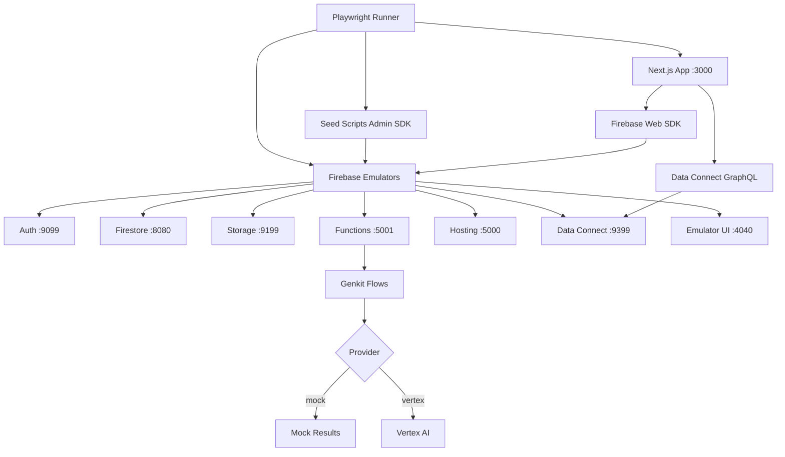
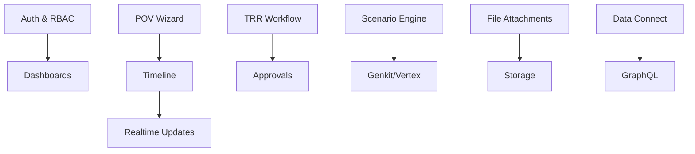

# E2E Testing Architecture

This document outlines the comprehensive end-to-end testing strategy for the Cortex DC Web platform, a Firebase-based monorepo with Next.js frontend and multiple backend services.

## Success Criteria

✅ **Critical Success Gate**: `firebase deploy` completes successfully and all Firebase/GCP services are operational
✅ **Service Validation**: Auth, Firestore, Storage, Functions, Data Connect, Genkit/Vertex AI all functional  
✅ **Role-Based Access**: User, Manager, Admin dashboards render with appropriate permissions
✅ **Cross-Browser Compatibility**: Tests pass on Chromium, Firefox, WebKit, and mobile devices
✅ **Performance Standards**: Lighthouse performance ≥ 0.8 on key pages

## Architecture Overview



## Component Test Coverage



## Testing Stack

### Core Technologies
- **Playwright**: Multi-browser E2E testing framework
- **Firebase Emulator Suite**: Local development and testing environment
- **Firebase Admin SDK**: User and data seeding
- **pnpm + Turborepo**: Monorepo orchestration
- **TypeScript**: Type-safe testing

### Project Structure
```
cortex-dc-web/
├── packages/
│   ├── admin-tools/          # Firebase Admin SDK utilities
│   │   ├── src/
│   │   │   ├── adminApp.ts   # Admin app initialization
│   │   │   ├── seedUsers.ts  # User seeding with roles
│   │   │   ├── seedData.ts   # Core data seeding
│   │   │   └── cleanup.ts    # Test cleanup utilities
│   │   └── package.json
│   └── test-utils/           # Shared testing utilities
│       ├── src/
│       │   ├── selectors.ts  # Common test selectors
│       │   └── helpers.ts    # Test helper functions
│       └── package.json
├── tests/
│   ├── e2e/
│   │   ├── specs/            # Test files
│   │   ├── fixtures/         # Test data fixtures
│   │   ├── global-setup.ts   # Environment orchestration
│   │   ├── global-teardown.ts
│   │   └── playwright.config.ts
│   ├── rules/                # Security rules tests
│   └── perf/                 # Performance tests
└── docs/testing/             # Testing documentation
```

## Test Categories

### 1. Smoke Tests (`000-smoke.spec.ts`)
- Firebase emulator connectivity
- Basic app rendering
- Service health checks

### 2. Authentication & RBAC (`001-auth-and-rbac.spec.ts`)
- User sign-in flows
- Role-based dashboard access
- Permission enforcement

### 3. Core Workflows
- **POV Management** (`010-pov-wizard.spec.ts`): Creation, editing, lifecycle
- **TRR Workflows** (`020-trr-approval.spec.ts`): Submission, review, approval
- **Scenario Engine** (`030-scenario-engine.spec.ts`): Genkit integration
- **File Attachments** (`040-attachments-storage.spec.ts`): Upload/download
- **Real-time Updates** (`050-timeline-realtime.spec.ts`): Firestore listeners

### 4. Service Validation (`100-firebase-services.spec.ts`)
- Firestore security rules
- Storage access controls
- Functions integration
- Data Connect GraphQL
- Real-time synchronization

### 5. Visual & Responsive (`200-responsive-visuals.spec.ts`)
- Dashboard layouts across devices
- Mobile responsiveness
- Cross-browser rendering

## Environment Setup

### Emulator Configuration
```json
{
  "auth": { "port": 9099 },
  "functions": { "port": 5001 },
  "firestore": { "port": 8080 },
  "hosting": { "port": 5000 },
  "storage": { "port": 9199 },
  "dataconnect": { "port": 9399 },
  "ui": { "port": 4040 }
}
```

### Environment Variables
```bash
# Test configuration
E2E_BASE_URL=http://localhost:3000
NEXT_PUBLIC_USE_EMULATORS=true
NEXT_PUBLIC_DATA_CONNECT_URL=http://localhost:9399/graphql

# Firebase emulator hosts
FIREBASE_PROJECT_ID=cortex-dc-web-dev
FIREBASE_AUTH_EMULATOR_HOST=127.0.0.1:9099
FIRESTORE_EMULATOR_HOST=127.0.0.1:8080
FIREBASE_STORAGE_EMULATOR_HOST=127.0.0.1:9199

# AI provider configuration
GENKIT_PROVIDER=mock
```

## Data Management

### User Seeding
- **user1@dev.local** (Password123!) - Domain Consultant role
- **manager1@dev.local** (Password123!) - Manager role  
- **admin1@dev.local** (Password123!) - Administrator role

Each user has appropriate custom claims set via Firebase Admin SDK.

### Test Data Namespacing
All test data uses `ns: "e2e"` to isolate from other data and enable cleanup.

### Collections Seeded
- `projects` - Test project with team assignments
- `povs` - Sample POV with scenarios
- `scenarios` - Network segmentation and identity verification scenarios
- Storage files under `e2e/` prefix

## Browser & Device Coverage

### Desktop Browsers
- **Chromium** - Chrome engine testing
- **Firefox** - Gecko engine testing  
- **WebKit** - Safari engine testing

### Mobile Devices
- **Mobile Chrome** - Pixel 5 viewport
- **Mobile Safari** - iPhone 12 viewport

### Special Projects
- **hosting-emulator** - Tests via Firebase Hosting emulator (port 5000)

## Genkit/AI Testing Strategy

### Mock Provider
For consistent, fast, deterministic tests:
```typescript
export function mockScenarioRecommendation(input: any) {
  return {
    recommendationId: "rec-e2e-1",
    scenarios: [
      { id: "scn-1", title: "Throughput optimization", score: 0.92 },
      { id: "scn-2", title: "Cost reduction", score: 0.87 }
    ],
    inputEcho: input
  };
}
```

### Provider Switching
Cloud Functions check `GENKIT_PROVIDER` environment variable:
```typescript
const useMock = process.env.GENKIT_PROVIDER === "mock";
const result = useMock ? mockScenarioRecommendation(payload) : await vertexProvider.runFlow(payload);
```

## Security Testing

### Firestore Rules Testing
Using `@firebase/rules-unit-testing`:
```typescript
test('users cannot write outside their project', async () => {
  const env = await initializeTestEnvironment({ 
    projectId: "cortex-dc-web-dev", 
    firestore: { rules: fs.readFileSync("firestore.rules", "utf8") } 
  });
  const ctx = env.authenticatedContext("uid_user", { role: "user" });
  const db = ctx.firestore();
  await expect(db.collection("projects").doc("other").set({ a: 1 })).rejects.toThrow();
});
```

### Storage Rules Testing
- Content-type validation
- User-scoped access controls
- File size limits

## Performance Testing

### Lighthouse CI Integration
```json
{
  "ci": {
    "collect": {
      "url": ["http://localhost:3000/", "http://localhost:3000/dashboard"],
      "numberOfRuns": 1
    },
    "assert": {
      "preset": "lighthouse:recommended",
      "assertions": { "performance": ["warn", { "minScore": 0.8 }] }
    }
  }
}
```

### Load Testing with k6
```javascript
export const options = { vus: 10, duration: "30s" };
export default function() {
  const res = http.get("http://127.0.0.1:5001/cortex-dc-web-dev/us-central1/health");
  check(res, { "status 200": (r) => r.status === 200 });
}
```

## Failure Debugging

### Artifacts Generated
- **Screenshots** - On test failures only
- **Videos** - Recorded for failed tests
- **Traces** - Detailed execution traces for debugging
- **HTML Reports** - Visual test results with timeline

### Artifact Access
```bash
# View latest HTML report
pnpm report:e2e

# Open specific trace file
playwright show-trace ./test-results/trace.zip
```

## CI/CD Integration

### GitHub Actions Matrix
Tests run across:
- Node.js versions: [20]
- Browsers: [chromium, firefox, webkit]
- Parallel execution with emulator orchestration

### Deployment Validation
Preview deploy workflow:
1. Build application
2. Deploy to Firebase Hosting preview channel
3. Run smoke tests against preview URL
4. Validate all services are operational

## Development Workflow

### Local Development Commands
```bash
# Start emulators
firebase emulators:start

# Seed test data (in another terminal)
pnpm seed:users
pnpm seed:data

# Run tests
pnpm e2e:local                    # Run all tests
pnpm test:e2e:ui                 # Interactive test runner  
pnpm test:e2e --project=chromium # Specific browser
pnpm report:e2e                  # View results

# Cleanup
pnpm clean:e2e
```

### Debugging Tests
```bash
# Run specific test file
pnpm test:e2e tests/e2e/specs/001-auth-and-rbac.spec.ts

# Debug mode
pnpm test:e2e --debug

# Headed mode (see browser)
pnpm test:e2e --headed
```

## Test Maintenance

### Never Delete Code Rule
Following the repository policy:
- Comment out code instead of deleting
- Reference TESTING.md for context
- Maintain evolution history
- Use searchable index for commented functionality

### Flake Management
- Use `data-testid` attributes for stable selectors
- Implement retry logic (2 retries in CI)
- Tag flaky tests with `.retry(n)` and ticket references
- Regular maintenance of test data and selectors

### Selector Strategy
Prefer deterministic selectors:
```typescript
// Good - stable
page.getByTestId('pov-wizard-next')

// Avoid - brittle  
page.locator('button:nth-child(3)')
```

## Security & Secrets

### CI Security
- Use Workload Identity Federation for GCP access
- No long-lived service account keys
- Secrets managed via GitHub encrypted secrets
- Default to mock providers unless explicitly configured

### Local Security
- Emulator isolation prevents production access
- Test data namespaced and auto-cleaned
- No real credentials required for local development

## Extending the Test Suite

### Adding New Test Files
1. Create in `tests/e2e/specs/`
2. Follow naming convention: `NNN-feature-name.spec.ts`
3. Use existing utilities from `packages/admin-tools/`
4. Include appropriate `data-testid` selectors

### Adding New Services
1. Update `seedData.ts` with fixture data
2. Add service validation in `100-firebase-services.spec.ts`
3. Update emulator configuration if needed
4. Document in this architecture guide

This architecture provides a robust, maintainable, and comprehensive testing foundation that ensures the Cortex DC Web platform operates correctly across all supported environments and use cases.