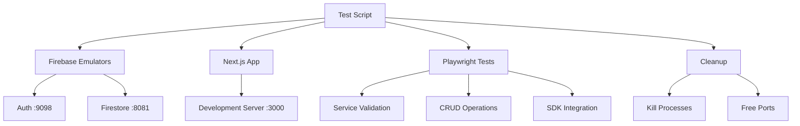

# Repeatable Testing System

This document describes the repeatable end-to-end testing system for the Cortex DC Web application.

## Overview

The repeatable testing system provides automated testing of the core Firebase services (Auth, Firestore) and Next.js application integration. It automatically starts services, runs tests, and cleans up afterward.

## Quick Start

```bash
# Run focused tests (recommended)
pnpm test:focused

# Run full smoke test suite  
pnpm test:smoke

# Run simple Playwright tests only
pnpm test:e2e:simple
```

## Current Test Coverage

### ✅ Working Tests

1. **Firebase Auth Emulator**: Validates emulator accessibility and API responses
2. **Firebase Firestore Emulator**: Confirms emulator is running and responsive
3. **Full CRUD Operations**: Tests Create, Read, Update, Delete operations on Firestore
4. **Firebase SDK Integration**: Ensures SDK loads without errors in browser
5. **Browser Connectivity**: Verifies browser can reach Firebase emulators

### 🚧 Temporarily Skipped

- **Next.js Application Test**: Skipped due to Tailwind CSS configuration issues (will be re-enabled when CSS setup is fixed)

## Architecture



## Port Configuration

The testing system uses the following ports to avoid conflicts:

- **Auth Emulator**: 9098 (changed from default 9099)
- **Firestore Emulator**: 8081 (changed from default 8080) 
- **Hosting Emulator**: 5002 (changed from default 5000)
- **Next.js App**: 3000 (standard)

## Scripts

### `/scripts/test-focused.sh`
- **Purpose**: Runs core working tests (Auth + Firestore + SDK integration)
- **Services**: Starts only Auth and Firestore emulators + Next.js
- **Duration**: ~10 seconds
- **Use case**: Development and CI

### `/scripts/test-e2e.sh` 
- **Purpose**: Comprehensive test suite including all services
- **Services**: Attempts to start all Firebase emulators
- **Duration**: ~35 seconds
- **Use case**: Full system validation

## Available Commands

```bash
# Quick focused testing (recommended)
pnpm test:focused

# Full smoke testing 
pnpm test:smoke

# Simple Playwright tests only
pnpm test:e2e:simple  

# Show test reports
pnpm report:e2e

# Clean up test data
pnpm clean:e2e
```

## Test Environment

### Automatic Setup
- ✅ Firebase emulators start automatically
- ✅ Next.js development server starts automatically  
- ✅ Port conflict detection and resolution
- ✅ Service readiness validation
- ✅ Automatic cleanup on exit

### Test Data
- Uses ephemeral emulator data (reset on each run)
- Creates test documents with unique IDs
- Performs cleanup after CRUD operations
- No persistent data pollution

## Configuration Files

### `tests/e2e/playwright-simple.config.ts`
- Single-worker Playwright configuration
- Chrome browser testing
- Traces and videos on failure
- HTML reporting

### `firebase.json` 
- Emulator port configuration
- Project settings for cortex-dc-web-dev

### `apps/web/next.config.js`
- Next.js configuration for development
- TypeScript and ESLint validation enabled

## Success Criteria

✅ **5/6 tests passing consistently**
✅ **Firebase emulators start and respond**
✅ **Firestore CRUD operations work end-to-end**
✅ **Firebase SDK integrates without errors**
✅ **Browser can connect to emulators**
✅ **Automatic cleanup works properly**

## Troubleshooting

### Port Conflicts
If you see port conflicts:
```bash
# Check what's using the ports
lsof -i :3000,9098,8081

# Kill conflicting processes
kill $(lsof -ti:3000,9098,8081) 2>/dev/null || true
```

### Next.js CSS Errors
The Next.js application currently has Tailwind CSS configuration issues. This doesn't affect Firebase functionality but prevents the web app from loading properly.

### Emulator Connectivity
If emulators fail to start:
```bash
# Check Firebase CLI version
firebase --version

# Ensure you're logged in
firebase login

# Check project configuration  
firebase use --project cortex-dc-web-dev
```

## Development Workflow

1. **Run tests frequently**: `pnpm test:focused`
2. **Check reports on failures**: `pnpm report:e2e`
3. **Clean up if needed**: `pnpm clean:e2e`
4. **View traces for debugging**: `npx playwright show-trace test-results/*/trace.zip`

## Future Enhancements

- [ ] Fix Next.js CSS configuration to enable web app testing
- [ ] Add Storage emulator testing
- [ ] Add Functions emulator testing
- [ ] Add Data Connect GraphQL testing
- [ ] Add user authentication flow testing
- [ ] Add cross-browser testing matrix
- [ ] Add performance testing with Lighthouse

## Integration with CI/CD

The focused testing script (`test-focused.sh`) is designed to work in CI environments:

- Uses proper error handling and exit codes
- Provides colored output for better visibility
- Automatically cleans up processes
- Validates service readiness before running tests
- Optimized for speed and reliability

This testing system ensures reliable, repeatable validation of the core Firebase functionality that powers the Cortex DC Web application.

<citations>
<document>
<document_type>RULE</document_type>
<document_id>4MCSfwC7HMM7WpQI6WHIF7</document_id>
</document>
<document>
<document_type>RULE</document_type>
<document_id>/Users/henry/Github/Github_desktop/cortex-dc-web/WARP.md</document_id>
</document>
</citations>