# Cortex DC Web - E2E Testing Infrastructure

## Overview

This comprehensive end-to-end (E2E) testing infrastructure provides full coverage testing for the Cortex DC Web application, a Firebase-based monorepo for Domain Consultant engagement acceleration. The testing framework leverages Playwright for browser automation and includes Firebase emulator integration for isolated testing environments.

## Architecture Diagram

```mermaid
graph TD
    A[E2E Test Suite] --> B[Core Firebase Services]
    A --> C[Authentication & Roles]
    A --> D[POV Creation Workflows]
    A --> E[TRR Approval Processes]
    A --> F[Cross-Browser Testing]
    A --> G[Visual Regression]
    
    B --> H[Firebase Emulators]
    B --> I[Storage Operations]
    B --> J[Functions Testing]
    B --> K[Firestore Operations]
    
    C --> L[User Seeding]
    C --> M[Role Management]
    C --> N[Auth State Persistence]
    
    D --> O[Multi-Step Wizard]
    D --> P[Form Validation]
    D --> Q[Data Persistence]
    
    E --> R[Manager Approval]
    E --> S[Admin Validation]
    E --> T[Digital Signoff]
    
    F --> U[Chromium]
    F --> V[Firefox] 
    F --> W[WebKit]
    
    G --> X[Dashboard Screenshots]
    G --> Y[Component Regression]
    G --> Z[Mobile Responsive]
    
    H --> AA[Auth Emulator]
    H --> BB[Firestore Emulator]
    H --> CC[Storage Emulator]
    H --> DD[Functions Emulator]
```



## Test Categories

### 1. Core Firebase Services (`000-core-firebase.spec.ts`)
- **Firebase Emulator Integration**: Validates all Firebase emulators are accessible
- **Storage Operations**: File upload/download, metadata handling, security rules
- **Functions Testing**: Cloud Functions health checks and invocation
- **Firestore Operations**: Real-time database connectivity and CRUD operations
- **Authentication Services**: User authentication and custom token claims

### 2. Authentication & Role Management (`005-auth-role-management.spec.ts`) 
- **User Authentication**: Sign-in/out workflows with seeded test users
- **Role-Based Access Control**: User, Manager, and Admin role hierarchy
- **Custom Token Claims**: Firebase Auth custom claims validation  
- **Auth State Persistence**: Authentication state management across sessions
- **Authentication Error Handling**: Invalid credentials and failure scenarios

### 3. POV Creation Workflows (`010-pov-creation-wizard.spec.ts`)
- **Multi-Step Wizard Navigation**: Complete POV creation workflow
- **Form Validation**: Input validation and error state handling
- **Data Persistence**: POV data storage and retrieval validation
- **Step-by-Step Progress**: Wizard state management and navigation
- **Cancellation Handling**: Proper cleanup when wizard is cancelled

### 4. TRR Approval Processes (`020-trr-approval-workflow.spec.ts`)
- **TRR Creation**: Technical Risk Review creation with risk assessment
- **Manager Review Process**: Manager approval workflow with digital signature
- **Admin Final Validation**: Administrative validation and compliance checks
- **Modification Requests**: Manager requests for TRR modifications
- **Multi-User Workflows**: Complete TRR lifecycle across user roles
- **Digital Signoff**: Final administrative approval with audit trails

### 5. Cross-Browser & Visual Testing (`030-cross-browser-visual.spec.ts`)
- **Multi-Browser Support**: Testing across Chromium, Firefox, and WebKit
- **Mobile Responsiveness**: Testing across device types and screen sizes
- **Visual Regression**: Screenshot comparison for UI consistency
- **Performance Monitoring**: Load times and JavaScript usage metrics
- **Accessibility Compliance**: Basic a11y checks and ARIA validation
- **Error Resilience**: Network failure handling and recovery

## Test Environment Setup

### Prerequisites
```bash
# Install dependencies
pnpm install

# Install Playwright browsers
npx playwright install

# Firebase CLI (if not installed)
npm install -g firebase-tools

# Authenticate with Firebase
firebase login
```

### Project Configuration
The testing infrastructure uses Firebase emulators with specific port configurations:

```javascript
// Emulator Ports
{
  "auth": { "port": 9098 },
  "firestore": { "port": 8081 },
  "storage": { "port": 9199 },
  "functions": { "port": 5001 },
  "hosting": { "port": 5000 },
  "ui": { "port": 4040 }
}
```

### Test Data Seeding
Test users are automatically seeded with the following roles:
- **user1@dev.local** (User role) - Password: `Password123!`
- **manager1@dev.local** (Manager role) - Password: `Password123!` 
- **admin1@dev.local** (Admin role) - Password: `Password123!`

## Running Tests

### Individual Test Suites
```bash
# Core Firebase services
pnpm run test:core

# Authentication and role management
pnpm run test:auth

# POV Creation Wizard
pnpm run test:pov

# TRR Approval Workflow  
pnpm run test:trr

# Cross-browser and visual testing
pnpm run test:visual
```

### Browser-Specific Testing
```bash
# Cross-browser testing (all browsers)
pnpm run test:cross-browser

# Mobile device testing
pnpm run test:mobile

# Individual browsers
npx playwright test --project=chromium
npx playwright test --project=firefox
npx playwright test --project=webkit
```

### Interactive Testing Modes
```bash
# Playwright UI Mode (recommended for development)
pnpm run test:e2e:ui

# Headed mode (see browser interactions)
pnpm run test:e2e:headed

# Debug mode (step through tests)
pnpm run test:e2e:debug
```

### Full Test Suite
```bash
# Complete test suite (unit + e2e)
pnpm run test:full-suite

# E2E tests only
pnpm run test:e2e

# CI-friendly run (for automated pipelines)
pnpm run test:ci
```

## Test Infrastructure Components

### Authentication Helpers (`utils/auth-helpers.ts`)
- **signIn()**: Authenticates users with Firebase Auth
- **signOut()**: Handles user sign-out and cleanup
- **seedTestUsers()**: Creates test users with appropriate roles
- **cleanupTestData()**: Cleans up test data after runs

### Firebase Emulator Integration
- **Automatic startup/shutdown**: Tests handle emulator lifecycle
- **Data seeding**: Pre-populated test data for consistent testing
- **Isolation**: Each test run uses clean emulator state
- **Port management**: Consistent port allocation across test runs

### Test Utilities
- **Page object patterns**: Reusable page interaction methods
- **Custom matchers**: Domain-specific test assertions
- **Screenshot helpers**: Visual regression testing utilities
- **Performance monitoring**: Load time and resource usage tracking

## Visual Regression Testing

Visual regression tests capture screenshots at key points to ensure UI consistency:

### Dashboard Views
- **User Dashboard**: `dashboard-user-view.png`
- **Manager Dashboard**: `dashboard-manager-view.png`  
- **Admin Dashboard**: `dashboard-admin-view.png`

### Component Testing
- **POV Wizard Steps**: `pov-wizard-step-1.png`, `pov-wizard-step-2.png`, etc.
- **TRR Creation**: `trr-creation-empty.png`, `trr-creation-filled.png`

### Responsive Testing
Screenshots are captured across multiple device configurations:
- Mobile Portrait/Landscape
- Tablet Portrait/Landscape  
- Desktop HD resolutions

## Performance Testing

Performance tests monitor:
- **Page Load Times**: Complete dashboard loading under 5 seconds
- **JavaScript Usage**: Code coverage and bundle efficiency
- **Resource Loading**: CSS and asset optimization
- **Network Resilience**: Graceful degradation during network issues

## Accessibility Testing

Basic accessibility compliance checks include:
- **Semantic HTML**: Proper heading hierarchy and landmarks
- **ARIA Labels**: Form inputs and interactive elements
- **Keyboard Navigation**: Focus management and tab order
- **Screen Reader Compatibility**: Role and label validation

*Note: Full accessibility testing would integrate `@axe-core/playwright` for comprehensive WCAG compliance.*

## CI/CD Integration

### GitHub Actions Support
```yaml
# Example CI configuration
- name: Run E2E Tests
  run: |
    pnpm install
    npx playwright install
    pnpm run test:ci
```

### Test Reporting
```bash
# Generate test reports
pnpm run test:report

# View results in browser
npx playwright show-report tests/e2e/test-results
```

## Development Workflows

### Adding New Tests
1. Create test file in appropriate `specs/` directory
2. Follow naming convention: `###-feature-name.spec.ts`  
3. Use existing helpers and utilities for consistency
4. Include proper cleanup in `afterEach` hooks
5. Add test documentation and comments

### Debugging Test Failures
```bash
# Run specific test with debugging
npx playwright test tests/e2e/specs/010-pov-creation-wizard.spec.ts --debug

# Run with browser visible
npx playwright test --headed

# Use Playwright Inspector
npx playwright test --ui
```

### Updating Visual Baselines
```bash
# Update all screenshots
npx playwright test --update-snapshots

# Update specific test screenshots  
npx playwright test tests/e2e/specs/030-cross-browser-visual.spec.ts --update-snapshots
```

## Troubleshooting

### Common Issues

**Emulator Port Conflicts**
```bash
# Check port usage
lsof -i :8081,9098,9199,5001

# Kill existing processes
firebase emulators:kill
```

**Browser Installation Issues**
```bash
# Reinstall browsers
npx playwright install --force

# Install system dependencies
npx playwright install-deps
```

**Test Data Issues**
```bash
# Clean test data
pnpm run clean:e2e

# Reseed test users
pnpm run seed:users
```

### Firebase Emulator Issues
```bash
# Clear emulator data
rm -rf .firebase/emulators

# Restart emulators with fresh data
firebase emulators:start --import=./tests/e2e/data --export-on-exit
```

## Test Coverage Goals

- **Core Firebase Services**: 100% emulator connectivity and operations
- **Authentication Flows**: Complete user lifecycle testing  
- **Business Workflows**: End-to-end POV and TRR processes
- **Cross-Browser Support**: 95%+ feature parity across browsers
- **Mobile Responsiveness**: Full responsive design validation
- **Performance Standards**: Sub-5-second load times
- **Accessibility Compliance**: WCAG 2.1 AA basic requirements

## Contributing

### Test Standards
- Use descriptive test names that explain the scenario
- Include proper setup and cleanup in hooks
- Add console.log statements for test progress tracking
- Use data-testid attributes consistently in components
- Follow the existing helper patterns and utilities

### Code Review Checklist
- [ ] Tests are isolated and don't depend on external state
- [ ] Proper error handling and timeout management
- [ ] Visual regression tests have stable selectors
- [ ] Performance tests have reasonable assertions
- [ ] Cross-browser compatibility considerations

## Architecture Success Criteria

✅ **Firebase Deploy**: `firebase deploy` completes successfully  
✅ **Generative AI**: All configured AI providers respond correctly  
✅ **Storage Services**: File upload/download operations work  
✅ **Database Operations**: Firestore and Data Connect function properly  
✅ **Authentication**: Role-based access control functional  
✅ **Project Management**: Complete POV/TRR lifecycle workflows operational  
✅ **User Dashboards**: Role-specific dashboards render with appropriate permissions  
✅ **Timeline Tracking**: Interactive timeline components display project events  
✅ **Creation Wizards**: Step-by-step POV and TRR creation workflows complete  
✅ **Emulator Suite**: All services start and interconnect locally

The E2E testing infrastructure ensures that all critical user workflows operate correctly across browsers and devices while maintaining consistent visual design and performance standards.

<citations>
<document>
<document_type>RULE</document_type>
<document_id>4MCSfwC7HMM7WpQI6WHIF7</document_id>
</document>
<document>
<document_type>RULE</document_type>
<document_id>a2VHqvja9Iev5intH875CA</document_id>
</document>
<document>
<document_type>RULE</document_type>
<document_id>p1mEdM6y1tpQLEjyuecRzx</document_id>
</document>
</citations>